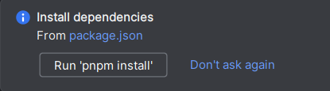

# 1. Initialize Frontend

## 1.1 Install Dependencies

Install Node.js (nvm - Node.js Version Control). The recommended version is less than < v18.00 and greater than > v16.14. (I'm currently using version v16.20.0)

Check the current (used) node version:

```
> node -v
```

Install Ant Design Pro, [follow the official documentation](https://pro.ant.design/en-US/docs/getting-started)

Open cmd / Git-Bash / IDE-terminal in the project root directory:

```
> # Using npm
> npm i @ant-design/pro-cli -g  	// Install/update globally
> pro create myapp              	// Initialize ant design pro 
	?> umi@4						// Choose umi4
```

Open IDE -> Open Project

Open terminal -> Install dependencies `yarn insall` or `yarn`

> There is a prompt in the bottom right corner, but do not directly click `'pnpm install'`. We use yarn to install dependencies. 
>
> 

>  Error: ESOCKETTIMEDOUT Timeout downloading
>  ```
>  > error An unexpected error occurred: "https://...: ESOCKETTIMEDOUT".
>  ```
>
>  Solution:
>
>  Check the network, and then reinstall dependencies using `yarn`.

## 1.2 Run

Find `package.json` -> Run with `"dev"` or `"start"`.

Choose the package manager: Choose the one that your computer has and you prefer to use. Here, select yarn, as it is more efficient than npm. `Apply` and then `Run`


## 1.3 Git Code Management

Initialize the git project version control tool

```
> git init
> git add .
> git commit -m 'first init'
```


# 2. Simplify Frontend Project

## 2.1 Remove Internationalization

```
"i18n-remove": "pro i18n-remove --locale=zh-CN --write",
// or
"i18n-remove": "pro i18n-remove --locale=en-US --write",
```

### Error: Prettier

**Error Cause:** Executed the command to remove internationalization from package.json `"i18n-remove": "pro i18n-remove --locale=en-US --write",`

**Expected Result:** Remove internationalization

**Error Message:**

```
throw error;
Error: Failed to load config "prettier" to extend from.
Referenced from: BaseConfig
  at ...
  at ...
  ...
  messageTemplate: 'extend-config-missing',
  messageData: { configName: 'prettier', importerName: '' }
}
```

**Solution:** [BUG Executing command to remove internationalization reports error #10452](https://github.com/ant-design/ant-design-pro/issues/10452)

Execute `yarn add eslint-config-prettier --dev yarn add eslint-plugin-unicorn --dev `

Then comment out `// es2022: true` in the node_modules/@umijs/lint/dist/config/eslint/index.js file.

**Next Step:** Attempt to remove internationalization again. `"i18n-remove": "pro i18n-remove --locale=en-US --write",`


### Error: SelectLang

**Error Cause:** After successfully removing/applying internationalization, attempted to execute the start command in package.json.

**Expected Result:** Start the project

**Error Message:**

```java
error - ./src/components/index.ts
Module build failed (from ./node_modules/@umijs/bundler-webpack/compiled/babel-loader/index.js):
SyntaxError: H:\yProjectBI\bi-frontend\src\components\index.ts: Export 'SelectLang' is not defined. (11:55)

   9 | import { Question } from './RightContent';
  10 | import { AvatarDropdown, AvatarName } from './RightContent/AvatarDropdown';
> 11 | export { AvatarDropdown, AvatarName, Footer, Question, SelectLang };
     |                                                        ^
```

**Solution:** Go to `./src/components/index.ts`, remove SelectLang, becomes:

```java
export { AvatarDropdown, AvatarName, Footer, Question };
```


> Error Analysis:
> From this, we can see that `AvatarDropdown, AvatarName, Footer, Question` can all be viewed by ctrl + [right click] or ctrl + b, but only the error `SelectLang` cannot, indicating that (probably) the formatting element `SelectLang` has been removed along with internationalization (without multiple languages, "Select Language SelectLang" has been removed). Calling the non-existent `SelectLang` resulted in an error.


**Next Step:** Execute the start command in package.json again.


### (Error: Left Sidebar Not Displaying)

**Error Cause:** Project started normally.

**Expected Result:** Left sidebar displays normally

**Error Message:** Left sidebar not displaying

**Solution:** Add the `name` attribute in `config/routes.ts` routes:

```tsx
routes: [
    { path: '/admin', name: 'Main-aaa', redirect: '/admin/sub-page' },
    { path: '/admin/sub-page', name: 'Sub-Page', component: './Admin' },
],
```


**Next Step:** Restart the project.


# 3. Initialize Backend

## 3.0 Template Introduction README

Contains an introduction to the current template, the technologies used, and the built-in features.


## 3.1 Modify Configuration Files

### application.yml

Navigate to `resource/application.yml`.

Find `datasource:`, modify `url`, `username`, and `password`.

```yml
datasource:
    driver-class-name: com.mysql.cj.jdbc.Driver
    url: jdbc:mysql://localhost:3306/my_db
    username: root
    password: [yourpassword]
```

Find `server:`, modify `port` to the desired deployment port.

```yml
server:
    address: 0.0.0.0
    port: 8080
```


### Modify Module Name springbootinit

Go to pom.xml -> Select `springboot-init` under `<name>springboot-init</name>` -> ctrl + shoft + r rename it to "bi-backend" -> replace all -> replace 


## 3.2 Enable Database

### Connect to Database

Database -> New -> Data source -> MySQL


Name: @New_name

User name: root 

Password: [your password]

OK

### Create Tables

Go to `sql/creat_table.sql`.

Select all with ctrl + a, then execute.

The newly created tables will appear in the Database sidebar.


## 3.3 Start the Project

Go to `src/main/java/com.yupi.springbootinit/MainApplication`.

Start the MainApplication method.

In the browser, access the backend deployment port 8080 and access the api doc file. http://localhost:8080/api/doc.html

### Error: port 8101 had been used 

**Error Cause:** Attempting to start the backend project normally.

**Expected Result:** Start normally

**Error Message:** port 8101 had been used 

**Reason:** Port conflict when starting the backend project Windows, Hyper-V virtualization platform, or other processes occupy the port.

**Solution:** Enter `netsh interface ipv4 show excludedportrange protocol=tcp` in cmd to view the ports occupied by the windows computer. Then select an unoccupied port to start the project.


## 3.4 Test Template Project

### Find Login User

Right sidebar -> user-controller -> GET getLoginUser -> Debug.

Attempt to retrieve the currently logged-in user. Click `/api/user/get/login` to send. Returns:

```json
{
  "code": 40100,
  "data": null,
  "message": "Not logged in"
}
```

Error indicates no logged-in user.

### Register User

Right sidebar -> user-controller -> POST userRegister -> Debug.

Attempt to register a new user. Input, then send:

```json
{
  "checkPassword": "12345678",
  "userAccount": "nick",
  "userPassword": "12345678"
}
```

Returns the new user id:

```json
{
  "code": 0,
  "data": "1704834202674135041",
  "message": "ok"
}
```


### Login User

Right sidebar -> user-controller -> POST userlogin -> Debug.

Login with the user just created, then send.

```json
{
  "userAccount": "nick",
  "userPassword": "12345678"
}
```

Returns user information:

```json
{
  "code": 0,
  "data": {
    "id": "1704834202674135041",
    "userName": null,
    "userAvatar": null,
    "userProfile": null,
    "userRole": "user",
    "createTime": "2023-09-21T12:25:22.000+00:00",
    "updateTime": "2023-09-21T12:25:22.000+00:00"
  },
  "message": "ok"
}
```


# 4. Database Tables

## 4.1 Database Table Design

Navigate to `sql/creat_table.sql`. Modify the table creation statements.

### Create Database

```sql
-- Create table
create database if not exists bi_db;

-- Use table
use bi_db;
```


### User Table

Navigate to `/sql/create_table.sql` in the existing project to find the table creation statement, which can be used as a basic template for modification:

```sql
-- user table
create table if not exists user
(
    id           bigint auto_increment comment 'id' primary key,
    userAccount  varchar(256)                           not null comment 'User Account',
    userPassword varchar(512)                           not null comment 'User Password',
    userName     varchar(256)                           null comment 'User Name',
    userAvatar   varchar(1024)                          null comment 'User Avatar',
    userRole     varchar(256) default 'user'            not null comment 'User role：user/admin',
    createTime   datetime     default CURRENT_TIMESTAMP not null comment 'Create Time',
    updateTime   datetime     default CURRENT_TIMESTAMP not null on update CURRENT_TIMESTAMP comment 'Update Time',
    isDelete     tinyint      default 0                 not null comment 'is delete',
    index idx_userAccount (userAccount)
) comment 'User' collate = utf8mb4_unicode_ci;
```

> It's recommended to use underscores for frontend naming conventions. For example: user_account, user_password.
>
> However, the use of camel case (e.g., userAccount) allows for easier collaboration between frontend and backend, as it can be a common naming convention for both. This allows for less logic conversion code on the backend and facilitates the generation of matching CRDU code for the frontend.


### chart Table

```sql
-- chart table
create table if not exists chart
(
    id           bigint auto_increment comment 'id' primary key,
    goal		 text null comment 'Purpose',
    chartData	 text null comment 'Raw Chart Data',
    chartType	 varchar(128) null comment 'Chart Type e.g. pie-chart, line-chart',
    genChart 	 text null comment 'Chart generated by AI',
    genResult	 text null comment 'Text/explanation generated by AI',
    userId		 bigint	null comment 'create user id',
    createTime   datetime     default CURRENT_TIMESTAMP not null comment 'Create Time',
    updateTime   datetime     default CURRENT_TIMESTAMP not null on update CURRENT_TIMESTAMP comment 'Update Time',
    isDelete     tinyint      default 0                 not null comment 'is delete'
) comment 'chart' collate = utf8mb4_unicode_ci;
```


## 4.2 Enable Database Tables

Select all with ctrl + a, then execute to create tables.

Navigate to `resource/application.yml` and modify the `url` under `datasource:` to the name of the newly created database. `url: jdbc:mysql://localhost:3306/bi_db`.


## 4.3 MybatisX Code Generation and Adaptation

### Generate Code

Database -> bi_db -> table -> select two tables -> right-click -> "MybatisX-Generator"

Select module path, then Next.


Modify settings, then Finish.


### Migrate Code

**mapper**

Delete your own `java/.../mapper/UserMapper`.

Move the two mappers in `generate/mapper` to `java/.../mapper`, ensuring there are no files with duplicate names. Confirm with reflector.

**service**

Move ChartService to your own `java/.../service`, and ChartServiceImpl to your own `java/.../service/impl`, without any user service-related files.

**domain**

Delete your own `model/entity/User`. Then move the Chart and User from `generator/domain` to `model/entity/User`.

**Finally**

Delete the `generator` package.

### Adjust Code

**Entity Related**

In `model/entity/`, for both User and Chart:

* Modify `@TableId(type = IdType.ASSIGN_ID)` for table modeling
* Add logical deletion annotation for `isDelete`

```java
public class User implements Serializable {
    @TableId(type = IdType.ASSIGN_ID)  		< --- Here 
    private Long id;

    ...
        
    @TableLogic
    private Integer isDelete;  				 < --- Here
}
```


**Mapper Related**

Navigate to `resource/mapper/ChartMapper.xml` and `UserMapper.xml`;

* Modify `<mapper namespace = "..." >`
* Modify `<resultMap id=... type="...">`

ChartMapper.xml：

```xml
<?xml version="1.0" encoding="UTF-8"?>
<!DOCTYPE mapper
        ...">
<mapper namespace="com.yupi.springbootinit.mapper.ChartMapper">							<-->Here</-->

    <resultMap id="BaseResultMap" type="com.yupi.springbootinit.model.entity.Chart">	<-->Here</-->
            ...
    </resultMap>
```

 ChartMapper.xml：

```xml
<?xml version="1.0" encoding="UTF-8"?>
<!DOCTYPE mapper
        ...">
<mapper namespace="com.yupi.springbootinit.mapper.UserMapper">						<-->Here</-->

    <resultMap id="BaseResultMap" type="com.yupi.springbootinit.model.entity.User">	<-->Here</-->
            ...
    </resultMap>
```


# 5. Simplifying the Backend Project

When starting the project in debug mode, it may encounter errors as expected.


## 5.0 Adjustments for User Not Found Errors

Ensure that the mapper-related code is correctly adjusted.

Based on the terminal output, for the errors in `/service` and `/service/impl`, where "User" is not found, manually import the user package `import com.yupi.springbootinit.model.entity.User;` wherever it is marked red and related problems are indicated.

Finally, attempt to run the project again.


## 5.1 Removal of WeChat Related Functionality

Based on the error messages, navigate to `service/impl/UserServiceImpl`.

* Remove the entire **userLoginByMpOpen()** method for third-party (WeChat) login. Then delete the **userLoginByMpOpen()** method in `UserService`.
* Delete the `java/.../wxmp` package related to WeChat login.
* Remove `/controller/WxMpController`.
* Delete the **userLoginByWxOpen()** method in `/controller/UserController`.


## 5.2 Testing

Test as previously done for registering users (3.4.2) and logging in users (3.4.3).


# 6. Adding and Adapting CRUD Functionality for Chart

## 6.1 Creating Requests

In `model/dto`, create a new package named `chart`. Then copy the `PostAddRequest`, `PostEditRequest`, `PostQueryRequest`, and `PostUpdateRequest` files from the `post` package into the `chart` package. Rename all files and update their content according to the structure and requirements of the frontend.


Based on the structure, content, and schema of the frontend, determine the request data to be transmitted.

1. Copy all table information from `model/entity/Chart` to each ChartRequest, from id to is_delete.
2. Remove comments. Spring MVC annotations are not required for requests.
3. Delete/retain required table information for different requests for ease of modification.

| File                 | Feature                            | Keep                           | Reason                                                       |
| -------------------- | ---------------------------------- | ------------------------------ | ------------------------------------------------------------ |
| `ChartAddRequest`    | Add new chart                      | goal, chartData, chartType     | id and parameters related to chart generation are not required for generating new charts |
| `ChartEditRequest`   | Edit existing chart                | id, goal, chartData, chartType | For editing existing charts, the following are required: the chart to be edited, modifications to the target, data retransmission, and modification of chart type. |
| `ChartQueryRequest`  | Query (read/search) existing chart | id, goal, chartType, userId    | Frontend/users can query existing charts based on: id, target, type, and creator ID. Perhaps later, chart naming will be implemented, allowing searches by name. |
| `ChartUpdateRequest` | Update                             | id, goal, chartData, chartType | Same as `ChartEditRequest` 。                                |

4. Remove void import (optional)


## 6.2 Adapting the Controller

### Creation

Copy `PostController` from `/controller` to the current directory and rename it to `ChartController`.

Copy the entire `getQueryWrapper()` method from `service/impl/PostServiceImpl` to the bottom of `ChartController`.


### Global Changes

Perform global changes (ctrl + r):

* Replace all occurrences of "post" with "chart".
* Replace all occurrences of "Post" with "Chart".
* Modify all @ annotations to "PostMapping". This corrects the Spring MVC syntax.
* Delete all imports related to `vo`, both uppercase and lowercase.

> Perform selective replacements: Select the desired range with the mouse and then press ctrl + r to perform replacements within that scope.


### Fine-tuning

Modify `getQueryWrapper()`:

* Delete the entire "paging search (querying from ES)" section.
* Modify other methods to remove fields specific to Post that are not needed for Chart. For example: tag, getTag, postId, and get postId.
* After modifying `getQueryWrapper()`, update `chartService.getQueryWrapper` to simply `getQueryWrapper`.


## (How to add New Table Information in general)

1. Modify the table creation statements.
2. Delete existing (incorrect) tables.
3. Execute the new table creation statements.
4. Manually update:
   1. `model/entity` to add new fields
   2. `model/dto/chartRequest` to modify request parameters
   3. `resource/mapper` to add new table information in `<resultMap>` and `<sql>`
   4. Alternatively, use MybatiesX for re-generation.


## 6.3 Testing

### User Login

Navigate to user-controller -> POST userlogin -> Debug.

```json
{
  "userAccount": "nick",
  "userPassword": "12345678"
}

Expected Response:
{
  ...
  "message": "ok"
}
```


### Create a Chart

Navigate to chart-controller -> POST addChart -> Debug.

```json
{
  "chartData": "[{\"Month\": 6}]",
  "chartType": "Bar chart",
  "goal": "I want to analyse the user growth trend of the web-site over the last year"
}

Expected Response:
{
  ...
  "message": "ok"
}
```


### Search Charts

**Search by ID**

Navigate to chart-controller -> GET getChartVOById -> Debug.

| Parameter Name | Parameter Value     |
| -------------- | ------------------- |
| id             | 1704921269215260673 |

```bash
Expected Response:
{
  ...
  "message": "ok"
}
```

**List Charts**

Submit [Empty].

```bash
{

}

Expected Response:
{
    "records": [
      {
        ...
        "goal": "I want to analyse the user growth trend of the web-site over the last year",
        "chartData": "[{\"Month\": 6}]",
        "chartType": "Bar chart",
        ...
  },
  "message": "ok"
}
```


# 7. Integration Testing between Frontend and Backend

## 7.1 Generating Service Methods Using OpenAPI

> `openapi` can automatically generate `service` files for us based on the backend Controller interface documentation. 
>
> `Swagger schema`: Based on the information of the interfaces generated by the backend Controller, the frontend code is generated using `OpenAPI`.

Find the URL for the frontend to request the backend's swagger model schema.
- Start the backend project.
- Access the backend project's home page `http://localhost:8080/api/doc.html#/home`.
- Open the Developer Console (F12) and navigate to the Network tab.
- Revisit `http://localhost:8080/api/doc.html#/home` (accessing it from within the project filters out irrelevant network requests, making it cleaner in the Developer Console).
- Find and double-click the `api-docs` request.
- The response should open, containing information like:

  ```json
  {
      "swagger": "2.0",
      "info": {
          "description": "bi-backend",
          "version": "1.0",
          "title": "接口文档"
          ...
  ```

- Copy its address, e.g., `http://localhost:8080/api/v2/api-docs`.


Go to the frontend's `config/config.ts` and find `openAPI: [ ... ]`, then update `schemaPath` and `projectName`. Comment out the configuration below it.

```typescript
openAPI: [
    {
        ...
        schemaPath: "http://localhost:8080/api/v2/api-docs",
        projectName: 'bi_front';
    },
    // {
    //   requestLibPath: "import { request } from '@umijs/max'",
    //   schemaPath: 'https://gw.alipayobjects.com/os/antfincdn/CA1dOm%2631B/openapi.json',
    //   projectName: 'swagger',
    // },
```

Go to `package.json` and execute `openapi`.

response:

```
[openAPI]: ✅ Successfully generated service files
```

The service files are located in `src/services`.


## 7.2 Frontend Request to Backend

Add `baseURL: "[backend address]"` to `app.tsx`.

```tsx
export const request = {
  baseURL: "http://localhost:8080",
  ...errorConfig,
};
```


## 7.3 Testing

In `src/pages/User/Login/index.tsx`, add test statements:

```tsx
useEffect(()=>{
    listChartByPageUsingPOST({}).then(res => {
        console.error('res', res)
    })
})

const fetchUserInfo = async () => {
	...
}
```

Expected response:


### Error: Unable to Access

**Error Cause:** Normal frontend project startup.

**Expected Result:** Successful project startup.

**Error Message:**

```tsx
fetch openapi error:FetchError:request to http://localhost:12345/api/v2/api-docs failed,reason:connect ECONNREFUSED 1:12345
at ...
at ...{
    type:'system',
    errno:ECONNREFUSED',
    code:'ECONNREFUSED'
}
```


**Reason:** Umi defaults to port 8000, not the port set by our backend.

**Solution:** Ensure completion of 7.2 Frontend Request to Backend. Add `baseURL: "[correct backend address]"` in `app.tsx`.
