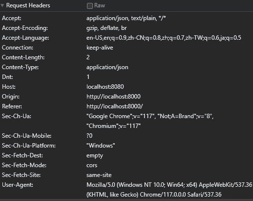
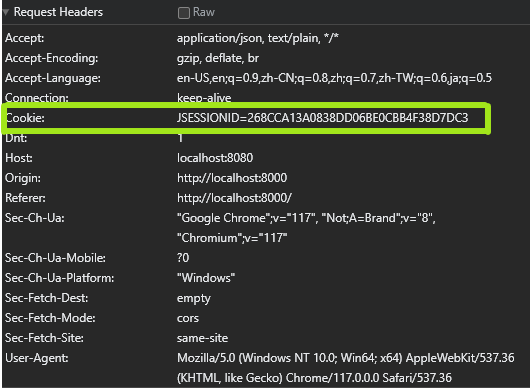
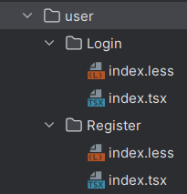

# Second Live Session - Frontend Login

## Tasks:

1. Optimize frontend template (remove unnecessary files)
2. Develop frontend login/registration page and functionality
3. Design intelligent analysis business process
4. Develop intelligent analysis features
   1. Excel data processing
   2. File upload
   3. AI website
5. Develop chart management functionality


# 1. Frontend Project Slimming

## 1.1 Project File Slimming & Purpose

1. **.husky**: Checks if the code is standardized when committing code.
2. **config**: Configuration files.
   1. `config.ts`: Global configuration file.
   2. `xxxConfig`: Environment-specific configuration files.
   3. (Remove) `openapi.json`: Code example.
   4. `proxy.ts`: Proxy configuration for local development.
   5. `routes.ts`: Route configuration, mapping URLs to pages.
3. (Remove) **mock**: Mock data (as we have a local backend).
4. **public**:
   1. (Remove) **icon**: Built-in icons.
   2. **scripts**: Keep (though unsure of their purpose).
   3. (Remove) `pro_icon.svg`.
   4. (Remove/Replace) `logo.svg` and `favicon.ico`.
5. **src**:
   1. **.umi**: Framework's built-in files.
   2. **components**: Components, main development focus.
   3. (Remove) **locales**: Internationalization components.
   4. **pages**: UI pages, main development focus.
      1. (Remove) `User/Login/__snapshots__` and `login.test.tsx`.
   5. **services**:
      1. `ant_design_pro`: Default template, delete last (due to early project dependency on ant design code).
      2. `bi_front`: Our actual template.
      3. (Remove) `swagger`: Basic built-in template.
   6. `access.ts`: Controls page access permissions.
   7. `app.tsx`: Framework file.
   8. `global.less`: Global styles.
   9. `global.tsx`: Global styles.
   10. (Remove) `manifest.json`: App development configuration file, packaging file.
   11. `requestErrorConfig.ts`: Controls sending of frontend requests and error handling.
   12. `service-worker.js`: Optimizes experience when offline (H5).
   13. `typing.d.ts`: typescript, type checks
6. (Remove) **tests**: Built-in test files.
7. (Remove) **types**: Test-related directory, completely unused.
8. `editorConfig` related, `eslint` related, `prettier` related, `stylelint` related (not currently introduced). These are for frontend code standards. To enable prettier formatting: Settings -> search for `prettier` -> Ctrl + Alt + L to auto-format code.
9. (Remove) `jest.config.ts`: Frontend UI unit testing framework (typically used only for large-scale projects).
10. `jsconfig.json`: Code syntax standards.
11. `package.json`: Framework scripts.
    1. `dev`: Starts the project with our developed backend. **For daily development use.**
    2. `start`: Starts the project with mock data from the `mock` file. Do not use "start" when there is a local backend.
12. `pnpm-lock.yaml`.
13. `README`: Project introduction document.


## 1.2 Customization

### 1.2.1 Replace Icons:

1. Find icons you like on an icon website such as iconfont.
2. Download the `.svg` images.
3. Move the downloaded `.svg` images to the `public` directory.
4. Replace the original logos with the downloaded images.


### 1.2.2 Replace Browser Window Icon

1. Download a `.png` image.
2. Convert the `.png` image to `favicon.ico` online.
3. Replace the original logo with the downloaded image.


### 1.2.3 Replace Website Title

1. Globally replace "Ant Design Pro" and "Ant Design" (Ctrl + Shift + R).
2. Replace all.


# 2. Develop Login/Registration Page

## 2.0 Start the Project

`package.json/dev`: Start the project with our custom backend data using `dev`.

> `package.json/start`: Start the project with mock backend data.


## 2.1 Simplify the Page

Remove the `Lang` international language selection component.

```tsx
const Lang = () => {
    ...
}

</Lang>
```

Remove the `mobile` mobile login-related component.

```tsx
'mobile'
```

Remove the `autoLogin` auto-login related component.

```tsx
'autoLogin'
"Forgot Password"
```

Remove the built-in error status display.

```tsx
const { status, type: loginType } = userLoginState;
...
{status === 'error' ...(
    <LoginMessage ... />
)}
```

Remove unused methods such as `ActionIcons`, `LoginMessage`.

Remove the unnecessary `userLoginState` related code:

```tsx
const [userLoginState, setUserLoginState] = useState<API.LoginResult>({});
```


## 2.2 Modify Minor Features

Update `title`, `subtitle`, placeholders, etc.

Add redirect links, such as the registration page redirect.


### 2.2.1 Display Avatar and Username

Prepare some avatars and copy their URLs.

Update the `userAvatar` data in the backend database and commit.

In the frontend `app.tsx`, modify the `avatar` to use our `userAvatar`.

```tsx
{src: initialState?.currentUser?.userAvatar,}
```

In `src/components/RightContent/avatarDropdown.tsx`, replace all instances of `name` with `userName`.


In `Login/index.tsx`, find the `setInitialState` error and change `userInfo` to `userInfo.data`.

```tsx
if (userInfo) {
    flushSync(() => {
        setInitialState((s) => ({
            ...s,
            currentUser: userInfo.data,
        }));
    });
}
```


### 2.2.2 Modify Text on the Login Button

Add `submitter` to `<LoginForm>`.

```tsx
<LoginForm
    submitter={{
        searchConfig: {
            submitText: 'Login'
        }
    }}
    ...
</LoginForm>
```


## 2.3 Develop Login Page

### 2.3.1 Modify Transmitted Parameters

Use the backend API documentation at http://localhost:8080/api/doc.html -> `user-controller` -> `POST userLogin` to understand the parameters to be transmitted.

```json
{
    "userAccount": "nick",
    "userPassword": "12345678"
}
```

In the frontend, locate the `<ProFormText>` form. This is used to define the input (input field) parameter names, which must match the backend parameter names `userAccount` and `userPassword`.

```tsx
<ProFormText
    name="userAccount"
    ...
</ProFormText>
    
<ProFormText.Password
    name="userPassword"
    ...
</ProFormText.Password>
```

Update the TypeScript type for the parameters being sent to the backend to use `API.UserLoginRequest` from the backend, ensuring they match.

```tsx
onFinish={async (values) => {
    await handleSubmit(values as API.UserLoginRequest);
}}
```

In the `handleSubmit()` method, update the parameter type to use `API.UserLoginRequest` from the backend.

```tsx
const handleSubmit = async (values: API.UserLoginRequest) => {
    ...
}
```


### 2.3.2 Update the `handleSubmit` Submit Method

```tsx
const handleSubmit = async (values: API.UserLoginRequest) => {
    try {
        // userLoginUsingPOST is an openAPI generated interface for communicating with the backend,
        // similar to our backend's userLogin interface.
        // values contains userAccount and userPassword.
        const res = await userLoginUsingPOST(values); 
        if (res.code === 0) {  // If the response code is 0, the login is successful.
            const defaultLoginSuccessMessage = 'Login successful!';
            message.success(defaultLoginSuccessMessage);
            await fetchUserInfo();  // Fetch current user information.
            const urlParams = new URL(window.location.href).searchParams;  // Get the URL before login.
            history.push(urlParams.get('redirect') || '/');  // Redirect back to the previous page.
            return;
        } else {
            message.error(res.message);  // Display error message.
        }
    } catch (error) {  // Catch exceptions.
        const defaultLoginFailureMessage = 'Login failed, please try again!';
        console.log(error);
        message.error(defaultLoginFailureMessage);
    }
};
```


### 2.3.3 Update `fetchUserInfo` to Fetch Login Information

```tsx
const fetchUserInfo = async () => {
    const userInfo = await getLoginUserUsingGET();  // openAPI generated interface, similar to our backend's getLoginUser interface.
    if (userInfo) {
        flushSync(() => {
            setInitialState((s) => ({  // Set the initial state to store the logged-in user's information in the frontend.
                ...s,
                currentUser: userInfo,
            }));
        });
    }
};
```

`setInitialState` sets an `Initial State`, which contains information about the logged-in user (such as which user, what information they have, if they are an admin, etc.). This represents the global state/variables for the entire frontend, allowing user information to be shared across multiple components.

Update the `getInitialState` method in `app.tsx`.

```tsx
export async function getInitialState(): Promise<{  // Method to fetch the global state.
    currentUser?: API.LoginUserVO;                 // Global state parameter.
}> {
    const fetchUserInfo = async () => {             // Method to fetch user login information.
        try {
            const res = await getLoginUserUsingGET();  // Use our custom method to fetch user login information.
            return res.data;                       // Return the information.
        } catch (error) {
            history.push(loginPath);
        }
        return undefined;
    };
    // If not on the login page, the user has already logged in.
    const { location } = history;
    if (location.pathname !== loginPath) {
        const currentUser = await fetchUserInfo();  // Fetch the current login information.
        return {
            currentUser,    // If the user is already logged in, set the global state to the current user.
        };
    }
    return {};  // If the user is not logged in, return an empty global state, indicating no user.
}
```


### 2.3.4 Testing

First, insert a user into the backend database with `accountName`, `accountPassword`, and `userName`.

In the browser, enter `userAccount: nick` and `userPassword: 12345678`. Log in.

You should successfully log in.


### 2.3.5 Modify Global Request Configuration

#### Error: Unable to Log In (No Cookies)

**Error Cause:** Successfully logged in but still on the login page.

**Expected Result:** Enter the functional page.

**Error Details:** F12 -> Network -> Refresh the page -> `login?token`.

- The request URL `http://localhost8080/...?token%20=%20123` contains a strange token `%20=%20123`.
- The request header for `login%token%20=20123` does not include cookies, indicating that the frontend is not passing cookies to the backend.

  

> **Error Analysis:** The frontend uses cookies to inform the backend which device and client sent the request, allowing the backend to return the correct data. Without sending cookies, the backend cannot determine which user is making the request, so it returns empty information, resulting in the frontend not receiving the user's login information.


**Solution for Cookies:** Modify the frontend's global request configuration.

In `app.tsx` -> `request` at the bottom -> Add `withCredentials: true;`

```tsx
export const request = {
    ...
    withCredentials: true,
}
```



**Solution for Token:** Request Interceptor

In `app.tsx` -> `request` at the bottom -> Locate the `errorConfig` method (which contains a request interceptor).

```tsx
export const request = {
    baseURL: "http://localhost:8080",
    withCredentials: true,
    ...errorConfig,  // <--- Here
};
```

In `requestErrorConfig.ts`, comment out the request interceptor and return the config directly.

```tsx
// Request interceptor
requestInterceptors: [
    (config: RequestOptions) => {
        // const url = config?.url?.concat('?token=123');  // <-- Here
        // return { ...config, url };                      // <-- Here
        return config;
    },
],
```

Use Shift + F6 to globally replace and rename the `requestErrorConfig.ts` file to `requestConfig.ts`.


## 2.4 Registration Page

Launch backend use "debug" mode from IDE

Launch frontend use  `sratr:dev` 

Try to login in using `validaccount` and `mypassword123`


### 2.4.1 Add Registration Page

1. Locate `src/pages/user/Login`. (you can go to `config.routes.ts` to check used routers)

2. Copy `src/pages/user/Login` to the current directory of `Login`, naming it `Register`.



3. In `Register/index.tsx`, use Ctrl+F to rename all component instances of `Login` to `Register` (excluding variable names).

```tsx
const Register: React.FC = () => {
    ...
}
export default Register;
```

> Ensure each page has a unique name to avoid confusion during future modifications.

4. Remove any unused imports.


### 2.4.2 Add Routing

Add a route for `Register` in `config/routes.ts`.

```tsx
{
    path: '/user',
    layout: false,
    routes: [
        { name: 'login', path: '/user/login', component: './user/Login' },
        { name: 'register', path: '/user/register', component: './user/Register' },
        { component: './404' },
    ],
}
```

> We are using `react router` to associate URLs with our page components. When a user visits a certain address, for example, `localhost:8000/user/register`, it specifies the location of a component we've written, such as `user/register`, which will be found under the user configuration directory.

Press `ctrl + alt + l` for quick formatting.


### 2.4.3 Optimize Framework (Fix Redirection Error)

It seems that accessing the `localhost:8000/user/register` page is still not working correctly. The issue might be due to directly copying the login logic, which forcefully redirects users to the login page.

#### Investigation 1 - `Login` Logic:

1. In `Register/index.tsx`, comment out the main logic inside `const Register: React.FC = () => {..}` and `return`.

```tsx
const Register: React.FC = () => {
    // const [userLoginState, setUserLoginState] = useState<API.LoginResult>({});
    // ...
    // const { status, type: loginType } = userLoginState;
    return (
        // ...
    )
}
```

2. Comment out the logic inside `<LoginForm`.

```tsx
<div className={styles.content}>
    {/*<LoginForm*/}
        ...
    {/*</LoginForm>*/}
</div>
```

3. Try accessing `localhost:8000/user/register`. If it still doesn't work, proceed to the next step.


#### Investigation 2 - `app.tsx`

Insert `alert(1)` in strategic locations in `app.tsx` to identify problematic logic.

```tsx
export async function getInitialState(): Promise<{
    ...
}> {
    alert(1);
    const fetchUserInfo = async () => {
        try {
            ...
        }
    };
```

Using "F5" to refresh pages, If the alert shows up "1", it indicates that this logic executes upon accessing the login page. 

Then remove `alert(1)`.

The issue with being forcefully redirected to the `/user/login` page might be related to the definition of a constant type in `app.tsx`, specifically `loginPath`, which points to `/user/login`.

```tsx
const loginPath = '/user/login';
```

Search for `loginPath` using `ctrl + f` to see all its occurrences. It seems that `history.push(loginPath);` is being used.

Disabling Automatic Redirect to Login Page by Commenting Out `history.push(loginPath)`

> `loginPath`  inside the `history.push(loginPath)`, which mean redirect to `user.Login` - the login pages.

You can also test whether `onPageChange` is being executed by adding `alert(1)` nearby (and then removing it). 

> The test result for `alert(1)`: It triggers every time a page is changed.
>
> `onPageChange` logic executes every time a page is changed. It checks the user's status and if not logged in, redirects to `user/Login`.

```tex
onPageChange: () => {
    alert(1);
    ...
    if (...) {
        history.push(loginPath);
    }
},
```


#### Solution

**For the first `push(loginPath)`**

Comment out the first `history.push(loginPath);`.

```tsx
const fetchUserInfo = async () => {
	...
    } catch (error) {
        // history.push(loginPath);
    }
};
```

**For the second `push(loginPath)`**

Locate the `history.push(loginPath)` code within `onPageChange: () => {...}`.

Create a whitelist `whiteList`, which allows access to certain pages without logging in, such as `Register` and the default `loginPath`.

```tsx
onPageChange: () => {
    const { location } = history;
    const whiteList = ['/user/register', loginPath];
    if(whiteList.includes(location.pathname)){
        return;
    }
    // Redirect to login if not logged in
    if (!initialState?.currentUser && location.pathname !== loginPath) {
        history.push(loginPath);
    }
```

>If the user is accessing a page on the whitelist, just `return` without redirection. Otherwise, if the user is not logged in, they will be redirected to the `Login` page.


#### Why the Forceful Redirection?

This behavior occurs because `app.tsx` is a global file for our frontend project, defining the logic to execute when entering a page.

Since this framework leans more towards backend management systems, it checks the user's login status on every page. If the user is not logged in, they are redirected to the login page.


### 2.4.4 Implement Registration Functionality

Restore all previously commented-out code in `Register/index.tsx`.


#### Remove Unnecessary Features

1. Remove the `fetchUserInfo` function and related code.

```tsx
const { initialState, setInitialState } = ...;

const fetchUserInfo = async () => {
    const userInfo ...
    if ...
};
    
...
await fetchUserInfo();
```

2. Remove the auto-login checkbox.

```tsx
<ProFormCheckbox noStyle name="autoLogin">
    <FormattedMessage ... />
</ProFormCheckbox>
```

3. Remove the "Forgot password" link.

```tsx
<div style={{ marginBottom: 24 }}>
    <a>
        <FormattedMessage ... = "Forgot password?" />
    </a>
</div>
```


#### Modify Text Content

1. Change "账号密码登录" to "注册" in `<LoginForm>`.

2. Adjust other text content as needed:

**Type 1:**

```tsx
anyName={intl.formatMessage({
    id: 'pages.login.accountLogin.tab',
    defaultMessage: "Register Account",
})}
```

Change to:

```tsx
[Name]={"[content]"}  
// for example:
tab={"Register Account"}
```

**Type 2:**

```tsx
message: (
    <FormattedMessage
        id="pages.login.password.required"
        defaultMessage="Please enter Password!"
    />
),
```

Change to:

```tsx
message: 'Please enter Password',
```


#### Error - 'Register' button text error

Solution:

Press `ctrl + b` (once) to enter the `LoginForm` source code `index.d.ts`.

On the left side, navigate to `project` to display the current document location.


Currently in `LoginForm.index.d.js`. Then navigate to the following `index.js` -> press `ctrl + f` to search for the keyword "登录" (login) -> find the following:

```js
var submitter = proFormProps...({
    searchConfig: {
        submitText: intl.getMessage('loginForm.submitText', '登录')
    },
```

> We can see the structure is `submitter` -> `searchConfig`: -> `submitText`.

We can modify the display text by modifying the submission text `submitText`.

Go back to `Register.index.tsx` and add the following code inside `<LoginForm>`.

```tsx
<LoginForm
    submitter={{
        searchConfig: {
            submitText: 'Register'
        }
    }}
    logo=...
    title=...
    ...
```


#### Implementation of User Input Fields

Find the HTML password input box `<ProFromText.Password`, and copy it, then change it to a "Confirm Password" input box.

- Modify the `name`.
- Modify the `placeholder`.

```tsx
<ProFormText.Password
    name="confirmPassword"
```

> Registration requires three user inputs: account, password, and confirm password.

Use `ctrl + f` to replace all instances of "登录" (login) with "注册" (register), including display and comments.


#### Implementation of Registration Submission Logic

##### Define Registration Parameters

In `Register.index.tsx`, find `onFinish`.

```tsx
onFinish={async (values) => {
    await handleSubmit(values as API.UserLoginRequest);
}}
```

> When the page is submitted, trigger the method inside `onFinish`.

Navigate to `UserLoginRequest`, copy 

```tsx
type UserLoginRequest = {
    userAccount?: string;
    userPassword?: string;
  };
```

and duplicate it as `UserRegisterRequest`.

```tsx
type UserRegisterRequest = {
    userAccount?: string;
    userPassword?: string;
    confirmPassword?: string;
};
```

> `[name]?: string;` The `?` indicates that the property is optional.

In `Register.index.tsx`, using ctrl + F,  to replace all occurrences of `UserLoginRequest` with `UserRegisterRequest`. Two total: 

```tsx
const handleSubmit = async (values: API.RegisterParams) => {
	try {...}
}

return (
...
onFinish={async (values) => {
    await handleSubmit(values as API.RegisterParams);
          }}
...
```


##### Implement Password Validation

At the beginning of the method, extract parameters into `values` for ease of use.

```tsx
const handleSubmit = async (values: API.RegisterParams) => {
    const {userPassword, confirmPassword} = values;
    ...
```

Add the following validation to check if `Password` matches `confirmPassword`.

```tsx
const handleSubmit = async (values: API.RegisterParams) => {
    const {userPassword, confirmPassword} = values;
    // verify
    if(userPassword !== confirmPassword){
        message.error('Password and Confirm Password not match!');
        return;
    }
    ...
```


##### Implementation of Registration Logic

```tsx
try {
    // Register
    const res = await userLoginUsingPOST(values);  // <--- Here
```

Press `ctrl + b` to navigate to `userLoginUsingPOST`, and go to `userController.ts`.

> `api.ts` defines functions for all requests sent to the backend. Typically, these are direct requests without business logic.

Copy the `userLoginUsingPOST` code and rename it to `userRegisterUsingPOST`. Modify the input parameters `body: API.UserRegisterRequest` and the `API.BaseResponse` parameter `'/api/user/register'`. Confirm the API name in the backend `controller.UserController`.

> (If it already exists, skip this step)

```tsx
export async function userRegisterUsingPOST(
  body: API.UserRegisterRequest,     		// <-- Here
  options?: { [key: string]: any },
) {
  return request<API.BaseResponseLong_>('/api/user/register', {    // <-- Here
    method: 'POST',
    headers: {
      'Content-Type': 'application/json',
    },
    data: body,
    ...(options || {}),
  });
}
```

> Press `ctrl + b` to navigate to `API.LoginResult`.
>
> Copy the `type LoginResult = {...}` code and rename it to `RegisterResult`.
>
> Modify the parameters to:
>
> ```tsx
> type RegisterResult = number;
> ```
>
> Confirm from the backend `service.UserService` that `Register` returns just a Long type user ID, not an object (including ID). So, directly use `=string` to receive it.
>
> 
>
> Back in `api.ts`, modify it to the newly created `<API.RegisterResult>`.


Back to `Register/index.tsx`, modify variable name (id) and method (register).

```tsx
try {
    // Register
    const id = await userRegisterUsingPOST(values);
```

> Resolve errors step by step.


##### Applying the New Registration Logic

```tsx
try {
    // Register
    const id = await userRegisterUsingPOST({ ...values });
    if (id) {
        const defaultRegisterSuccessMessage = 'Register successful!';
        message.success(defaultRegisterSuccessMessage);
        history.push('/user/login');
        return;
    }
    // else {
    //   message.error(id.message);
    // }
} catch (error) {
    const defaultRegisterFailureMessage = 'Register failed, please try again!';
    console.log(error);
    message.error(defaultRegisterFailureMessage);
}
```


##### (Deleting Unnecessary Code)

Delete `LoginMessage` related.

```tsx
const LoginMessage: React.FC<{
    content: string;
}> = ({ content }) => (
    <Alert
        style={{
            marginBottom: 24,
        }}
        message={content}
        type="error"
        showIcon
        />
);
```

Delete `login state` related.

```tsx
const [userLoginState, setUserLoginState] = useState<API.LoginResult>({});
...
const { status, type: loginType } = userLoginState;
```

Delete `login error` related.

```tsx
{status === 'error' && loginType === 'account' && (
    <LoginMessage
        content={intl.formatMessage({
            id: 'pages.login.accountLogin.errorMessage',
            defaultMessage: 'Incorrect username/password!',
        })}
        />
)}
```

Delete unused `import` statements. (Use `ctrl + alt + o` to remove all unused imports)


##### Adding Page Navigation 

##### Error - No Available 'button' Presets

Since the entire login form is pre-set, it's difficult to copy a login 'button' separately for registration redirection.

Solution: Use Ant Design's `<Space>` spacing separator.

[Space - Ant Design](https://ant.design/components/space#components-space-demo-split)

**Register -> Login**

Go to `Login/index.tsx`. Add between `</LoginForm>` at the bottom:

`<Space ...>` and `<Link ...>`

```tsx
<div
    style={{
        marginBottom: 24,
    }}
>
    <Space size={[1, 1]} wrap split={<Divider type="vertical" />}>
        <ProFormCheckbox noStyle name="autoLogin">
            <FormattedMessage ..."Remember me" />
        </ProFormCheckbox>

        <Link to={"/user/register"}>Sign up </Link>

        <a
            style={{
                float: 'right',
            }}
            href={LinkedIn_contact}
            target="_blank"
            rel="noreferrer"
            >
            <FormattedMessage ..."Forgot password?" />
        </a>
    </Space>
</div>
```

```tsx
<Space size={[1, 1]}...
// explanation: 
<Space size={[0~1 column width add on, not-important]}...
```


**Adding Registration -> Login Page Navigation** 

Go to `Register/index.tsx`. Add above `</LoginForm>`:

`<Space ...>` and `<Link ...>`

```tsx
...    
	<div
        style={{marginBottom: 24,}}
        >
        <Space size={[1, 1]} wrap split={<Divider type={"vertical"} />}>
            <Link to={"/user/login"}>Go to Login </Link>
        </Space>
    </div>
</LoginForm>
```


### 2.4.5 Testing Login Functionality

Set a breakpoint in the backend `UserController`.

```java
// define the Three argument we are receiving
String userAccount = userRegisterRequest.getUserAccount();
String userPassword = userRegisterRequest.getUserPassword();
String confirmPassword = userRegisterRequest.getConfirmPassword();
```

Go to frontend `src.app.tsx`, increase the `timeout`. e.g., 10,000,000, originally 10,000.

Try registering accounts.

1. `test1`, password `123456789`.

2. `test2`, password `123456789`.

Try two passwords not matching.

Try registering correctly.

Press F8 for next step. F9 to finish all.

Upon successful registration, <u>display a success message, </u>redirect to `user/login`, and return the user id:


Try registering with an existing username. (`response` will be -1)

Go to frontend `src.app.tsx`, set `timeout` back to 10000.


#### Error - Return Address `redirect=undefined`

But the return is `/user/login?redirect=undefined`. **redirect=undefined**.

Indicating the user didn't use the `redirect` parameter.

Solution:

Press `ctrl + b` to navigate to `history.push` of `push`. Then enter `push(location: LocationDescriptorObject...` of `LocationDescriptorObject`. It's found that we can pass the `redirect` address parameter using the built-in method.

Delete `const { redirect }`.

Add `history.push({...});` with parameters.

```tsx
if (!history) return;
const { query } = history.location;
history.push({
    pathname: '/user/login',
    query,
});
```


# Others

## Redis

https://articles.zsxq.com/id_kpjct36urrzf.html

Redis is an in-memory Key/Value database suitable for systems with extremely frequent user information retrieval. Redis has high read and write performance based on memory, achieving qps (query per second) 50k ~ 100k. For example: online shopping - check user account every time they pouched items.


## Install Redis  

[Redis Doc](https://redis.io/docs/getting-started/installation/install-redis-on-windows/) 

Redis default port 6379 

To enable Redis service -> win + R -> services.msc
