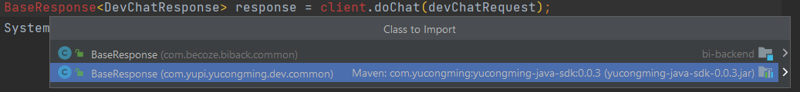
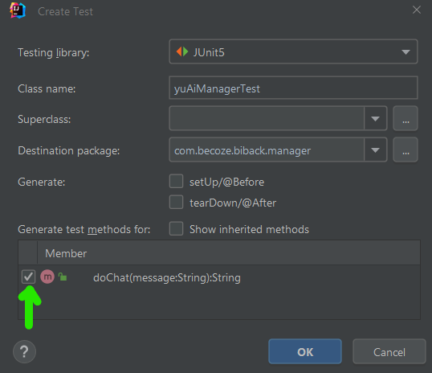
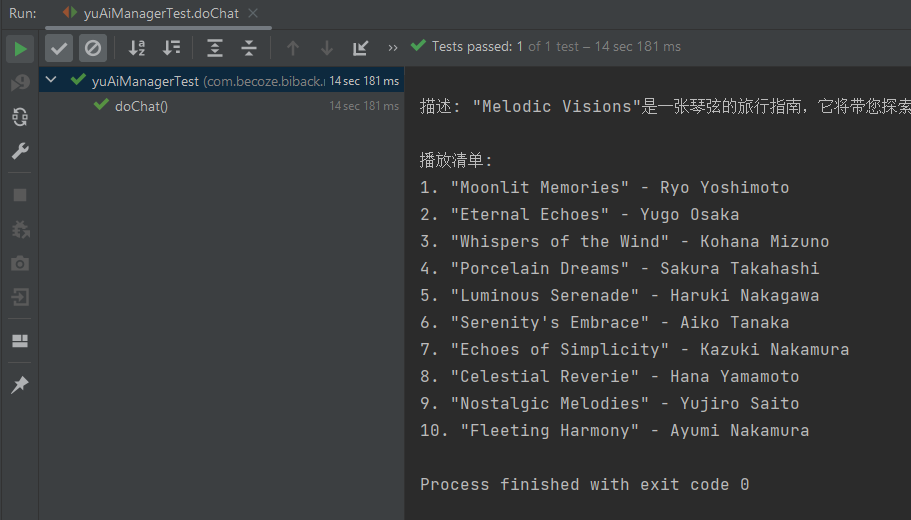
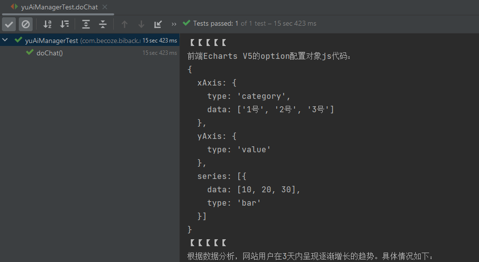
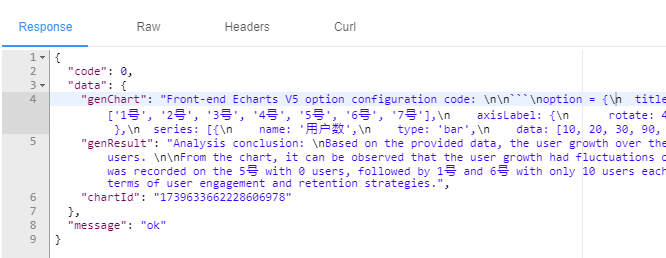
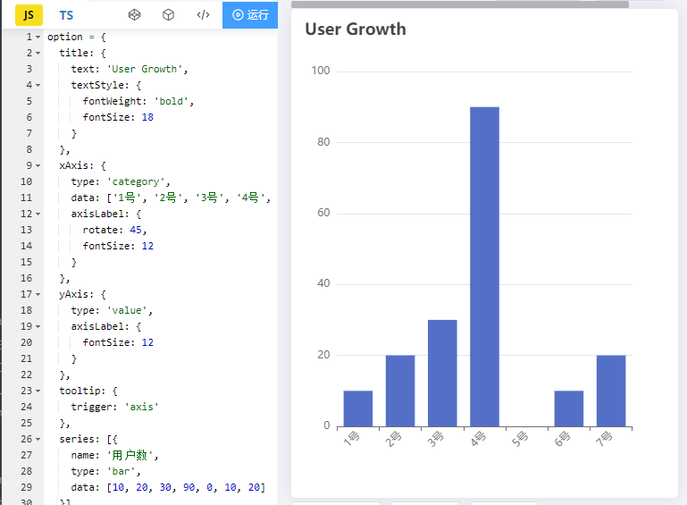
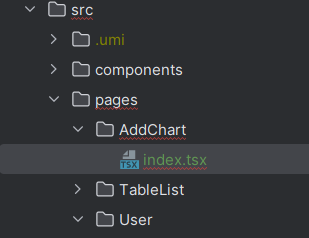
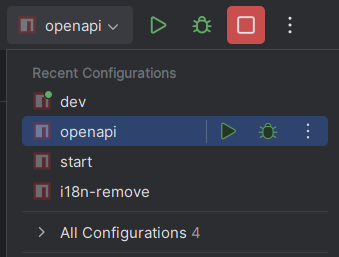
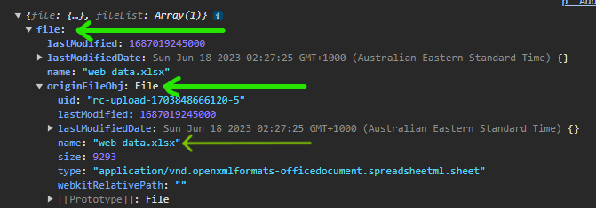
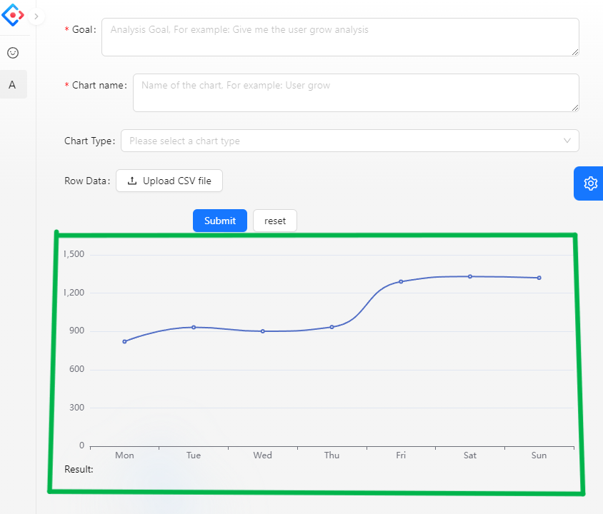

# 1. Backend - Implementation of Basic Business Logic

## 1.1 Design Business Process

1. User Input

   1. Analysis goal
   2. Upload raw data (excel)
   3. Control the generated charts, such as chart type, chart name, etc.

2. Backend Validation

   1. Validate user input, such as length.
   2. Cost control, including validation of frequency and authentication.

   > Importance of Cost Control: Given the system's limited capacity and the cost of providing services, cost control is necessary.

3. Call AI Interface: Input the processed data into the AI model. The AI returns chart information and conclusion text.

4. Display the charts and text returned by the AI.


## 1.2 Obtain User Input

### 1.2.1 Add New Fields to Database

#### Modify Database

Go to `sql/create_table.sql` and modify the `chart` table creation statement.

Add `name`

```sql
create table if not exists chart
(
    ...
    goal		 ...
    `name`       varchar(128) null comment 'Chart name',
) comment 'chart' collate = utf8mb4_unicode_ci;
```

> The table creation statement will not be applied to the existing database; modifying the table creation statement is only for archiving.

Go to Database -> Right-click on the `chart` table -> "Modify Table (Old UI)" -> Add a new SQL -> Modify the SQL script as follows -> Then `execute`

```sql
alter table chart
    add `name`       varchar(128) null comment 'Chart name';
```

In Database -> The `chart` table -> Scroll to the end to see a new column `name`.


#### Add New Field

Add the new field `name` to following :

- `model/entity/Chart.java`

- all `ChartxxxRequest` files in `model/dto/chart`.

```java
/**
* Name
*/
private String name;
```


In `resources/mapper/ChartMapper.xml`, add the new field in `BaseResultMap` and `Base_Column_List`

```java
<resultMap id="BaseResultMap" type="..">
    ...
    <result property="name" column="name" jdbcType="VARCHAR"/>
    ...
</resultMap>

<sql id="Base_Column_List">
    ...`name`...
</sql>
```


In `controller/ChartController`, add a new query condition in `getQueryWrapper`.

```java
// Query parameters
...
String goal = ...;
String name = chartQueryRequest.getName();
...
    
// Build query conditions
...
queryWrapper.eq(...
queryWrapper.like(StringUtils.isNotBlank(name), "name", name);
...
```

> `.like()` performs a fuzzy query, meaning it checks for "similar" `name`.


### 1.2.2 Configure `GenChartByYuAiRequest`

Copy `model/dto/file/UploadFileRequest` and paste it into `model/dto/chart`, and name it `GenChartByYuAiRequest`.

Configure the request with: `name`, `goal`, `chartType`.

```java
@Data
public class GenChartByYuAiRequest implements Serializable {
    /**
     * Name
     */
    private String name;

    /**
     * User Goal
     */
    private String goal;

    /**
     * Chart Type
     */
    private String chartType;
    ...
}
```


### 1.2.3 Implement `ChartController` Interface

#### Initialization

Go to `controller/file/Controller` and copy the `uploadFile` method.

Paste it into `controller/ChartController`.

Rename the method to `genChartByAi` and the parameter to `GenChartByYuAiRequest`.

```java
public BaseResponse<String> genChartByAi(@RequestPart("file") MultipartFile multipartFile, GenChartByYuAiRequest genChartByYuAiRequest, HttpServletRequest request) {
```


#### Excel

Create `ExcelUtils.java` under `utils`. (Using template) 

> Testing:
>
> You can write a `main` method in the current `Util` class to experiment with `excelToCsv()` method.
>
> ```java
> public class ExcelUtils {
>      public static String excelToCsv(MultipartFile multipartFile){
>      ...    
>      }
> 
>      public static void main(String[] args) {
>          excelToCsv(null); // <-- Testing
>      }
> }
> ```

 

After removing unnecessary code, the final effect should be:

```java
@Slf4j
public class ExcelUtils {
    /**
     * Excel to CSV
     * @param multipartFile
     * @return
     */
    public static String excelToCsv(MultipartFile multipartFile) {
        // gather input data
        List<Map<Integer, String>> list = null;
        // receive "multipartFile"
        try {
            list = EasyExcel.read(multipartFile.getInputStream())
                    .excelType(ExcelTypeEnum.XLSX)
                    .sheet()
                    .headRowNumber(0)
                    .doReadSync();
        } catch (IOException e) {
            // Slf4j Exception
            log.error("Excel to CSV error!", e);
        }
        if (CollUtil.isEmpty(list)) {
            return "";
        }

        // Convert to csv
        StringBuilder stringBuilder = new StringBuilder();
        // read table header
        LinkedHashMap<Integer, String> headerMap = (LinkedHashMap) list.get(0);
        // remove null cells (not empty cell)
        List<String> headerList = headerMap.values().stream().filter(ObjectUtils::isNotEmpty).collect(Collectors.toList());
        stringBuilder.append(StringUtils.join(headerList, ",")).append("\n");

        // read table content 
        for (int i = 1; i < list.size(); i++) {
            LinkedHashMap<Integer, String> dataMap = (LinkedHashMap) list.get(i);
            List<String> dataList = dataMap.values().stream().filter(ObjectUtils::isNotEmpty).collect(Collectors.toList());
            stringBuilder.append(StringUtils.join(dataList, ",")).append("\n");
        }
        return stringBuilder.toString();
    }
}
```


### 1.2.4 Compress Data

Why compress data and a Example: 

Iteration 1: Original Data

> First row: Date: 1st, Users: 10
> Second row: Date: 2nd, Users: 20
> Third row: Date: 3rd, Users: 30

Iteration 2:

> Header: Date, Users
> 1st, 10
> 2nd, 20
> 3rd, 30

Iteration 3: (Not applicable for large data)

> Dates 1st-3rd, users are 10/20/30 respectively.


### 1.2.5 Use `ExcelUntil` in `ChartController`

Go to `controller/Controller`. Add `Excel` to use `excelToCsv`. Comment out all the code under `// Excel` just for now.

```java
// authentication
...
ThrowUtils.throwIf(...

// Excel
String res = ExcelUtils.excelToCsv(multipartFile);
return ResultUtils.success(res);
                   
//        User loginUser = userService.getLoginUser(request);
//        // File directory: divided by business and user
//        ..
//        try {
//            ...
//        }...
```

> Commenting out the code is to directly return the file first, then use the test front end to receive and display it. Then open the business `try-catch`.


### 1.2.6 Testing

Go to `ChartController` and set breakpoints.

```java
// gather user input
String name = genChartByYuAiRequest.getName();  // <-- BreakPoint Here
...

// Excel
String res = ExcelUtils.excelToCsv(multipartFile);  // <-- BreakPoint Here
return ResultUtils.success(res);
```


Use the web frontend to log in to the account.

Open the Swagger API documentation at `http://localhost:8080/api/doc.html#/` and navigate to `chart-controller/genChartByAi`.

Send a request with following information:


Next step (F8) until...

Press F7 to step into `ExcelUtil.java` execution.

```java
...
String res = ExcelUtils.excelToCsv(multipartFile);  // <-- F7 Here
return ...
```


Expected Test Results:


Swagger API should return information with "data" and "message" fields containing content.

```java
{
  "code": 0,
  "data": "Date,Users\n1,10\n2,20\n3,30\n4,90\n5,0\n6,10\n7,20\n",
  "message": "ok"
}
```


### 1.2.7 Concatenate AI Data

In `ChartController.java`, manually concatenate system preset text with AI data: system preset + analysis goal + (compressed) data.

```java 
StringBuilder userInput = new StringBuilder();
userInput.append("You need to use ").append(chartType).append("xxx");
```


### 1.2.8 Design AI Model

```bash
You are a data analyst and frontend development expert. I will provide content in the following fixed format:
Analysis Requirement:
The need or goal for data analysis
Raw Data:
{raw data in CSV format, separated by commas}
Based on these two parts, generate content in the specified format below (do not include any additional headers, footers, or comments):
【【【【【
The JSON code for the front-end Echarts V5 option configuration object, properly visualizing the data without generating any extra content such as comments}
【【【【【
{clear and detailed data analysis conclusions without generating extra comments}
```

> AI cannot directly generate ready-made charts, but AI can generate chart code. Using the frontend component library (Echarts), these generated chart codes can be displayed on the web.


# 2. Backend Integration with AI (Other AI)

## 2.1 Calling AI

> Log in to YuCongMing at https://www.yucongming.com/ -> Go to the "Smart Q&A" page -> Click on the account avatar -> "Open Platform" -> Java Open Platform -> Follow the official documentation


### 2.1.1 Introduce SDK

```java
<dependency>
    <groupId>com.yucongming</groupId>
    <artifactId>yucongming-java-sdk</artifactId>
    <version>0.0.3</version>
</dependency>
```


### 2.1.2 Obtain Developer Key

> user profile 


### 2.1.3 Create Injection Object

Go to `application.yml` and add yuapi configuration

```yaml
yuapi:
  client:
    access-key: your-access-key
    secret-key: your-secret-key
```

Create `manager/AiManager.java` in the `manager` package

```java
@Service
public class YuAiManager {
    @Resource
    private YuCongMingClient yuCongMingClient;
    
}
```


### 2.1.4 Construct Request Parameters

```java
@Service
public class YuAiManager {
    ...
    public String doChat(String message){
        DevChatRequest devChatRequest = new DevChatRequest();
        devChatRequest.setModelId(000000000000000L);   // YuCongMing model ID
        devChatRequest.setMessage(message);
    }
}
```


### 2.1.5 Get Response Result

```java
BaseResponse<DevChatResponse> response = client.doChat(devChatRequest);
```

`BaseResponse` should be imported from the `cyucongming.dev.common` package.



Change `client` to our `yuCongMingClient`.

```java
BaseResponse<DevChatResponse> response = yuCongMingClient.doChat(devChatRequest);
```


### 2.1.6 Add Validation and Return Output

Final code

```java
public String doChat(String message){
    DevChatRequest devChatRequest = new DevChatRequest();
    devChatRequest.setModelId(000000000000000L);   // YuCongMing model ID
    devChatRequest.setMessage(message);

    BaseResponse<DevChatResponse> response = yuCongMingClient.doChat(devChatRequest);
    if(response == null){
        throw new BusinessException(ErrorCode.SYSTEM_ERROR, "AI response error");
    }
    return response.getData().getContent();
}
```


### 2.1.7 Additional

Add an extra parameter for model ID to allow choosing different AI models as needed, such as YuCongMing.

```java
public String doChat(long modelID, String message){
    ...
    devChatRequest.setModelId(modelID);   // YuCongMing model ID
    ...
}
```


## 2.2 Test AI Connection

### 2.2.1 Create Test Class

In `yuAiManager`, press alt + enter -> "Create Test" -> Select the `doChat` method -> OK




### Initialize Test Class

Add the `@SpringBootTest` annotation to enable the test class to load the necessary SpringBoot beans at runtime.

Instantiate the newly created `yuAiManager`.

```java
@SpringBootTest
class yuAiManagerTest {
    @Resource
    private yuAiManager yuAiManager;

    ...
}
```

Go to `yuAiManager.java` and use the AI model ID `1651468516836098050` for the "song recommender" to facilitate testing.


### Test `doChat`

```java
@Test
void doChat() {
    String res = yuAiManager.doChat("Mitsukiyo");
    System.out.println(res);
}
```

Run the current test class. It should return content similar to the following:




## 2.3 Test AI Model

Go to `yuAiManager.java` and use the AI model ID `1709156902984093697` for the "Intelligent BI" you have set.

Ensure the visibility of the yuBI model is set to "public."

Modify the `doChat` test class:

```java
@Test
void doChat() {
    String res = yuAiManager.doChat("Analysis Requirement: Analyze website user growth\n" +
        "Raw Data:\n" +
        "Date, Users\n" +
        "1st, 10\n" +
        "2nd, 20\n" +
        "3rd, 30\n");
    System.out.println(res);
}
```

Run the current test class. It should return content similar to the following:




# 3. Backend Implementation of AI Functionality

## 3.1 Develop AI Interface

Create the `VO (Value Object)` for `YuAiManager`

In `model.vo`, create a `YuAiResponse` to store the output results of `YuAiManager`.

```java
@Data
public class YuAiResponse {

    private String genChart;
    
    private String genResult;

}
```


Go to `ChartController.java`

Instantiate the `yuAiManager` method at the beginning of the method.

```java
@Resource
private YuAiManager yuAiManager;
```

1. Construct user request
2. Call the YuAi SDK to get the AI response
3. Process the AI output to extract the needed information
4. Save the "chart" code information

```java
@PostMapping("/gen")
public BaseResponse<YuAiResponse> genChartByYuAi(@RequestPart("file") MultipartFile multipartFile,
                                               genChartByYuAiRequest genChartByYuAiRequest, HttpServletRequest request) {
    // gather user input
    ...

    // authentication
    ..
    User loginUser = userService.getLoginUser(request); // gather information for logged-in user

    // AI, id of yuAi
    long biModelId = 1709156902984093697L;

    // User Input - goal, chart type, chart name
    StringBuilder userInput = new StringBuilder();
    userInput.append("Analysis goal: ").append(goal).append(". \n");
    // Use user chart type preference, or let AI decide
    if(StringUtils.isNotBlank(chartType)){
        userInput.append("Generate a ").append(chartType).append(" accordingly. \n");
    }else{
        userInput.append("Generate a most suitable chart").append(". \n");
    }
    userInput.append("Raw data: ").append("\n");
    String rawData = ExcelUtils.excelToCsv(multipartFile); // Excel content (raw data)
    userInput.append(rawData).append("\n");

    // Use AI gather response
    String aiResponse = yuAiManager.doChat(biModelId, userInput.toString());

    // AI Response check
    String[] splits = aiResponse.split("【【【【【");
    if(splits.length < 3){      // AI generate wrong format
        throw new BusinessException(ErrorCode.SYSTEM_ERROR, "AI Response Error");
    }

    // Splits and Keep response accordingly
    String genChart = splits[1].trim();
    String genResult = splits[2].trim();

    // Save data into database
    Chart chart = new Chart();
    chart.setName(name);
    chart.setGoal(goal);
    chart.setChartData(rawData);
    chart.setChartType(chartType);
    chart.setGenChart(genChart);
    chart.setGenResult(genResult);
    chart.setUserId(loginUser.getId());

    // Save chart
    boolean saveResult = chartService.save(chart);
    ThrowUtils.throwIf(!saveResult, ErrorCode.SYSTEM_ERROR, "Chart saving Error");

    YuAiResponse yuAiResponse = new YuAiResponse();
    yuAiResponse.setGenChart(genChart);
    yuAiResponse.setGenResult(genResult);
    yuAiResponse.setChartId(chart.getId());

    return ResultUtils.success(yuAiResponse);
}
```

> Note: modify response type of method `public BaseResponse<YuAiResponse>` to `YuAiResponse`。


## 3.2 Test AI Interface

Start the frontend and backend projects.

Log in to the account (also remember to turn on the accelerator).

Open the Swagger interface documentation at http://localhost:8080/api/doc.html#/home.

Navigate to `genChartByYuAi` -> Debug.


Enter the required information:

* file: "web data.xlsx"
* chartType: "bar Chart"
* goal: "detail analysis user growth"
* name: "User growth test 1"
* Send!

AI returns:



The database will also save everything. Put the generated code into [Echarts Online Debugging](https://echarts.apache.org/examples/en/editor.html?c=line-simple) to get:




# 4. Frontend Development of User Form Page

The page elements include:

* User input form
* Echarts chart display
* Text conclusion display


## 4.0 Simplify the Project (Again)

Delete the entire `services/ant-design-pro` folder and code.

> The browser reports an error `Can't resolve ... in '...\components\RightContent'` related to `components\RightContent`.

Therefore, locate `/components/RightContent/AvatarDropdown.tsx`.

* Remove the erroneous `import { outLogin }`
* Remove the erroneous `await outLogin`

> The browser now reports an error `Can't resolve ... in '...\pages\TableList'`.

Therefore, delete `TableList` and its route.

Finally, restart `dev`.


## 4.1 Create Route

frontend -> config/routes.ts

```tsx
{ path: '/welcome'...
{ path: '/add_chart', name: 'addChart', icon: '', component: './AddChart' },
```


## 4.2 Initialize Page Component

Go to `/pages/Login`, copy the entire `Login` page file, paste it into the `pages` directory, and name it `AddChart`.



Simplify the page by removing unnecessary functionalities.

```tsx
const containerClassName = useEmotionCss(() => {...});

const fetchUserInfo = async () => {...};
                                   
const handleSubmit = async (...) => { ... }
```

Remove all page elements from the `return()` except for `className`, and rename it to `add-chart`.

```tsx
return (
    <div className="add-chart">
      
    </div>
);
```

Go to the Ant Design Pro component website and find a ready-made page component: https://ant.design/components/form. Copy the code from `onFinish` and the `Form` into your file.


## 4.3 Develop the Page

Remove unnecessary code and modify or add necessary parts.

* `name="xxx"` must match the backend names, which are `goal`, `name`, and `chartType`.

Intermediate code:
```tsx
const onFinish = (values: any) => { 
	console.log('User Input ', values);
}

return (
    <div className="add-chart">
        <Form
            name="add-chart"
            onFinish={onFinish}
            initialValues={{  }}
            >

            <Form.Item name="goal" label="Goal" rules={[{ required: true, message: 'Please enter your analysis goal!' }]}>
                <TextArea placeholder = "Analysis Goal, For example: Give me the user grow analysis"/>
            </Form.Item>

            <Form.Item name="name" label="Chart name" rules={[{ required: true, message: 'Please give a me to the chart!' }]}>
                <TextArea placeholder = "Name of the chart, For example: User grow "/>
            </Form.Item>

            <ProFormSelect
                name="chartType"
                label="Chart Type"
                showSearch
                debounceTime={300}
                request={async () => {
                    return [
                        { value: '(Let ai deice)', label: '' },
                        { value: 'Bar Chart', label: 'Bar Chart' },
                        { value: 'Line Chart', label: 'Line Chart' },
                        { value: 'Pie Chart', label: 'Pie chart' },
                        { value: 'Scatter Plot', label: 'Scatter Plot' },
                        { value: 'Histogram', label: 'Histogram' },
                        { value: 'Radar Chart', label: 'Radar Chart' },
                        { value: 'Treemap', label: 'Treemap' },
                    ];
                }}
                placeholder="Please select a country"
                rules={[{ required: true, message: 'Please select your country!' }]}
                />


            <Form.Item
                name="file"
                label="Row Data"
                >
                <Upload name="file" >
                    <Button icon={<UploadOutlined />}>Upload CSV file</Button>
                </Upload>
            </Form.Item>


            <Form.Item wrapperCol={{ span: 12, offset: 6 }}>
                <Space>
                    <Button type="primary" htmlType="submit">
                        Submit
                    </Button>
                    <Button htmlType="reset">reset</Button>
                </Space>
            </Form.Item>
        </Form>
    </div>
);
```

> Old `chartType` component:
>
> ```tsx
> <Form.Item
>  name="chartType"
>  label="Chart Type"
>  >
>  < Select
>      placeholder="Please select a chart type"
>      options={[
>          {value: '(Let ai deice)', label: ''},
>          {value: 'Bar chart', label: 'Bar chart'},
>          {value: 'Line chart', label: 'Line chart'},
>          {value: 'Pie chart', label: 'Pie chart'},
>          {value: 'xxx', label: 'xxx'},
>          {value: 'yyy', label: 'yyy'},
>      ]}/>
> </Form.Item>
> ```


## 4.4 Test Page Functionality and `onFinish console.log()`

> This is just to test whether `onFinish` can receive data. The `console.log()` here only displays data in the console and does not upload it to the backend.

Open the `addChart` page in the browser.

Open F12 -> console.

Enter the following information:

* goal: Analyze the growth of website users
* Chart name: test 1
* Chart type: Bar Chart
* CSV Data: web data.xlsx

Submit.


# 5. Integration of Frontend and Backend with File Upload

## 5.1 Generate API using OpenAPI

Using WebStorm, select `openapi` from the project menu and then run `run`.



`openapi` will generates codes into `genChartByYuAiUsingPOST` in `service/bi_front/chartController.ts` and `typings.d.ts`.

- `genChartByYuAiUsingPOST` is the API in `chartController`.
- `genChartByYuAiUsingPOSTParams` is the corresponding variable in `typings`.


## 5.2 Call `genChartByYuAiUsingPOST`

Navigate to `addChart/index.tsx`.

Modify `onFinish` function.

```tsx
const onFinish = async (values: any) => {
    const params = {
        ...values,
        file: undefined
    }
    try {
        const res = await genChartByYuAiUsingPOST(params, {}, values.file.file.originFileObj)
        console.log(res);
        message.success('AI analysis success');
    } catch (e: any) {
        message.error('AI analysis fail, ' + e.message)
    }
};
```


## 5.3 Fix `AddChart`

Change the main function name from `Login` to `AddChart` in the page.

```tsx
const Login: React.FC = () => { 
    ...
}
    
export default AddChart;
```

Remove two errors at the beginning of `const AddChart` and `useEffect`.

```tsx
const [type, setType] = useState<string>('account');
const { setInitialState } = useModel('@@initialState');

useEffect(()=>{ ... }
```


## 5.4 Test File Upload Functionality

> (Ensure the VPN is active.)

Set breakpoints on `return` and `rawData` in `controller/ChartController.java/genChartByYuAi`.

> This step is necessary because it involves uploading to the backend and invoking AI, requiring the VPN.

Login via the browser and open the `addChart` page.

Open F12 --> Network.

Fill in the information:
- Goal: Analyze the growth of website users
- Chart name: test 2 - upload file
- Chart type: Bar Chart
- CSV Data: web data.xlsx


### Error Extracting File

400 Error: (Backend error code) Parameter error on input.

> Backend `Springboot` error:
>
> `Resolved [...MissingServletRequestPartException: Required request part 'file' is not present]`
>
> 'file' is not present - which mean file upload error/fail

Debug:
- Add `console.log(values.file)` on the first line of `onFinish`.

  ```tsx
  const onFinish = async (values: any) => {
      console.log(values.file)
      ...
  }
  ```

F12 on browser -> console, then submit (file upload) request again 



Identify that `values.file` contains an extra layer `file`, where `file` contains `originFileObj` with `web data.xlsx`.

Resolve:
- Modify `values.file.file.originFileObj` in `onFinish`.

```tsx
const onFinish = async (values: any) => {
    ...
    try {
        const res = await genChartByYuAiUsingPOST(params, {}, values.file.file.originFileObj)
        ...
    }   
}
```

Although there's still an `AI Response Error`, the backend successfully receives and analyzes the file.

> `AI Response Error` indicates that the model isn't yet refined enough; the generated content doesn't meet requirements and is intercepted by the backend.


# 6. Frontend Display of Charts

## 6.1 Define State - Used to Receive Backend Responses

```typescript
const [chart, setChart] = useState<API.YuAiResponse>();
```

> `const`: declares a constant variable.
>
> `[xxx, xxx]`: extracts two values. The first value,
>
> * `chart`, is the variable name representing the current state value,
> * `setChart` is a function to update the state.
>
> `useState`: React hook that adds state to functional components. Returns an array with two elements: the current state value - `chart`, and a function - `setChart` that lets you update the state.
>
> `<API.YuAiResponse>`: type information about the state.
>
> * Find the type of the form: `ctrl+b genChartByYuAiUsingPOST --> API.BaseResponseYuAiResponse_ --> data of YuAiResponse;
>
> ```tsx
> // typings.d.ts
> type YuAiResponse = {
>     chartId?: number;
>     genChart?: string;
>     genResult?: string;
> };
> ```


## 6.2 Display Text and Chart Content

### 6.2.1 Display Text Content

```tsx
<Form>
    ...
</Form>
   
<div>
    {/* eCharts related */}
</div>
<div>
    Result: {chart?.genResult}
</div>
```


### 6.2.2 Display Chart Content

#### Initialization

**Install `echarts-for-react` Library**

Use the eCharts React wrapper library: https://git.hust.cc/echarts-for-react/

```bash
$ npm install echarts-for-react
```


**Use `echarts-for-react`**

Import the package

```tsx
...
import ReactECharts from 'echarts-for-react';
```


**Copy `options` and `<ReactECharts ...>`**

* `options` is a fixed value used for testing.
* `<ReactECharts ...>` displays the chart.

```tsx
const AddChart: React.FC = () => {
    const options = {
        grid: { top: 8, right: 8, bottom: 24, left: 36 },
        xAxis: {
            type: 'category',
            data: ['Mon', 'Tue', 'Wed', 'Thu', 'Fri', 'Sat', 'Sun'],
        },
        yAxis: {
            type: 'value',
        },
        series: [
            {
                data: [820, 932, 901, 934, 1290, 1330, 1320],
                type: 'line',
                smooth: true,
            },
        ],
        tooltip: {
            trigger: 'axis',
        },
    };
    
    const [chart, setChart] = ...
    ...
    <Form>
    	...
	</Form>
    
    <div>
    	Chart: <ReactECharts option={options} />;
	</div>
	<div>
    	Result: {chart?.genResult}
	</div>
}
```


#### Test `echarts-for-react` Library

Because a new library was installed, restart the frontend.




#### Validate and Save the Return Result

**Validation:** `JSON.parse()`: `chart?.genChart` returns only a string, which eCharts component cannot directly recognize. Therefore, use `JSON.parse()` to parse `chart?.genChart` into an object. However, parsing into an object may fail, so add a step to check if parsing was successful.

**Save:** Add `setChart(res.data)` where "AI returned successfully" in `onFinish` to save the result returned by the backend, which is then used by `<ReactECharts ...>`.

> Otherwise, `res.data` will be empty, and any attempts to fetch data from `chart`, such as `chart?.genChart`, will result in empty data.

```tsx
const [eChartOption, setEChartOption] = useState<any>();
...

const onFinish = async (values: any) => {
    if(!res?.data){
        message.error('...')
    }else{
        message.success('...');
        
        // Validate JSON parsing of res.data.genChart
        const eChartOption = JSON.parse(res.data.genChart ?? '');
        if(!eChartOption) {
          throw new Error("Chart parsing error.")
        } else {
          setChart(res.data);
          setEChartOption(eChartOption);
        }
    }
}
```


#### Display Generated Chart

Delete `const options { ... }`

Modify `<ReactECharts ...>`

```tsx
<div>
    Chart: {
        eChartOption && <ReactECharts option={eChartOption} />
    }
</div>
```

> This code segment means: if `eChartOption` is not empty (i.e., `JSON.parse(res.data.genChart)` was successful), then use `<ReactECharts option={eChartOption}` to display the chart. If `<ReactECharts option={eChartOption}` displays an empty option, an error will occur.


#### Add "Loading" Effect

Add check for "submitted"

```tsx
const [submitting, setSubmitting] = useState<boolean>(false);

const onFinish = async (values: any) => {
    // prevent multiple submit
    if(submitting){
      return;
    }
    setSubmitting(true);
    
    ...
    try { ...
    } catch {...
    }
    
    setSubmitting(false); 	// <-- Here
}
```

Add "Loading" animation and disable uploading during loading.

```tsx
<Button type="primary" htmlType="submit" loading={submitting} disabled={submitting}> 
    Submit
</Button>
```

> `loading={submitting}` : When `submitting` is true (indicating uploading), display a spinning animation.
>
> `disabled={submitting}` : When `submitting` is true (indicating uploading), disable the Submit button (gray it out).


```tsx
<Col span={12}>
	...
</Col>

<Col span={12}>
    <Card title="Chart">
        { eChartOption ? <ReactECharts option={eChartOption} /> : <div>Please submit information at the left panel </div>}
        <Spin spinning={submitting} />
    </Card>

    <Divider />

    <Card title="Conclusion">
        {chart?.genResult ?? <div>Please submit information at the left panel </div>}
        <Spin spinning={submitting} />
    </Card>
</Col>
```


### 6.2.3 Test

send a request with following info.:

* goal: Analyse the growth of website users
* Chart name: test 3 - show my eChart 
* Chart type: Bar Chart
* CSV Data: web data.xlsx
* Send!


## 6.3 Optimizing Page Display

### 6.3.1 Overall Layout Optimization

```tsx
return (
    <div className="add-chart">
        <Row gutter={24}>
            <Col span={12}>
                <Card>
                    <Form ...   // User input form goes here
                    >
                    ...
                    </Form>
                </Card>
            </Col>

            <Col span={12}>
                <Card title="Chart">
                    { eChartOption ? <ReactECharts option={eChartOption} /> : <div>Please submit information at the left panel </div>}
                </Card>

                <Divider />

                <Card title="Conclusion">
                    {chart?.genResult ?? <div>Please submit information at the left panel </div>}
                </Card>
            </Col>
        </Row>
    </div>
);
```

> **gutter**: spacing between columns.
>
> **span**: width proportion of each column.


### 6.3.2 Detail Optimization

Page layout refinement

```tsx
// Form style
<Form
    name="add-chart"
    onFinish={onFinish}
    labelAlign="left"        // <-- Adjust label alignment
    labelCol={{ span: 4 }}   // <-- Adjust label column width
>   
```

```tsx
// Submit button style
<Form.Item wrapperCol={{ span: 12, offset: 4 }}>   // <-- Adjust form item layout
    <Space>
        <Button type="primary" htmlType="submit" loading={submitting} disabled={submitting}>
            Submit
        </Button>
        <Button htmlType="reset">Reset</Button>
    </Space>
</Form.Item>
```


Reset `chart` and `eChartOption` data

```tsx
const onFinish = async (values: any) => {
    ...
    setSubmitting(true);
    
    // Reset and clear Chart and eCharts-option  
    setChart(undefined);
    setEChartOption(undefined);
    ...
}
```


Add "Loading" animation effect on the right-hand side

```tsx
<Col span={12}>
    ...
</Col>

<Col span={12}>
    <Card title="Chart">
        { eChartOption ? <ReactECharts option={eChartOption} /> : <div>Please submit information at the left panel </div>}
        <Spin spinning={submitting} />
    </Card>

    <Divider />

    <Card title="Conclusion">
        {chart?.genResult ?? <div>Please submit information at the left panel </div>}
        <Spin spinning={submitting} />
    </Card>
</Col>
```


Set maximum file upload

```tsx
<Form.Item
    name="file"
    label="Row Data"
>
    <Upload name="file" maxCount={1}>   // <--- Set maximum count here
        <Button icon={<UploadOutlined />}>Upload CSV file</Button>
    </Upload>
</Form.Item>
```


Change the icon in the right-hand sidebar

Navigate to `route`, modify icon and name

```tsx
{ path: '/add_chart', name: 'Add My Chart', icon: 'barChart', component: './AddChart' }, 
```

Here you can browse official icons: [Ant Design Icons](https://ant.design/components/icon)
