# 1. Develop Frontend Chart Query Functionality

## 1.1 Create the Page

### Create the Route

```tsx
{ path: '/add_chart', ... }
{ path: '/my_chart', name: 'My Chart', icon: 'pieChart', component: './MyChart' },
```


### Initialize the Page

Copy the entire `AddChart` file to the same `page` directory.

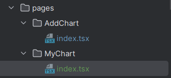

Simplify the page by deleting most of the content. It should look like this:

```tsx
const MyChartPage: React.FC = () => {
  return (
    <div className="My-Chart">
      

    </div>
  );
};
export default MyChartPage;
```

> You can use Shift + F6 to batch rename.


## 1.2 Fetch "Chart" Data

### Define the Method to Fetch "Chart" Data

```tsx
// Load Chart from database using user parameters
const initSearchParams = {
    pageSize: 8,
}
const [searchParams, setSearchParams] = useState<API.ChartQueryRequest>({...initSearchParams})

// Keep Chart to display a list
const [chartList, setChartList] = useState<API.Chart[]>();

// Keep Chart number to divide in multiple pages
const [total, setTotal] = useState<number>(0);

const loadChart = async () => {
    try {
        const res = await listMyChartByPageUsingPOST(searchParams);
        if(res.data){
            setChartList(res.data.records ?? []);
            setTotal(res.data.total ?? 0);
        } else {
            message.error('Chart loading failed');
        }
    } catch (e: any) {
        message.error('Chart loading failed' + e.message);
    }
}
```

> ```tsx
> const [searchParams, setSearchParams] = useState<API.ChartQueryRequest>()
> ```
>
> `useState<>();` contains the data type within `< >`.
>
> It defines the query conditions, so `userState<>` contains the type of "parameters passed to the backend `searchParams`", which is `API.ChartQueryRequest`. This can be found by ctrl + b on the interface `listMyChartByPageUsingPOST` to locate `ChartQueryRequest`:
>
> ```tsx
> export async function listMyChartByPageUsingPOST(
> body: API.ChartQueryRequest,  // <-- This API.ChartQueryRequest parameter is the type of the parameter passed to the backend.
> options?: { [key: string]: any },
> ){ ... }
> ```
>
> ```tsx
> const [chartList, setChartList] = useState<API.Chart[]>();
> ```
>
> `useState<>` contains the type `Chart[]`. This can be found by ctrl + b on `listMyChartByPageUsingPOST` --> `BaseResponsePageChart_` --> `PageChart_` --> `records?: Chart[];` --> find `Chart`.


### Test Chart Fetching

```tsx
// Refresh data. Run loadChart() when first launched the page, and reload loadChart() when any change on searchParams
useEffect(()=>{
    loadChart();
}, [searchParams]);

return (
    <div className="My-Chart">
        My Chart:
        { JSON.stringify(chartList)} // Simply output data as a string, not yet rendering eChart and styles
        <br/>
        Total:
        { totalChart } 				// Same as above

    </div>
);
```

It should look like this:

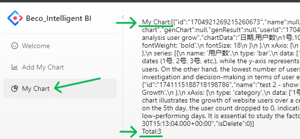


## 1.3 Display "Chart" Data

### Initialization

Remove the simple output statements we used for testing:

```tsx
// Remove these lines!!!
My Chart:
{ JSON.stringify(chartList)} 
<br/>
Total:
{ totalChart }
```


Go to the Ant Design `List` component website: [Ant Design List](https://ant.design/components/list). Find the list style we need and copy-paste the `<List>` component into our project:

```tsx
return (
    <div className="My-Chart">
        <List
            itemLayout="vertical"
            size="large"
            ...
        />
    </div>
);
```

Import the necessary libraries.


### Adjust List Content

> At this point, the front-end page cannot be started yet.

Remove the error-prone `actions={[ ... ]}`

Remove `footer`

Replace all `data` with our `chartList`.


**Delete the <List.Item.Meta> component-related parts**

- Replace `avatar={ ... }` with our own avatar image.

- Replace `title={ ... }` with our own "Chart Name" name.
- Replace `description={ ... }` with our own "Analysis Goal" goal.
- Change the bottom { } to be related to `goal`.

```tsx
<List.Item.Meta
    avatar={<Avatar src={'https://raw.githubusercontent.com/becoze/becozePictureHosting/main/usercenter/cat_read%202.png'} />}
    title={ item.name }
    description={ item.chartType ? ('Given Chart Type: ' + item.chartType) : 'Not given - AI decided' }
/>
{'Goal: ' + item.goal}
```


### Display Charts

Add a loading mechanism:

```tsx
const [loading, setLoading] = useState<boolean>(true);

const loadChart = async () => {
    setLoading(true);  // <-- Here
    
    try{
        ...
    } catch {
        ...
    }
    
    setLoading(false);  // <-- Here
}
```


Modify `pageSize`:

```tsx
<List
    ...
    pagination={{
        ...
        pageSize: searchParams.pageSize,    // <-- Here
    }}
    ...
/>
```


Modify `<ReactECharts>`, and remove `extra`.

```tsx
<List.Item
    key...
>
    ...
    <ReactECharts option={JSON.parse(item.genChart ?? '{}')} />
</List.Item>
```


#### Error: No Width (Height, Width defaults to 0)

**Error:** Unable to display the Chart component.

**Troubleshooting:**

Inspecting the component location: F12 --> Elements --> [Find the component location] --> Check the style

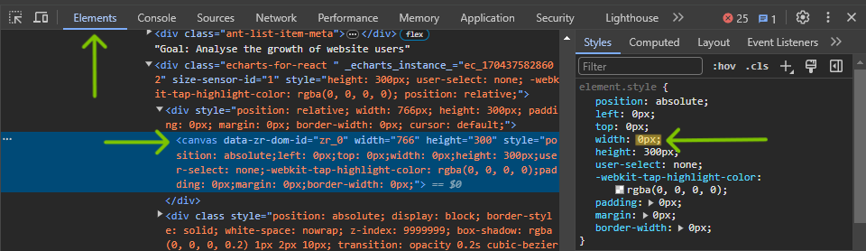

> We can Select Page Element Using Mouse
>
> 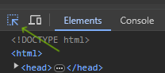


**Cause:**

1. Extra fixed columns, position is inflexible.
2. **Extra component defaults to 0 height, which results in a blank display.**

Therefore, it's not recommended to place it inside `extra`.


**Solution:**

Move `<ReactECharts>` outside and remove `extra`.

```tsx
<List.Item
    key...
>
    ...
    <ReactECharts option={JSON.parse(item.genChart ?? '{}')} />
</List.Item>
```


#### Error: eChart Dirty Data

**Error:** Display error when showing eChart.

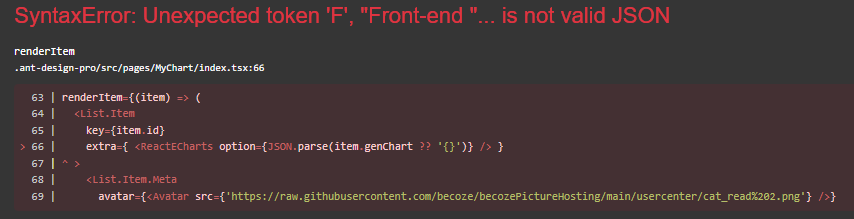

**Cause:**

This is due to dirty `options` data in the database.

- Normally it should be: `{ title: ... }`, containing only `options` data.
- Dirty data example: `This is eChart Code: 【【【【【 option={ ... }`, with unnecessary sentences.

**Solution:**

Delete or modify the erroneous data in the database:

- Remove data with extra characters.
- Ensure the eChart code is in JSON format, not JS format.
  - JS format: `title: { text: 'User Growth',},`
  - JSON format: `"title": { "text": 'User Growth',},`


### Display User Avatar

Fetch current user:

```tsx
// User login state
const { initialState } = useModel('@@initialState');
const { currentUser } = initialState ?? {};
```

> `useModel('@@initialState')` is a fixed method in Ant Design Pro for fetching user state.
>
> This can be seen in `Login/index.tsx` and `RightContent/AvatarDropdown.tsx`.

Display user avatar:

```tsx
<List.Item
    key...
    >
    <List.Item.Meta
        avatar={<Avatar src={currentUser && currentUser.userAvatar} />}
        ...
    />
</List.Item>
```

> `currentUser.userAvatar` retrieves `userAvatar` from `currentUser` in Ant Design.
>
> Example in `app.tsx`:
> ```tsx
> src: initialState?.currentUser?.userAvatar,
> ```


### Adjust Styles

Use `<Card>` style:

```tsx
<List.Item
    key...
    >
    <Card>		// <-- Wrap with Card
        <List.Item.Meta
            ...
        />
		...
    </Card>		// <-- Wrap with Card
</List.Item>
```


Remove `itemLayout` and `size`, use Grid layout:

```tsx
<List
    itemLayout="vertical"   // <-- delete
    size="large"			// <-- delete
    grid={{ gutter: 16,
            xs: 1,
            sm: 1,
            md: 1,
            lg: 2,
            xl: 2,
            xxl: 2,
    }}
    ...
/>
```

> Ant Design Grid Layout: [Grid Layout](https://ant.design/components/list#list-demo-grid)


### Process/Adjust eChart Display Data

**Approach 1:**

Example: Exclude `"title" = {"abcdef"}` from eChart, as the `givenName (name)` is already present.

```tsx
if (res.data) {
    setChartList...
    setTotalChart...
    // Erase the "title" option from eChart
    if (res.data.records) {
        // `forEach`: Iterate over each row of data, and its content
        res.data.records.forEach(data => {
            // Convert data.genChart to JSON format
            const chartOption = JSON.parse(data.genChart ?? '{}');
            // Erase the "title"
            chartOption.title = undefined;
            // Assign the result object, ready to display
            data.genChart = JSON.stringify(chartOption);
        });
    }
} else {
    // Handle error
}
```


**Approach 2:**

Adjust the AI model:

```
"do not include "title" in generated eChart"
```


## 1.4 Adding Pagination Functionality

### Introducing the `pagination` Component

Refer to the Ant Design List component library: [Ant Design List](https://ant.design/components/list#pagination).

For more detailed pagination API: [Ant Design Pagination](https://ant.design/components/pagination).


### Adding Page Number and Switch

Add the `current` page API.

```tsx
<List
    pagination={{
        onChange: (page, pageSize) => {
            setSearchParams({
                ...searchParams,
                current: page,
                pageSize,
            })
        },
        current: searchParams.current,
        total: totalChart,
        pageSize: searchParams.pageSize,
    }}
/>
```

> The `onChange` method is triggered when the pagination component is clicked, using `setSearchParams` to update the `searchParams` information.
>
> Combined with the previously written `useEffect` function: whenever `searchParams` changes, `loadChart()` will be triggered, achieving the effect of page refresh on change.
>
> ```tsx
> useEffect(() => {
>  loadChart();
> }, [searchParams]);
> ```


Initializing the Current Page (Default First Page)

```tsx
const initSearchParams = {
    // Initialize the "current" page, which is the default page
    current: 1,
    ...
}
```


### Testing

Modify the number of items displayed per page to be less than the total number of charts to test if the next page can be displayed normally and if it can switch and display correctly.

For example: If I currently have 5 charts, changing `pageSize` to 4 will display 4 charts per page, and then paginate to show the last one.

```tsx
const initSearchParams = {
    ...
    pageSize: 4,
}
```


## 1.5 Adding Search Functionality

Using the Ant Design List component library: [Ant Design List](https://ant.design/components/list#pagination), copy the `<Search placeholder="Please insert Chart Name" enterButton` component.

- Add a `<div style>` around it.
- Add `onSearch={ ... }` in `<Search>`.

```tsx
return (
    <div className="My-Chart"> 
        <div style={{ marginBottom: 16 }}>
            <Search placeholder="Please insert Chart Name" enterButton loading={loading} onSearch={(value) => {
                    setSearchParams({
                        // Initialize the parameters to go back to the first page for each search
                        ...initSearchParams,
                        name: value,
                    })
                }}/>
        </div>
        ...
    </div>
)
```


### Tips: Atomic CSS (Defining Fixed Styles)

Go to `src/global.less`.

Define a commonly used style at any position (suggested at the bottom), such as:

```less
.margin-16 {
  margin-bottom: 16px;
}
```

Then, go to the place where you want to use it:

```tsx
<div className={'margin-16'}> ... </div>
// Compare with
<div style={{ marginBottom: 16 }}> ... </div>
```


# 2. Security

> This section mainly focuses on understanding the concepts. Implementation is relatively straightforward and involves only a few lines of code.


## 2.0⭐ Midterm Security Analysis

❓ What aspects of our website are currently lacking?


### Security

❓ What if a user uploads an extremely large file, such as 1000GB?

**Issue:** Allowing users to upload content exposes us to potential attacks. For instance, if our website uses an image storage server, an attacker might try to exploit our server's bandwidth and storage by uploading an enormous file (e.g., 1000GB).

This type of attack is dangerous because it can significantly increase server load and network traffic. Since servers are expensive and home broadband costs are cheap, an attacker could use their home network to attack us (low-cost attack causing high-cost damage to us). Therefore, if our website involves user uploads, we must validate the uploaded files to prevent attacks. Failing to validate uploads would require us to spend more on defense.

**Solution - File Validation and Filtering:**

Validation dimensions:

1. ✅ File size
2. ✅ File extension
3. 🟩 File content (more costly)
4. 🟩 File compliance (e.g., sensitive content, recommended to use third-party review functions)


### Data Storage

❓ We store all raw data for each chart in a single data table (chart table). As data volume increases, querying the chart table or retrieving charts will become slow.

**Issue:** Storing all raw data for each chart in a single field (column) of the chart table can lead to slow queries as data volume grows. This is inefficient for feature expansion.

When users want to view or perform simple queries on the raw data (e.g., add/delete a row, view certain columns), storing all data in one field means querying as plain text within a cell, which is inefficient.

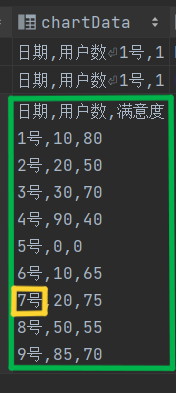


**Solution - Sharding & Partitioning:**

Separate the raw data of each chart into individual tables rather than storing them all in one field.

* Horizontal Sharding: Splitting the table into multiple tables.
* Vertical Partitioning: Splitting the database into multiple databases.

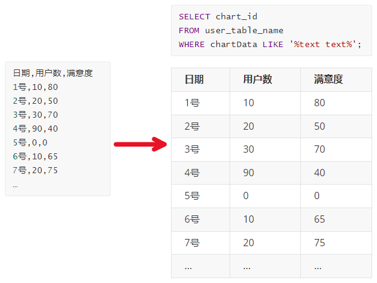

**Solution - Separate Storage:**

**Storage** can be separated to ensure that different users' data does not interfere with each other. (For example, if multiple users' charts contain the same popular keyword "user", a search might retrieve other people's charts, slowing down the search efficiency.)

> When storing chart information, instead of storing data as fields, create a new table named `chart_{chart_id}`. Using fields such as chart ID, column name, and data type, generate and execute the following SQL statement:

```sql
create table chart_id_123456789
(
	date int null,
    userNum int null,
    ... // more
);
```


**Separate Query:**

When **querying**, you can use SQL statements to flexibly retrieve the required fields instead of pure text search, resulting in faster query performance.

> Previously, you would directly query the chart and retrieve the `chartData` field. Now, it has been changed to read from the `chart_{chart_id}` data table.

```sql
SELECT * FROM chart_{chart_id_123456789}
```

Implementation details: Utilize MyBatis dynamic SQL, such as dynamically handling `chart_id_1234`.


### Rate Limiting

Rate limiting is used to prevent DoS attacks and limit web scraping.

❓ What if a user sends 100 requests per second to maliciously overload our service (e.g., AI)?

In a real-world system that requires payment to use, consider the following:

* **Service Limitation**: The goal is to avoid exceeding the budget 📉 and minimize certain costs. For example, each time a user calls an AI service and sends a message, it incurs a cost.
* **Computing Power Limitation**: The goal is to maximize performance 📈 and increase certain efficiencies. For example, server resources and operational costs. These costs need to be controlled.

> Running and using a system incurs costs, and users may abuse the system, causing financial loss.
>
> **Solution - Rate Limiting**:
>
> 1. Control costs -> Limit the total number of user calls.
>
> 2. Control traffic -> Prevent users from excessively using the system in a short period, which could overload the server (or other resources), making it unavailable to other users.

**Implementing Rate Limiting**:

1. **Local Rate Limiting (Single Machine)**: Each server individually limits the rate, even if multiple servers are involved.
   * **Cons**: Hard to control, not suitable for multi-server projects. The server to which the user request is assigned can vary. In extreme cases, the same user can simultaneously request multiple servers. For example, with 10 servers, each limiting to 3 requests/second, a user can maliciously rotate through servers, causing 30 requests/second. This violates the intended rate limiting and doesn't solve resource wastage.
   * **Suitable for**: Monolithic projects with only one server.
   * **Guava RateLimiter**: An open-source rate limiting library by Google.
2. **Distributed Rate Limiting (Multi-Machine)**: User request frequency data is stored centrally, such as in Redis, ensuring that all servers adhere to the same data.
   * **Suitable for**: Projects with multiple servers, like microservices, should use distributed rate limiting.
   * **Examples**: Rate limiting and statistics are centralized in the gateway (e.g., Sentinel, Spring Cloud Gateway).


**Common Rate Limiting Algorithms**

Reference: [Juejin](https://juejin.cn/post/6967742960540581918)

Assume our server can handle 10 requests per minute, or 1 request per 6 seconds.

1. **Fixed Window Rate Limiting**: Allows a certain number of operations within a time unit. Excess operations are rejected.
   * **Pros**: Simple.
   * **Cons**: Cannot prevent traffic bursts. Early requests have a higher chance of being processed, while later requests might be rejected.
   * **Example**: No operations in the first 59 seconds, 7 operations at the 59th second, and 8 more at the 1st second of the next minute. This results in 14 operations in 2 seconds, but doesn't violate the rate limit logic. The server might crash or restart, ignoring 15 operations.
   * **Illustration**: (Capacity/Rate Limit: 10 items per minute) 10 burgers are put on sale every minute. Users rush to buy, and if they run out, they wait until the next minute.
2. **Sliding Window Rate Limiting**: Allows a certain number of operations within a sliding time unit.
   * **Pros**: Better at preventing traffic bursts, mitigating early vs. late request issues.
   * **Cons**: More complex to implement. Doesn't fully solve early vs. late request issues. Requires analysis to adjust window size, balancing resources and performance (smaller sliding units work better).
   * **Example**: No operations in the first 59 seconds, 7 operations at the 59th second, and 7 more at the 1st second of the next minute. With a 30-second sliding unit, 59 seconds to 1:01 minute can handle 10 requests, rejecting the other 5, and restarts the limit after 1 minute.
   * **Illustration**: (Capacity/Rate Limit: 10 items per minute) Checks periodically if there are 10 burgers. If not, produces the next batch.
3. **Leaky Bucket Rate Limiting - Recommended**: Processes requests at a fixed rate. Excess requests are rejected when the bucket is full.
   * **Pros**: Better at preventing traffic bursts. Provides a more even request handling.
   * **Cons**: Fixed rate limits fast processing of a batch of requests, only handling one at a time sequentially.
   * **Example**: 10 requests per minute, bucket capacity of 10, processing one request every 6 seconds. If 10 requests come in a short time, they are processed one by one. The 11th request will be rejected if the bucket is full.
   * **Illustration**: (Capacity/Rate Limit: 1 item every 6 seconds) Burgers are made on demand, and customers queue up, each waiting at least 6 seconds.
4. **Token Bucket Rate Limiting - Recommended**: (Tokens represent slots) Tokens are generated in batches, such as 10 tokens per minute. Users must obtain a token before performing an operation, allowing simultaneous operations.
   * **Pros**: Can handle concurrent requests, improving performance.
   * **Cons**: Doesn't fully solve early vs. late request issues. Requires analysis to adjust token generation intervals.
   * **Example**: Similar to sliding window.
   * **Illustration**: (Capacity/Rate Limit: 10 items per minute) Prepares 10 burgers in advance. Users can simultaneously take multiple burgers. Then, it behaves like the sliding window.


## 2.1 File Extension Check - Security 

* Validate file size
* Validate file extension

```java
/*
 * file authentication
 */
// Check file size
long size = multipartFile.getSize();
final long ONE_MB = 1024 * 1024 * 1L;   // define the size of 1 MB threshold
ThrowUtils.throwIf(size > ONE_MB, ErrorCode.PARAMS_ERROR, "Exceed file size limit 1M");

// Check file suffix
String originalFilename = multipartFile.getOriginalFilename();
String suffix = FileUtil.getSuffix(originalFilename);       // HuTool FileUtil.getSuffix() method
final List<String> validFileSuffix = Arrays.asList("xlsx", "xls");
ThrowUtils.throwIf(!validFileSuffix.contains(suffix), ErrorCode.PARAMS_ERROR, "Invalid file suffix");
```


## 2.2 Data Storage - Security 

### Separate Query

Go to `resources/mapper/ChartMapper.xml` and add a new dynamic query.

```xml
<sql id...> ... </sql>

<select id="queryChartData" parameterType="string" resultType="map">
	${querySql}
</select>
```

> `${querySql}` is highly flexible, but since it uses `$`, be cautious of SQL injection risks. Strengthen SQL statement validation on the backend Java side.


Go to the corresponding `ChartMapper.java` in `/biback/mapper/` or use `ctrl + B` here ->`<mapper namespace="com.becoze.biback.mapper.ChartMapper">`

```java
public interface ChartMapper extends BaseMapper<Chart> {
    List<Map<String, Object>> queryChartData(String querySql);
}
```

> Ensure the method name `queryChartData` is consistent.


### Testing

**Manually Create Subtable:**

Go to the database's chart and copy a chart's ID.

Right-click on the database's `table` -> New -> Table (old UI) -> (enter data)

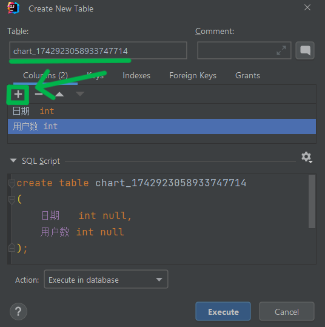

Manually insert data

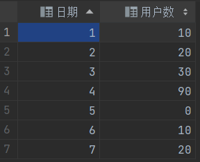

**Create Test Class:**

In `ChartMapper.java`, use `alt + enter` on the method name `ChartMapper` -> "Create Test"

```java
public interface ChartMapper extends BaseMapper<Chart> { ... }
```

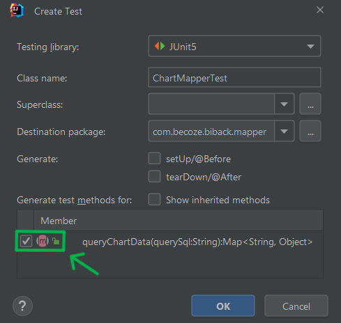

```java
@SpringBootTest
class ChartMapperTest {

    @Resource
    private ChartMapper chartMapper;

    @Test
    void queryChartData() {
        String chartId = "1742923058933747714";
        String querySql = String.format("select * from chart_%s", chartId);
        List<Map<String, Object>> resultData = chartMapper.queryChartData(querySql);
        System.out.println(resultData);
    }
}
```

> Don't forget `@SpringBootTest`

Place a breakpoint on `System.out.println()` and run in Debug mode.


## 2.3 Implement Distributed Rate Limiting

> Redisson - a Redis toolkit (data grid) library. Redisson includes a rate limiting utility class that helps developers use Redis for storage and statistics.

### Install Redis

`Redis-x64-5.0.14.msi`


### Add Redisson Dependency

Backend.

Go to Redisson's GitHub repository: [Redisson GitHub](https://github.com/redisson/redisson) and follow the Quick Start guide.


Add the dependency to your `pom.xml`:

```xml
<dependency>
   <groupId>org.redisson</groupId>
   <artifactId>redisson</artifactId>
   <version>3.25.2</version>
</dependency>  
```


Enable Redis-related configuration in the `application.yml` project configuration file:

```yml
redis:
    database: 1
    host: localhost     // host name, here we use local
    port: 6379          // Redis default port
    timeout: 5000
    password: 123456
```


### Create Redisson Instance

Initialize the `RedissonClient` Redisson client:

```java
@Configuration
@ConfigurationProperties(prefix = "spring.redis")
@Data
public class RedissonConfig {
    @Bean
    public RedissonClient redissonClient(){
        // Create config object
        Config config = new Config();
        config.useSingleServer()
                .setDatabase(1)
                .setAddress("redis://127.0.0.1:6379")
                .setPassword("123456");

        // Sync and Async API
        RedissonClient redisson = Redisson.create(config);
        return redisson;
    }
}
```

> - `Config` is from the `org.redisson.config.Config` package.
> - `setDatabase(1)`: Plans to use "database 1" for rate limiting (consider distribution if there are other business databases, e.g., use 1 for business and 2 for rate limiting).
> - `@Configuration`: Defines a Spring bean (paired with `@Bean` below).
> - `@ConfigurationProperties(prefix...)`: Dynamically reads configuration from `application.yml` under the spring->redis section.
> - `@Data`: Lombok annotation for generating boilerplate code like getters, setters, `toString`, and `equals` methods.
> - `@Bean`: Instructs Spring to automatically create the Redisson object during startup, generating a bean (`RedissonClient`) managed by the Spring container.


Dynamically retrieve configuration information:

```java
@Configuration
@ConfigurationProperties(prefix = "spring.redis")
@Data
public class RedissonConfig {
    // Dynamically retrieve configuration information
    private Integer database;
    private String host;
    private Integer port;
    private String password;

    @Bean
    public RedissonClient redissonClient() {
        // Create config object
        Config config = new Config();
        config.useSingleServer()
                .setDatabase(database)
                .setAddress("redis://" + host + ":" + port)
                .setPassword(password);
        RedissonClient redisson = Redisson.create(config);
        return redisson;
    }
}
```


### Create New Error Code

Add a new error code in `common/ErrorCode`:

```java
TOO_MANY_REQUEST(42900, "Too many requests, please try again later"),
```


### Create `RedisLimiterManager`

Create `RedisLimiterManager` under the `manager` package to provide general **Redis** functions that are not limited by project or business.

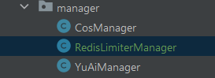

```java
/**
 * Provides RedisLimiter rate limiting services, not limited by project or business, offering general Redis functionality.
 */
@Service
public class RedisLimiterManager {

    @Resource
    private RedissonClient redissonClient;

    /**
     * Rate limiting operation
     * @param key Distinguishes different limiters, such as different user IDs
     */
    public void doRateLimit(String key) {
        // Create a rate limiter named User_limiter, with a maximum of 5 accesses per second
        RRateLimiter rateLimiter = redissonClient.getRateLimiter(key);
        rateLimiter.trySetRate(RateType.OVERALL, 5, 1, RateIntervalUnit.SECONDS);

        // Request a token each time an operation occurs
        boolean canOp = rateLimiter.tryAcquire(1);
        
        if (!canOp) {
            throw new BusinessException(ErrorCode.TOO_MANY_REQUEST);
        }
    }
}
```


### Test 1 - Verify Excess Requests Are Rejected

On the `RedisLimiterManager` class name, press alt + enter -> select `member` for `doRateLimit()` -> ok

> The current `RedisLimiterManager` setting allows only 5 accesses per second.
>
> ```java
> rateLimiter.trySetRate(RateType.OVERALL, 2, 1, RateIntervalUnit.SECONDS);
> ```


The test class is set to make 5 requests (but only 2 will pass). The test will output how many times "success" is printed.

```java
@SpringBootTest
class RedisLimiterManagerTest {
    @Resource
    private RedisLimiterManager redisLimiterManager;

    @Test
    void doRateLimit() {
        String userId = "1";
        for (int i = 0; i < 5; i++) {
            redisLimiterManager.doRateLimit(userId);
            System.out.println("success");
        }
    }
}
```

Run `void doRateLimit()`


**Expected Result:**

It should print "success" twice and then throw the defined error message "Too many requests." This indicates that while handling excess requests, it allowed the set 2 requests and intercepted the third and subsequent excess requests.

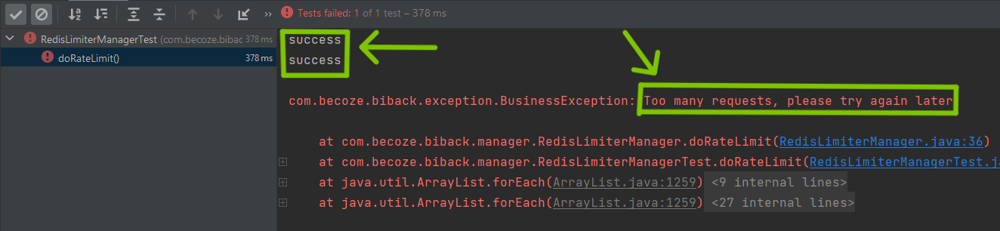


#### Error - `NoSuchBeanDefinitionException`

Check the Spring Boot annotations for `RedissonConfig` and `RedisLimiterManager`.

Especially check the `@Service` annotation for `RedisLimiterManager`.


#### Error - `BeanCreationException ... Unable to connect to Redis server`

Check for errors in the `RedissonConfig` class.

Typically, Redis does not have a password set. If Redis does not have a password, remove the `.setPassword` line.

```java
config.useSingleServer()
                .setDatabase(database)
                .setAddress("redis://" + host + ":" + port);
//                .setPassword(password);	// <-- Delete this line
```

> If Redis does not have a password set, passing in a password will be seen as an incorrect password.


### Test 2 - Verify Token Refresh Rate

> Token = Number of allowed submissions.

```java
@SpringBootTest
class RedisLimiterManagerTest {
    @Resource
    private RedisLimiterManager redisLimiterManager;

    @Test
    void doRateLimit() throws InterruptedException {
        String userId = "1";
        for (int i = 0; i < 2; i++) {        // First, request 2 times
            redisLimiterManager.doRateLimit(userId);
            System.out.println("success");
        }

        Thread.sleep(1000);                // <-- wait 1 second 
        
        for (int i = 0; i < 5; i++) {        // Then, request 5 times
            redisLimiterManager.doRateLimit(userId);
            System.out.println("success");
        }
    }
}
```


**Expected Result:** Tokens are refreshed every 1 second.

1. Accept the first 2 requests normally.
2. Wait for 1 second to refresh 2 tokens.
3. Make 5 requests instantly, allow 2 of them, and block the remaining requests (program interruption).

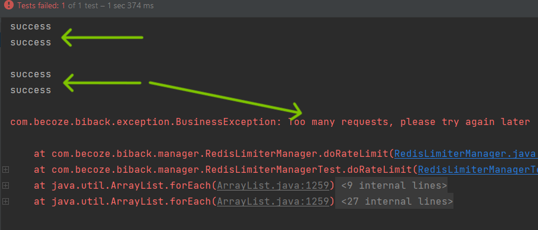


### Implementing Redisson

In `ChartController.java`:

```java
...
@Resource
private RedisLimiterManager redisLimiterManager;

...

@PostMapping("/gen")
public BaseResponse<YuAiResponse> genChartByYuAi(HttpServletRequest request) {
    ...
    // Get login user
    User loginUser = userService.getLoginUser(request);

    // Rate Limiter, limit every user using the current genChartByYuAi method
    redisLimiterManager.doRateLimit("genChartByYuAi_" + loginUser.getId());
    
    ...
}
```

> Since `redisLimiterManager` requires user information, it should be placed after `getLoginUser`.


# Other

## Browser Network Throttling Mode

> throttling: Reduce the rate of requests to control network load.

Used to test web performance under poor network conditions.

Browser -> F12 -> Networking -> Network Throttling

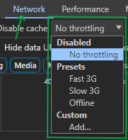


## Viewing Library Source Code in the IDE

**Download Source Code**

Press `ctrl + b` to enter the method you want to learn about. For example, `rateLimiter.trySetRate(...);`.

A `Download Sources` option will appear at the top.

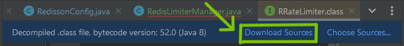

After downloading, more detailed parameter explanations and additional information will be available.

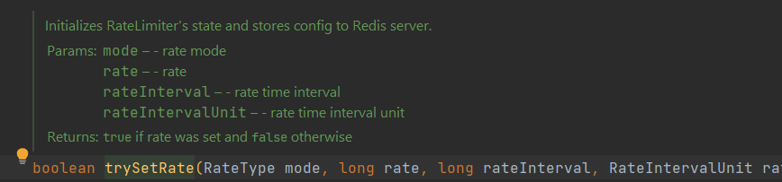
