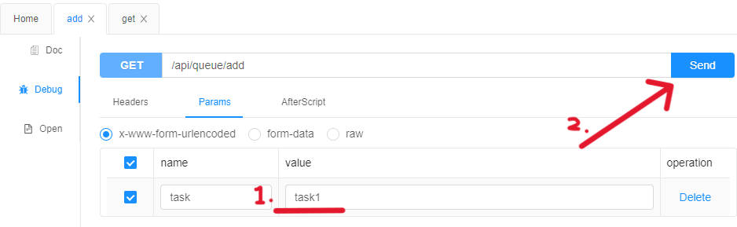

# System Problem Analysis

## 0.1 Asynchronization

**Problem Scenario:** The called service has limited processing capacity, or the processing/return time is long.

1. **Long User Wait Time:** AI production takes time, and users already have to wait. If multiple users submit requests simultaneously, they need to **wait in line (queue),** increasing wait times and decreasing user satisfaction.
2. **System Resource Strain:** The business server might be handling numerous requests, leading to resource strain and, in severe cases, server crashes or the inability to handle new requests.
3. **Limited Third-Party Service Processing:** The processing capacity of third-party services (like AI capabilities) is limited. For example, if the AI can only handle one request every 3 seconds, it will be overwhelmed, potentially refusing service to our backend.


### Synchronous vs Asynchronization

**Synchronous:** Tasks are executed sequentially, one after another.

* Example: A user submits information for AI analysis. After clicking "submit," a loading page/animation is displayed, and the user cannot do anything but wait for a minute for the AI to return results (which might fail).


**Asynchronous:** Tasks are executed without waiting for the previous one to finish, and a notification is sent when the task completes.

- Example: A user submits information for AI analysis. After clicking "submit," the user is notified that the analysis is in progress. The user can browse or use other features and submit another AI analysis request. After a minute, the user is notified of the results (success or failure), enhancing the user experience.


> **Simple the better - Use synchronous if you can (but not compulsory)**
>
> Asynchronous multi-threading requires more considerations, becomes more complex, and is prone to issues. For instance, maintenance difficulty increases—when business logic is very complex, tracking task progress becomes harder, complicating maintenance and debugging.


### Standard Asynchronous Business Process

1. When a user **initiates** a long-duration operation, instead of waiting on a page, the task is recorded in a database queue. This queue is essentially a TODO list.
2. The process for **submitting** new tasks involves:
   1. If the <u>task queue</u> has space and <u>threads</u> are available --> the new task is processed immediately.
   2. If the <u>task queue</u> has space but <u>threads</u> are busy --> the task waits in the queue.
   3. If the <u>task queue</u> is full and <u>threads</u> are busy --> the request is rejected (if recording the task isn't possible, minimal logging, such as in a txt file, should be done).
   4. If the <u>task queue</u> is full but <u>threads</u> are available --> ...there's a bug!
3. Each time a thread completes a task or picks a new one, it updates the task's status.
4. For very complex tasks (or groups of tasks), the progress should be recorded in the database.
5. Upon **task completion**, notify the user via email, system message, SMS, etc., about the task's status (success or failure).


### YuAI Asynchronous Business Process

1. When the user clicks the submit button on the intelligent analysis page, the system immediately saves the chart request as a task in the database (the chart is now a TODO item awaiting processing).
2. The system displays all tasks' information and status on the user's chart management page, including completed, incomplete, and failed tasks.


## 0.2 Thread Pool

**Problem Scenario 1:** What should the maximum capacity of the task queue be?

Adjust based on the actual business scenario and system resources to find an optimal setting.

* Barrel Effect: The task queue's maximum capacity should consider the system's weakest link. In the YuAI project, it's AI analysis since it requires time, money, and is prone to errors.


**Problem Scenario 2:** How does the program pick tasks from the task queue? How is the task queue's process implemented? How to ensure the program executes a maximum of multiple tasks simultaneously?


### What is a Thread Pool?

The thread pool helps manage threads and coordinate task execution easily.

When thread management becomes complex, such as determining when to add or remove threads.

> Example: On regular days, only 2 threads are needed, but more threads are required during busy periods. After the busy period, reducing idle threads is necessary. Without flexible thread scheduling and management, efficiency drops.
>
> Here, "threads" can be understood as "employees" or "human resources." For example, on regular days, only 2 employees are needed, but more are required during holidays...

Task storage and retrieval can become complex, such as determining when to accept or reject tasks, avoiding multiple threads competing for the same task, and efficiently distributing tasks of varying difficulty.

> Example: A large number of small tasks (say 100) may quickly fill a queue with only 20 slots, even though all 100 tasks together are not as complex as a single medium task. They are numerous but not complicated. In this case, the remaining 80 tasks should not be rejected.


### Thread Pools in Development

Typically, ready-made thread pools are used, such as Spring's `ThreadPoolTaskExecutor` or the `ThreadPoolExecutor` in Java's JUC concurrency package.


### Common Parameters of Thread Pools

Explanation of `ThreadPoolExecutor` parameters:

```java
public ThreadPoolExecutor(int corePoolSize,
                              int maximumPoolSize,
                              long keepAliveTime,
                              TimeUnit unit,
                              BlockingQueue<Runnable> workQueue,
                              ThreadFactory threadFactory,
                              RejectedExecutionHandler handler) { ... }
```

| Parameter                          | Is Optional | Explanation                                                  | Analogy                                                  |
| ---------------------------------- | ----------- | ------------------------------------------------------------ | -------------------------------------------------------- |
| `corePoolSize`                     | MUST        | Minimum number of core threads always ready to work under normal conditions | Core permanent employees                                 |
| `maximumPoolSize`                  | MUST        | Maximum number of threads allocated under extreme conditions, controlling cost and avoiding management bugs | Maximum number of temporary workers a company can handle |
| `keepAliveTime`                    | MUST        | Time to release idle (no task) non-core thread resources     | Time to dismiss idle temporary workers                   |
| `TimeUnit unit`                    | MUST        | Time unit (e.g., minutes, seconds). Combined with `keepAliveTime`, it forms a time window (e.g., 180 seconds, 5 minutes) |                                                          |
| `workQueue`                        | MUST        | Queue for storing tasks to be executed by threads, with a recommended length to avoid infinite queue length | TODO list                                                |
| `threadFactory`                    | Optional    | Controls the creation and attributes of each thread, such as thread name | Recruitment of employees with different abilities        |
| `RejectedExecutionHandler handler` | Optional    | Strategy for handling tasks when the queue is full, such as throwing an exception, not throwing an exception, ensuring high-priority tasks are handled first (VIP) | VIP, high-priority orders                                |


### Setting Thread Pool Parameters

❗❗ **It is crucial to set parameters based on actual circumstances.** Generally, thread pool parameters are set as follows:

- `corePoolSize`: 2 ~ 4 under normal conditions
- `maximumPoolSize`: Up to an additional 4 threads beyond `corePoolSize`
- `keepAliveTime`: Generally in seconds or minutes, up to 2 minutes
- `TimeUnit unit`: Minutes, seconds
- `workQueue`: Set based on actual conditions, around 20
- `threadFactory`: To be set based on specific conditions
- `RejectedExecutionHandler`: Throw an exception and mark the database task status as "task full, rejected"


**Setting `corePoolSize` Thread Count**

Always set based on actual conditions. Generally, tasks are **I/O-intensive** or **CPU-intensive**.

* **I/O-intensive:** Consumes bandwidth and read/write capabilities of memory and hard drives, such as waiting for network data transfer (network I/O) or waiting for database read results (disk I/O).

  For I/O-intensive tasks, consider setting more threads, typically 2n (twice the number of CPU cores), to increase I/O concurrency and handle multiple tasks simultaneously to save time. However, always prioritize business implementation efficiency, such as setting around 20 cores if the database supports 20-core queries, or 30 cores if it supports 30-core queries, to maximize business implementation.

  

* **CPU-intensive:** Consumes CPU resources, such as audio/video processing, image processing, mathematical calculations.

  For CPU-intensive tasks, do not set too many threads, typically n + 1 (CPU cores + 1). The number of threads matching the CPU cores reduces frequent thread switching and saves time. An additional thread allows better coordination among the working cores, improving CPU utilization.


### Thread Pool Mechanism


1. **Task Submission:** When a new task is submitted, it first checks if the number of running threads is less than `corePoolSize`. If so, a new core thread is created to handle the task.
2. **Queueing:** If the number of running threads equals `corePoolSize`, the task is placed in the `workQueue`.
3. **Maximum Threads:** If the `workQueue` is full and the number of running threads is less than `maximumPoolSize`, a new thread is created to handle the task.
4. **Rejection:** If the `workQueue` is full and the number of running threads equals `maximumPoolSize`, the task is handled by the `RejectedExecutionHandler`.


# 1. Thread Pool

## 1.1 Custom Thread Pool

Create `/config/ThreadPoolExecutorConfig.java` and initialize it.

```java
@Configuration
public class ThreadPoolExecutorConfig {

    @Bean
    public ThreadPoolExecutor threadPoolExecutor(){
        ThreadPoolExecutor threadPoolExecutor = new ThreadPoolExecutor();
        return threadPoolExecutor;
    }
}
```

Create a thread factory `ThreadPoolExecutor` and fill in the thread configuration:

- `corePoolSize`: 2
- `maximumPoolSize`: 4
- `keepAliveTime`: 100
- `TimeUnit unit`: `TimeUnit.SECONDS`
- `workQueue`: `new ArrayBlockingQueue<>(4)`
- `threadFactory`: threadFactory
- `RejectedExecutionHandler`: (default)

```java
@Configuration
public class ThreadPoolExecutorConfig {

    @Bean
    public ThreadPoolExecutor threadPoolExecutor(){
        
        // Thread Factory
        ThreadFactory threadFactory = new ThreadFactory() {
            private int count = 1;
            
            @Override
            public Thread newThread(@NotNull Runnable r) {
                Thread thread = new Thread(r);
                thread.setName("Thread " + count);
                count++;
                return thread;
            }
        };

        ThreadPoolExecutor threadPoolExecutor = new ThreadPoolExecutor(2, 4,
                100, TimeUnit.SECONDS, new ArrayBlockingQueue<>(4), threadFactory);
        return threadPoolExecutor;
    }
}
```


## 1.2 Testing the Thread Pool

### Writing a Test Interface (Simplified Task Submission)

Create a new controller for testing `controller/QueueController.java`.

> To quickly initialize a controller:
>
> 1. Copy another controller, such as `FileController`.
> 2. Rename it to `QueueController`.
> 3. Delete all the code.
> 4. Rename `RequestMapping` to `"/queue"`.
> 5. Press `ctrl + alt + O` to organize the code, mainly to delete all unnecessary imports with one click.

```java
/**
 * Queue test controller
 */
@RestController
@RequestMapping("/queue")
@Slf4j
@Profile({"dev", "local"})
public class QueueController {

}
```

> `@Profile({"dev", "local"})` indicates that the current interface only takes effect in development and local environments. This test interface should not go live. If you forget to delete it, this provides a layer of protection.


Define a test interface `add` to submit a task that occupies a thread for 10 minutes.

```java
@Resource
private ThreadPoolExecutor threadPoolExecutor;

@GetMapping("/add")
public void add(String task){

    // Create a task with no return value
    CompletableFuture.runAsync(() -> {
        System.out.println("Processing task: " + task + " by " + Thread.currentThread().getName());

        try {
            // This task will last for 10 minutes (for testing)
            Thread.sleep(600000);
        } catch (InterruptedException e) {
            e.printStackTrace();
        }
    }, threadPoolExecutor);
}
```


Define another test interface `get` to check the thread pool status.

> Use `getQueue()`, `getTaskCount()`, etc. to get the necessary information, then package it into a map and output it.

```java
@GetMapping("/add")
public void add(String task){ ... }

@GetMapping("/get")
public String get(){
    Map<String, Object> map = new HashMap<>();

    int size = threadPoolExecutor.getQueue().size();
    map.put("Size of the Queue", size);

    long taskCount = threadPoolExecutor.getTaskCount();
    map.put("# of Tasks", taskCount);

    long completeTaskCount = threadPoolExecutor.getCompletedTaskCount();
    map.put("# of Completed tasks", completeTaskCount);

    int activeCount = threadPoolExecutor.getActiveCount();
    map.put("# of Active threads", activeCount);

    return JSONUtil.toJsonStr(map);
}
```


### Testing

Restart the backend (no need to log in).

Go to `http://localhost:8080/api/doc.html#/home`.

Find `queue-controller`, which should have `add` and `get`.


Step 0: First go to `get` and click "Send" to get the output. At this point, each item's output should be 0.


Step 1: Go to `add` and add a "task1".




Step 2: Check IDEA, which should return the following information:


Step 3: Go back to `get` and click "Send" to get the output. Some of the `Active threads` and `# of Tasks` should be 1.

```bash
{"# of Completed tasks":0,"# of Active threads":1,"# of Tasks":1,"Size of the Queue":0}
```

Step 4: Repeat steps 1 to 3.


### Result Analysis

First, our settings are as follows:

- `corePoolSize`: 2 
- `maximumPoolSize`: 4
- `workQueue`: `new ArrayBlockingQueue<>(4)` The queue can hold up to 4 tasks

Test results (better reading experience with full screen):

```java
Task 1
IDEA - Progressing task: task1 by Thread 1
log  - {"# of Completed tasks":0,"# of Active threads":1,"# of Tasks":1,"Size of the Queue":0}
// Note: task 1 process by core-thread 1 --> not go into queue

Task 2
IDEA - Progressing task: task2 by Thread 2
log  - {"# of Completed tasks":0,"# of Active threads":2,"# of Tasks":2,"Size of the Queue":0}
// Note: task 2 process by core-thread 2 --> not go into queue

Task 3
IDEA - (no output)	// no thread taking this task
log  - {"# of Completed tasks":0,"# of Active threads":2,"# of Tasks":3,"Size of the Queue":1}
// Note: no core thread available --> task 3 go into queue

Task 4
IDEA - (no output)
log  - {"# of Completed tasks":0,"# of Active threads":2,"# of Tasks":4,"Size of the Queue":2}
// Note: no core thread available --> task 4 go into queue

Task 5
IDEA - (no output)
log  - {"# of Completed tasks":0,"# of Active threads":2,"# of Tasks":5,"Size of the Queue":3}
// Note: no core thread available --> task 5 go into queue

Task 6
IDEA - (no output)
log  - {"# of Completed tasks":0,"# of Active threads":2,"# of Tasks":6,"Size of the Queue":4}
// Note: no core thread available --> task 6 go into queue

Task 7
IDEA - Progressing task: task7 by Thread 3
log  - {"# of Completed tasks":0,"# of Active threads":3,"# of Tasks":7,"Size of the Queue":4}
//													   ^ one new thread						^ full
// Note: no core thread available, and the queue is full --> task 7 is process by new backup-thread 3

Task 8
IDEA - Progressing task: task8 by Thread 4
log  - {"# of Completed tasks":0,"# of Active threads":4,"# of Tasks":8,"Size of the Queue":4}
// Note: no any other thread available, and the queue is full --> task 8 is process by new backup-thread 4

Task 9
IDEA - RejectedExecutionException
add  - "System Error"
log  - {"# of Completed tasks":0,"# of Active threads":4,"# of Tasks":8,"Size of the Queue":4}
// Note: no any other thread available, the queue is full, and no backup-thread available --> task 9 been rejected 
```

> `Size of the Queue` same as `Number of Tasks in the queue`.


# 2. System Asynchronous Optimization

## 2.0 Asynchronous Design

> Optimized system workflow
>
> 1. When the user clicks the submit button on the intelligent analysis page, the system immediately saves the chart request as a task in the database (at this point, the "chart" is a pending item and has not yet moved to the next processing step).
> 2. The system displays all task information and statuses on the user's chart management page, including completed, incomplete, and failed tasks, etc.

Based on the expected system workflow, arrange the following development process:

1. ✅Add new task status fields (such as Queued, Running, Completed, Failed) and task execution information fields (to record execution details or failure information) to the `chat` table.
2. ✅Retain the old synchronous submission method and add a new page for asynchronous submission.
3. ✅Implement user asynchronous submission logic:
   1. When the user clicks the submit button on the intelligent analysis page, first save the chart to the database and then submit the task.
   2. The task status can change according to the execution result, e.g., initially set the task status to "Running," then to "Completed" or "Failed," while also recording any failure information.
4. ✅Users can view all charts (generated, generating, failed) and their statuses on the chart management page.
5. 🟩(Users can modify the information of charts that failed to generate and click to regenerate them.)


## 2.1 Adding New Database Fields

### Modify Database

Go to `sql/create_table.sql`, find the chart table creation statement, and add `status` and `execMessage`. Copy these two lines of the table creation statement.

```java
-- chart table
create table if not exists chart
(
    genResult ...
    status       varchar(128) not null default 'wait' comment 'wait, running, succeed, failed',
    execMessage  text null comment 'execution message',
    ...
) comment 'chart' collate = utf8mb4_unicode_ci;
```

> Modifying the table creation statement here does not affect the existing database but is important for future database maintenance and updates.


In IDEA, open the "Database" tab on the right sidebar -> select your database -> right-click "chart" -> "Modify Table (Old UI)" -> "New" -> paste the copied table creation statement and make necessary adjustments.


In the `chart` table, update the `status` of previously completed records to "succeed."


### Update Database Mapper

Go to the database mapping in `model/entity/Chart.java`.

```java
...

/**
 * Chart status. wait, running, succeed, failed
 */
private String status;

/**
 * Execution message
 */
private String execMessage;
```


## 2.2 Backend Implementation of User Asynchronous Submission Logic

> This part is a more complex version of task submission but follows a similar structure to the previous test interfaces.

Go to `controller/ChartController.java`.


### Initialization

Define a thread pool executor that we just created:

```java
@Resource
private ThreadPoolExecutor threadPoolExecutor;
```


Duplicate the `genChartByYuAi()` method and rename it to `genChartByYuAiAsync()`. Change the endpoint to `"/gen/async"` and update the comments accordingly.

```java
/**
     * AI Analysis upload (Async)
     *
     * @param multipartFile
     * @param genChartByYuAiRequest
     * @param request
     * @return
     */
@PostMapping("/gen/async")
public BaseResponse<YuAiResponse> genChartByYuAiAsync(@RequestPart("file") MultipartFile multipartFile,
                                                      GenChartByYuAiRequest genChartByYuAiRequest, HttpServletRequest request) {

}
```

> This allows for comparing normal and asynchronous effects simultaneously.


### Implement "Save Chart First, Then Submit Task"

Enter `genChartByYuAiAsync`.

Find the code related to calling the AI, and wrap this code with the message queue task `CompletableFuture.runAsync`. This will allow the AI to be called as a task using the task queue.

```java
CompletableFuture.runAsync(() -> {
    // Change chart status to "running" when task is progressing
    Chart updateChartRunning = new Chart();
    updateChartRunning.setId(chart.getId());
    
    ...
        
    boolean updateResult = chartService.updateById(updateChartResult);
    if(!updateResult){
		...
    }
}, threadPoolExecutor);
```


Remove the 4 errors related to `genChart` and `genResult` (no results are returned yet).

```java
/*
* Submitting "call ai requests (a task)" as a task queue
*/
CompletableFuture.runAsync(() -> {
    /*
	* Using AI to gather response
    */
    String aiResponse = yuAiManager.doChat(biModelId, userInput.toString());

    /*
    * Check AI Response is valid, splits AIGC content for data saving
    */
    String[] splits = aiResponse.split("【【【【【");
    if(splits.length < 3){      // AI generate wrong format
        throw new BusinessException(ErrorCode.SYSTEM_ERROR, "AI Response Error");
    }

    String genChart = splits[1].trim();
    String genResult = splits[2].trim();
}, threadPoolExecutor);
```

> Don’t forget to include `threadPoolExecutor` in `runAsync`. Use `CompletableFuture.runAsync(() -> { ... }, threadPoolExecutor)`.


Move the code related to "Save data into database" to before `CompletableFuture.runAsync(() -> { ... })`, and add `setStatus`.

```java
/*
 * Save data into database
 */
Chart chart = new Chart();
chart.setName(name);
chart.setGoal(goal);
chart.setChartData(rawData);
chart.setChartType(chartType);
chart.setStatus("wait");		// <-- Here 
chart.setUserId(loginUser.getId());
boolean saveResult = chartService.save(chart);
ThrowUtils.throwIf(!saveResult, ErrorCode.SYSTEM_ERROR, "Chart saving Error");

// Task queue
CompletableFuture.runAsync(() -> { ... })
    
// Generate response for front end
YuAiResponse yuAiResponse = new YuAiResponse();
yuAiResponse.setChartId(chart.getId());

return ResultUtils.success(yuAiResponse);
```


### Implement "Task Status Changes According to Result"

Define `handleChartStatusError` below `CompletableFuture.runAsync(() -> { ... })` to handle failure cases uniformly.

```java
CompletableFuture.runAsync(() -> { ... }, threadPoolExecutor)
                           
private void handleChartStatusError(long chartId, String execMessage){
        // Change chart status to fail
        Chart updateChartFail = new Chart();
        updateChartFail.setId(chartId);
        updateChartFail.setStatus("fail");
        updateChartFail.setExecMessage(execMessage);
        boolean updateFail = chartService.updateById(updateChartFail);
        if(!updateFail){
            log.error("Fail to change chart status to \"fail\". Chart id: " + chartId + " , message: " + execMessage);
        }
    }
```


Within `CompletableFuture.runAsync(() -> { ... })`, add code to modify the status to "running" and "success".

```java
CompletableFuture.runAsync(() -> {
    // Change chart status to "running" when task is progressing
    Chart updateChartRunning = new Chart();
    updateChartRunning.setId(chart.getId());
    updateChartRunning.setStatus("running");
    boolean updateRunning = chartService.updateById(updateChartRunning);
    if(!updateRunning){
        handleChartStatusError(chart.getId(), "Fail to change chart status to \"running\".");
        return;
    }
    
    /*
	* Using AI to gather response
	*/
    String aiResponse ...
    String[] splits ...; splits[1].trim()...

    // Change chart status to "running" when task is progressing
    Chart updateChartResult = new Chart();
    updateChartResult.setId(chart.getId());
    updateChartResult.setGenChart(genChart);
    updateChartResult.setGenResult(genResult);
    updateChartResult.setStatus("success")
        boolean updateResult = chartService.updateById(updateChartResult);
    if(!updateResult){
       handleChartStatusError(chart.getId(), "Fail to change chart status to \"success\".");
    }
}, threadPoolExecutor);

...
                           
private void handleChartStatusError( ... ){ ... }
```


## 2.3 Add `genChartByYuAiAsync` Page to Frontend

> Due to the asynchronous nature, the frontend will not wait for the backend to return conclusions and echart results like it does for "synchronous" requests. Therefore, the focus is on removing the functionality for displaying conclusions and updating the prompts.

### Initialization

Go to `config/routes.ts` and add a new page.

```tsx
{ path: '/add_chart_async', name: 'Add My Chart (Async)', icon: 'barChart', component: './AddChartAsync' },
```


Duplicate `AddChart` and name it `AddChartAsync`.

Change the page name to `AddChartAsync`.

```tsx
const AddChartAsync: React.FC = () => {
    ...
};

export default AddChartAsync;
```


### Modify the Page

Remove unused variables and their corresponding errors:

```tsx
const [chart ...
const [eChartOption ...
```


Remove all `echart` related code.

Remove `Chart` and `Conclusion` displays.

```tsx
<Col span={12}>
    <Card title="Chart">    </Card>
    <Card title="Concultion">    </Card>
</Col>
```


Copy everything from `<Form name="add-chart" ... >`, then delete all `<Row>` and `<Col>`. 

Code:

```tsx
<div className="add-chart-async">
    <Form
        name="add-chart"
        ...
     >
    </Form>
</div>
```


### Add New Features

Add `form` control and include `form.resetFields();` to refresh the form.

Update the prompts.

```tsx
const AddChartAsync: React.FC = () => {
    const [form] = useForm();
    ...
    try {
        const res = await genChartByYuAiUsingPOST...

        if(!res?.data){
            message.error('Submit fail, Please try again later')
        }else{
            message.success('Submit successful! Please check back later on the "My Charts" page!');
            form.resetFields();
        }
    } ...
};
```


Apply `form` styling in the form:

```tsx
<Form
    form={form}
    name="add-chart"
    ...
>
```


### Use Backend API

After making all the changes, execute "openapi" to automatically generate the interface.

Update the "asynchronous" page’s `genChartByYuAiUsingPOST` to:

```tsx
const res = await genChartByYuAiAsyncUsingPOST(params, {}, values.file.file.originFileObj)
```


## 2.4 Frontend Compatibility for Displaying Generating Charts in "MyChart"

Go to `pages/MyChart/index.tsx`.


### Modify Display List

Update `<p> item.goal ... </p>` and `<ReactECharts ... item.genChart />` to:

```tsx
<List.Item.Meta
    avatar=...
    title=...
    description=...
/>
<>
    {
        item.status === 'wait' && <>
        <Result
            status="warning"
            title="Waiting for processing..."
            subTitle={item.execMessage ?? 'System buys, please wait.'}
            />
        </>
    }
    {
        item.status === 'running' && <>
        <Result
            status="info"
            title="Generating concultions"
            subTitle={item.execMessage}
            />
        </>
    }
    {
        item.status === 'succeed' && <>
        <div style={{ marginBottom: 16 }} />
        <p> {'Goal: ' + item.goal} </p>
        <div style={{ marginBottom: 16 }}/>
        <ReactECharts option={JSON.parse(item.genChart ?? '{}')} />
        </>
    }
    {
        item.status === 'failed' && <>
        <Result
            status="error"
            title="Generating failed!"
            subTitle={item.execMessage}
            />
        </>
    }
</>
```

> The `<Result>` component can be found in the [Ant Design component library - result](https://ant.design/components/result).
>
> The `<Result>` component is imported from the "antd" library.


### Add Format Conversion Check

Find `const loadChart...` and add an `if (xxx === 'succeed')` check before the `chartOption` format conversion:

```tsx
const loadChart = async () => {
    try {
        ...
        if(res.data.records){
            res.data.records.forEach(data => {
                if(data.status === 'succeed'){			// <--- Here
                    const chartOption = JSON.parse(data.genChart ?? '{}');
                    chartOption.title = undefined;
                    data.genChart = JSON.stringify(chartOption);
                }										// <--- to here
            })
        }
    } else ...
	}
}
```

> This prevents errors from being thrown due to missing results while waiting.


### Modify "MyChart" to Sort Charts by Generation Time

```tsx
const initSearchParams = {
      // Initialize the "current" page, which is the default page
      current: 1,
      // Item on each page
      pageSize: 6,
      sortField: 'createTime',
      sortOrder: 'desc',
    }
```

> `sortField` and `sortOrder` can be found in the backend `ChartQueryRequest` -> `PageRequest`.

2.5 Testing

Open the accelerator.

Log in to the frontend via the browser.

Use "Add Chart (Async)" and attempt to submit an analysis.

The webpage should immediately display a message indicating successful submission.


Then, quickly go to "My Chart" before the conclusion is generated, and you should see: (or modify the database to change the "status" to view the display effect)


After a while, a new conclusion (the one just submitted) should appear in the backend.


