# 0. Midterm Analysis

Although the system has been modified to be asynchronous, it is currently implemented through a **local** thread pool. The local thread pool, and therefore the **single-machine system**, has the following drawbacks:

1. **Lack of Centralized Limitation, Only Individual Machine Limitation**

   > For instance, if a service (AI service) supports only 2 users at a time, the maximum **core thread count** of the thread pool can only be 2. This is fine for a single server. However, if the service becomes distributed across multiple servers, say 2 servers, using the same "maximum **core thread count** of 2" setting will exceed the service (AI service) limit. This requires either 1. unified thread allocation planning; 2. individual server settings, which becomes cumbersome without centralized management.

   **Solution:** Manage task issuance in a centralized location (e.g., centrally store the number of currently executing tasks).

   

2. **High Risk of Task Loss When Stored Locally**

   > Although tasks can be manually retrieved from the database and retried, this requires extra development (e.g., scheduled tasks). Developing for such "retry scenarios" is unnecessary and can be solved through other simpler, faster, and more direct solutions.

   **Solution:** Store tasks on a persistent storage medium.

   

3. **(Optimization) Potential Resource Contention as the System Grows More Complex**

   > Service decomposition, application decoupling, microservices: As system functionalities and services grow, long-duration tasks increase, making the system more complex and requiring multiple thread pools. Long-duration and resource-intensive tasks can be isolated into separate programs to avoid impacting the main business.

   **Solution:** Use a middleware (mediator) to connect two systems (e.g., core system and intelligent generation business).
   
   

## 0.1 What is Middleware?

Middleware, a mediator, helps developers connect multiple different systems, enabling seamless cooperation. For example, if systems A and B use the same database, the database acts as middleware between systems A and B. Middleware includes Redis (data storage solution), message queues, distributed storage, Etcd, etc.

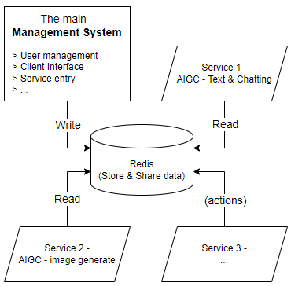


## 0.2 What is a Message Queue?

A message queue is a queue that stores messages.

- **Storage:** Store data
- **Message:** A data structure such as a string, object, binary data, JSON, etc.
- **Queue:** A first-in-first-out data structure
- **Application Scenario:** Acts like a special database, focusing not on data storage but on data transmission. **It facilitates message transmission between multiple different systems and applications without considering programming language, system, architecture, etc.**

  For example, a Java-developed application can send messages while a PHP-developed application can receive them, eliminating the need to write all code in a single project (the concept of application decoupling).


### Message Queue Model

- **Producer:** Produces and sends messages (server side).
- **Consumer:** Receives and reads messages (client side).
- **Message:** The data to be transmitted from producer to consumer.
- **Message Queue:** The queue that stores the messages.


**Why use a message queue instead of direct-transmission?**

- **Direct Transmission:** This is similar to synchronous communication. It requires the consumer to request the producer, wait for the producer to complete, and then transmit to the consumer. If the consumer cannot receive, the producer must wait until the consumer is ready.

- **Message Queue:** The producer does not concern itself with whether or when the consumer will consume the message. It only needs to place the message in the queue, completing its job. The consumer retrieves the message from the queue when needed.
  - **Decoupling:** The producer and consumer are decoupled and do not affect each other. (Synchronous communication has its benefits too, such as being safer and more real-time, suitable for short tasks where both parties are online. The choice depends on the actual scenario.)
  - **Language, System, and Architecture Agnostic:** Allows multiple producers to send messages simultaneously (provide services), regardless of different systems, frameworks, or languages (e.g., Java, Python, Springboot). Multiple consumers can also retrieve messages after authentication, each taking what it needs from the message queue.


### Why Use "Distributed Message Queues"?

#### Advantages of Message Queues

1. **Asynchronous Processing**: Once the producer sends the message, it can continue with other tasks, and the consumer can consume the message whenever it wants, avoiding blocking.
2. **Peak Shaving and Valley Filling**: Instantaneous requests are turned into a queue of tasks to be processed, distributing the system's instantaneous pressure and avoiding server crashes. Example: User requests are placed in a message queue, and consumers (applications performing actual operations) wait and process them gradually according to their capacity.
   - AS_IS: At 12 o'clock, 100,000 requests come in. In the original scenario, these 100,000 requests would be processed immediately within the system, quickly causing system overload and **crashing**.
   - TO_BE: Place these 100,000 requests in a message queue, and the processing system executes at a constant rate (e.g., one per second), protecting and stabilizing the system.

3. **Application Decoupling**:

   - **Data Persistence**: Messages can be centrally stored on a hard drive, allowing for retrieval and traceability even in case of unexpected events (like server restarts), ensuring no data loss.
   - **Scalability**: Nodes can be added or removed as needed, maintaining stable service.
   - **Cross-Language Compatibility**: Connects systems developed in various languages and frameworks, allowing them to flexibly transmit and read data.
   - **System Independence**: A service failure doesn't affect other services, nor the entire system. After a system crash and recovery, messages can still be retrieved and business logic continued.

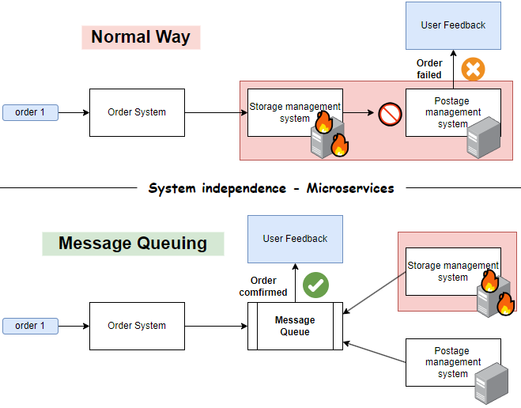

- **Asynchronous Message Passing**: Ideal for handling long-duration tasks, improving user experience. Once a message is sent to the queue, it can return immediately without synchronously calling all systems, resulting in higher performance.

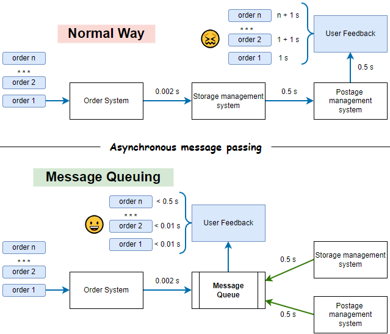

- **Publish/Subscribe**: Typically used in large systems involving multiple microservices, platforms, or third parties (e.g., WeChat, Google). The core system always sends messages to a single place (message queue), and other systems subscribe to this message queue to read messages.

> If the core system implements an update, it needs to notify all its subsystems. Traditional point-to-point broadcasting has the following drawbacks:
>
> 1. Difficult to selectively publish: Every time a notification is sent, it needs to call all systems, making it hard to precisely push to specific systems (e.g., only push to all internal subsystems, not to third parties).
>   - Solution: Multiple subscription channels can be set up, such as internal company channels, third-party channels, etc. The main system only publishes messages on specific channels, and recipients subscribe to the relevant channel according to their needs and permissions, waiting for message delivery.
> 2. Receiving difficulties: If a new project hasn't fully integrated into the main system, it might miss messages; a small push might not be noticeable in a large project.
>   - Solution: As long as the main system updates, even if a new project initially misses the message, the message remains until acknowledged. The recipient can receive and process the message when ready.

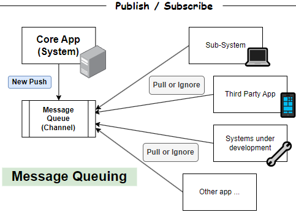


#### Application Scenarios for Message Queues

1. **Time-Consuming Scenarios**: Asynchronous message passing.
2. **High Concurrency Scenarios**: Asynchronous processing.
3. **Distributed System Collaboration**: Cross-team, cross-language collaboration using publish/subscribe.
4. **High Stability Scenarios**: Such as in finance, involving data persistence and peak shaving and valley filling.


#### Disadvantages of Message Queues

- **Increased System Complexity**: Introducing an additional MQ middleware increases system complexity, requires extra maintenance for the middleware, and incurs additional deployment costs.
- **Message Loss**: Messages can still be lost in areas not covered by the MQ (e.g., if the Order System fails to send information initially or sends the wrong message). This issue is often overlooked in practice.
- **Order and Duplicate Consumption Issues**: Consumers might receive the same message multiple times, leading to message confusion.
- **Data Consistency Issues**: A common problem in distributed systems.

  > Of course, single-machine systems don't have data consistency issues, but they also lack the advantages of distributed systems.


## 0.3 Selection of Mainstream Distributed Message Queues

### Mainstream Technologies

- ActiveMQ
- RabbitMQ
- Kafka
- RocketMQ
- ZeroMQ
- Pulsar
- Apache InLong

### Technical Comparison

| Name     | Throughput        | Latency  | Availability  | Reliability    | Advantages                                                   | Application Scenarios                                        |
| -------- | ----------------- | -------- | ------------- | -------------- | ------------------------------------------------------------ | ------------------------------------------------------------ |
| ActiveMQ | 10 Thousands      | ms       | High          | High           | Simple and easy to learn                                     | Suitable for small to medium-sized enterprises               |
| RabbitMQ | 10 Thousands      | **ms**   | High          | High           | Easy to learn; good ecosystem - supports most languages; **versatile** | Suitable for most distributed applications                   |
| Kafka    | **100 Thousands** | **< ms** | **Very high** | **Very high**  | Powerful data stream processing capability; **overall strong performance** | Suitable for **large-scale** data processing scenarios.<br/>E.g., big data, logging systems,<br/>real-time data streams, and event stream collection and transmission |
| RocketMQ | 100 Thousands     | ms       | **Very high** | **Very high+** | High reliability                                             | Suitable for **large-scale** message processing.<br/>E.g., finance, e-commerce,<br/>and other scenarios requiring high reliability |
| Pulsar   | 100 Thousands     | ms       | **Very high** | **Very high**  | Advanced architecture (based on the publish-subscribe model) | Suitable for large-scale, high-concurrency distributed systems.<br/>E.g., cloud-native, real-time analysis,<br/>event stream processing, IoT data processing |

> **Throughput**: IO, concurrency.
>
> **Latency**: Similar to delay. The time taken for a message to be sent and received.
>
> **Availability**: The ratio of the system's uptime. (E.g., 99.999% availability - 1 second downtime in 365 days).
>
> **Reliability**: The probability of messages not being lost and the system not failing.


# 1. Introduction to RabbitMQ

Features: Good ecosystem, easy to learn, strong latency performance, supports many different language clients, and offers good scalability and availability. The official website provides high-quality, easy-to-learn tutorials: [RabbitMQ Tutorial](https://rabbitmq.com/getstarted.html). RabbitMQ is a very cost-effective message queue for learning.


## 1.1 Basic Concepts

### RabbitMQ AMQP 0-9-1 Model

AMQP (Advanced Message Queue Protocol): Messages are published to *exchanges*, which distribute message copies to *queues* using rules called *bindings*. Then the broker either delivers messages to consumers subscribed to queues or consumers fetch/pull messages from queues on demand.

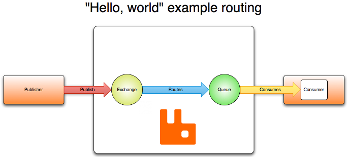

> 1. **Producer (Publisher)**: E.g., an app. Produces messages for consumers and sends them to the corresponding message queue through the exchange and routing.
> 2. **Exchange**: Distributes messages to the corresponding **message queues**.
> 3. **Routing**: Routes messages within the local area network (LAN) or the internet.
> 4. **Queue**: Stores messages.
> 5. **Consumer**: E.g., a user. Retrieves messages from the queue.


## 1.2 Installing RabbitMQ

RabbitMQ Official -> Get Started -> [Download + Installation](https://rabbitmq.com/download.html) -> Windows: Windows Installer -> Using the Installer

> Chocolatey: A package manager for Windows


### Install Erlang

 [Using the Installer](https://rabbitmq.com/install-windows.html#installer) -> Dependencies -> [Erlang 25.3](https://www.erlang.org/patches/otp-25.3.2) -> Download Windows Installer

> Erlang: A programming language like Java and C, known for its high performance. RabbitMQ depends on Erlang.

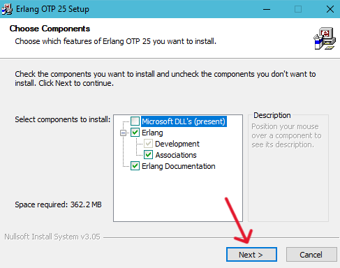

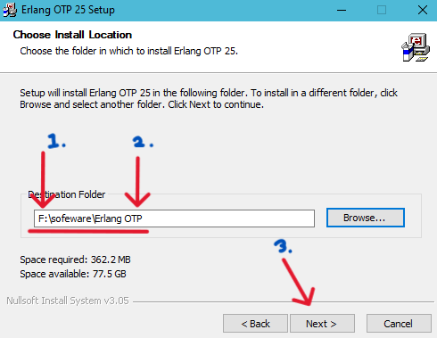

1. Recommended to install Erlang in a non-system drive (not C:).
2. Confirm installation in the "Erlang OTP" folder, not the root directory.


### Install RabbitMQ

 [Using the Installer](https://rabbitmq.com/install-windows.html#installer) -> Direct Downloads -> "rabbitmq-server-x.xx.xx.exe"

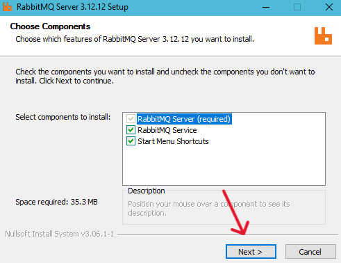

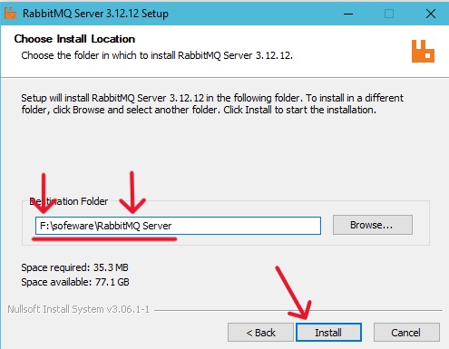

1. Recommended to install Erlang in a non-system drive (not C:).

1. During installation, if prompted by a firewall, select "Allow Access".

2. Choose "Open RabbitMQ service" and click Finish.

   

### Confirm Service is Running

Press `Win + R` -> type "services.msc" -> look for RabbitMQ service.

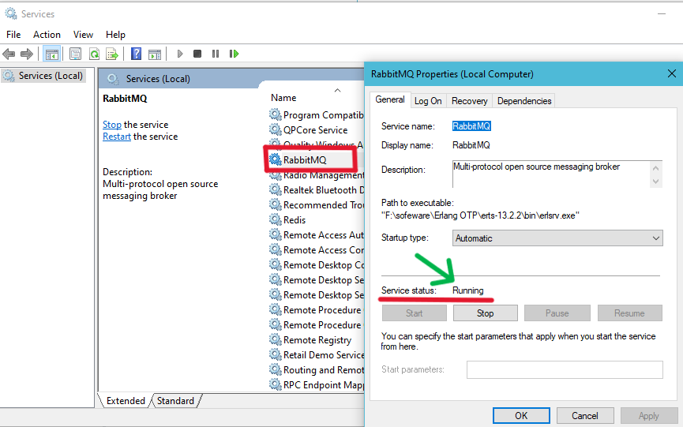


### Install RabbitMQ Management Panel

> Although RabbitMQ can be managed via Windows script commands without the management panel, such as:
> ```powershell
> rabbitmqctl.bat help
> rabbitmqctl.bat stop
> rabbitmqctl.bat status
> ...
> ```


RabbitMQ Official -> Docs -> CLI tools -> "[rabbitmq-plugins](https://rabbitmq.com/rabbitmq-plugins.8.html)" -> find the command -> copy the second command

```java
// X - Official original, but not used 
rabbitmq-plugins enable rabbitmq_shovel rabbitmq_management

// O - Use this
rabbitmq-plugins.bat enable rabbitmq_management
// .bat: Windows script file for installing software
// rabbitmq_shovel: RabbitMQ's other toolset, not needed, so it's removed
```


Navigate to the RabbitMQ installation path `...\RabbitMQ Server\rabbitmq_server-3.12.12\sbin`

> `rabbitmq-server.bat`: Script to manage the service.
>
> `rabbitmq-plugins.bat`: Script to manage plugins.

Open cmd in this directory, execute:

``` java
rabbitmq-plugins.bat enable rabbitmq_management
```

> Allow access if prompted by the firewall.

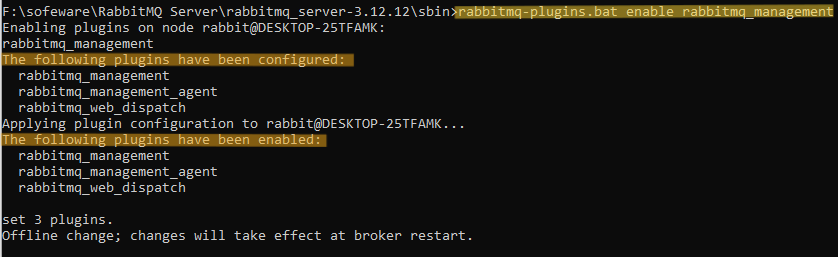

Then restart the computer.


### Accessing RabbitMQ Management Panel

> After installing the RabbitMQ management panel, you need to restart your computer once.

With the service running (Service status: Running), access the management panel in your browser at `localhost:15672`.

- Username: guest (lowercase)
- Password: guest

> The local guest has admin privileges but can only be used for local access.
>
> Remote access with the guest account is disabled for RabbitMQ management. To access RabbitMQ remotely (e.g., on a server), you need to create an [admin account Access Control](https://rabbitmq.com/access-control.html) and add users accordingly.


### Import RabbitMQ Maven Library

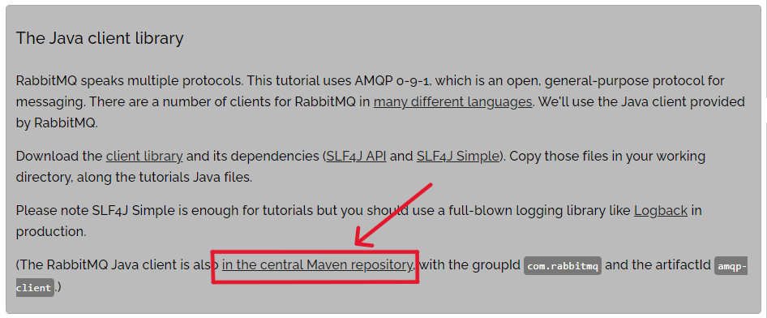

Go to the [Maven - RabbitMQ Java Client](https://mvnrepository.com/artifact/com.rabbitmq/amqp-client) repository and copy the dependency code to your backend project's `pom.xml` file.

```xml
<dependency>
    <groupId>com.rabbitmq</groupId>
    <artifactId>amqp-client</artifactId>
    <version>5.20.0</version>
</dependency>
```


### Additional Information

Refer to RabbitMQ [Port Access](https://rabbitmq.com/install-windows.html#ports) for information on port configurations.


### Key Features of RabbitMQ (Interview Preparation) ⭐

1. **Concepts, Models, and Use Cases of Message Queues**
   1. **Concepts** - E.g., 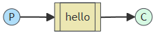
   2. **Models** - Design diagrams
   3. **Use Cases** - Differences between using and not using message queues, comparison with other message queues
2. **Exchange Types and Routing Bindings**
   1. `fanout`
   2. `direct`
   3. `topic`
   4. `header`
3. **Message Reliability**
   1. **Message Acknowledgement** (ack, nack, reject)
   2. **Message Durability** (durable)
   3. **Message Expiry Mechanism**
   4. **Dead Letter Queue**
4. **Delayed Queue** (not covered in this tutorial, similar to dead letter queue)
5. **Sequential Consumption and Idempotent Consumption** (not covered in this tutorial)
6. **Scalability** (not covered in this tutorial, just for understanding, apply with ctrl+CV when needed)
   1. Clustering
   2. Fault Recovery Mechanism
   3. Mirroring
7. **Operations Monitoring and Alerts** (not covered in this tutorial, just for understanding, unrelated to message queues)

## 1.3 Single Send

### "Hello World"

RabbitMQ [https://rabbitmq.com/](https://rabbitmq.com/) -> Get Started -> [RabbitMQ Tutorials](https://rabbitmq.com/getstarted.html) -> "Hello World" -> Java


Scenario: 1-to-1


### Sending Messages

#### Writing Send Code

RabbitMQ tutorial -> "Hello world" -> Java -> Sending -> [ "Here's the whole Send.java class" ](https://github.com/rabbitmq/rabbitmq-tutorials/blob/main/java/Send.java)

Copy and paste the code into IDE 

```java
import com.rabbitmq.client.Channel;
import com.rabbitmq.client.Connection;
import com.rabbitmq.client.ConnectionFactory;

import java.nio.charset.StandardCharsets;

public class Send {

    private final static String QUEUE_NAME = "hello";

    public static void main(String[] argv) throws Exception {
        ConnectionFactory factory = new ConnectionFactory();
        factory.setHost("localhost");
        try (Connection connection = factory.newConnection();
             Channel channel = connection.createChannel()) {
            channel.queueDeclare(QUEUE_NAME, false, false, false, null);
            String message = "Hello World!";
            channel.basicPublish("", QUEUE_NAME, null, message.getBytes(StandardCharsets.UTF_8));
            System.out.println(" [x] Sent '" + message + "'");
        }
    }
}
```


Create a new package called `mq` in the backend, and then paste the copied RabbitMQ Send code (you can automatically create a new class and paste the code).

Change the official code class name to `SendSingle` (Send Single Message) for sending a single message.

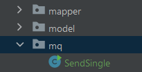


#### Code Explanation

The steps for the producer and consumer are roughly the same:

1. Create a connection factory `new ConnectionFactory()`

2. Configure the connection factory `factory.setXXX()`

3. Create a connection `.newConnection()`

4. Create a channel `.createChannel()`

   > Channel: Understand it as a client (e.g., jdbcClient, .redisClient) for operating the message queue, providing methods for communication with the message queue server. **Programs interact with the MQ through the channel**.

5. Declare a message queue: `.queueDeclare(...)`

   ```java
   private final static String QUEUE_NAME = "hello";
   ...
   channel.queueDeclare(String queue, boolean durable, boolean exclusive, boolean autoDelete, Map<String, Object> arguments);
   ```

   - `queue` / `QUEUE_NAME`: Queue name used for the Producer and Consumer.

     > Note! A message queue with the same name can only be created once with the same parameters.

   - `durable`: Whether the queue is durable. Setting it to true means: after a message queue restart, the queue continues to run, and the original messages will not disappear.

   - `exclusive`: Whether only the creator (connection) of the message queue can access it. Setting it to true means: only the creator can access this queue, and others cannot. This includes if the connection is restarted, the creator will no longer be able to access this queue.

   - `autoDelete`: Whether the queue should be automatically deleted when no consumers are connected (not recommended).

Send messages to MQ: `.basicPublish(...)`


#### Testing

Run `Send`

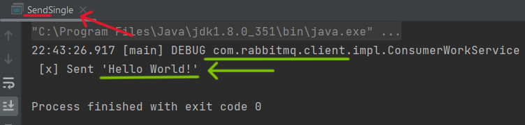


Open RabbitMQ management at `localhost:15672` (guest) to view the produced messages.

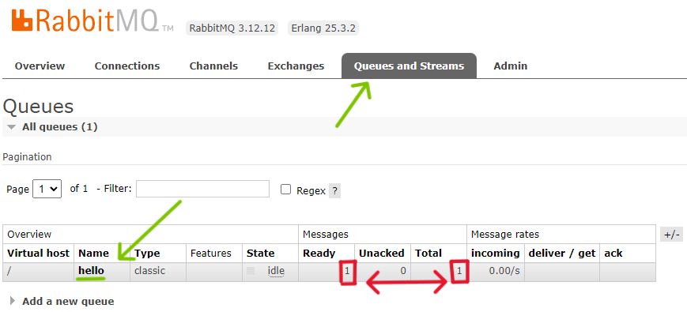


### Receiving Messages

#### Writing Recv Code

RabbitMQ tutorial -> "Hello world" -> Java -> Receiving -> [ "Here's the whole Recv.java class" ](https://github.com/rabbitmq/rabbitmq-tutorials/blob/main/java/Recv.java)

Copy and paste the code into IDE 

```java
import com.rabbitmq.client.Channel;
import com.rabbitmq.client.Connection;
import com.rabbitmq.client.ConnectionFactory;
import com.rabbitmq.client.DeliverCallback;
import java.nio.charset.StandardCharsets;

public class Recv {

    private final static String QUEUE_NAME = "hello";

    public static void main(String[] argv) throws Exception {
        ConnectionFactory factory = new ConnectionFactory();
        factory.setHost("localhost");
        Connection connection = factory.newConnection();
        Channel channel = connection.createChannel();

        channel.queueDeclare(QUEUE_NAME, false, false, false, null);
        System.out.println(" [*] Waiting for messages. To exit press CTRL+C");

        DeliverCallback deliverCallback = (consumerTag, delivery) -> {
            String message = new String(delivery.getBody(), StandardCharsets.UTF_8);
            System.out.println(" [x] Received '" + message + "'");
        };
        channel.basicConsume(QUEUE_NAME, true, deliverCallback, consumerTag -> { });
    }
}
```


(Same as "Writing Send Code")

In the `mq` package, directly paste the copied RabbitMQ Recv code (you can automatically create a new class and paste the code).

Change the official code class name to `RecvSingle` (Receive Single Message) for receiving a single message.


#### Code Explanation

The steps for the producer and consumer are roughly the same:

1. Create a connection factory `new ConnectionFactory()`
2. Configure the connection factory `factory.setXXX()`
3. Create a connection `.newConnection()`
4. Create a channel `.createChannel()`
5. Declare a message queue: `.queueDeclare(...)`

Process messages: `deliverCallback = (consumerTag, delivery) -> { ... }`

Acknowledge message consumption: `.basicConsume(...)`


#### Testing

Run `RecvSingle` and keep it running (unlike Send).

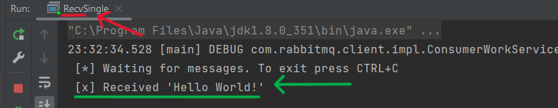


Open RabbitMQ management at `localhost:15672` (guest) to view the produced messages.

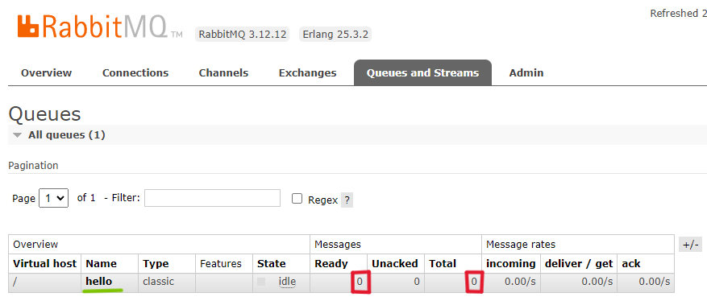


### Send & Recv Overall Test

At this point, Send and Recv have established a connection.

Run `RecvSingle` and keep it running. This way, Recv will automatically consume messages. Then run Send multiple times to produce several messages.

Open RabbitMQ management at `localhost:15672` (guest) to view the produced messages.

Check the "Consumption Records" for the `hello` queue:

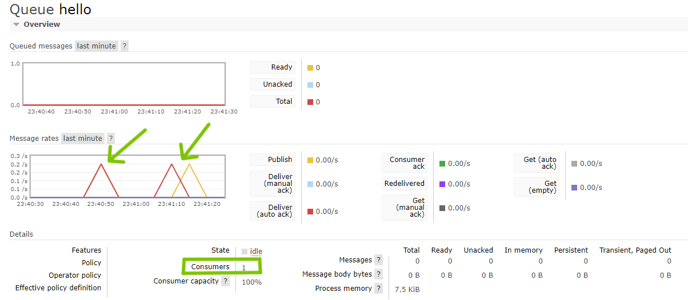


## 1.4 Concurrency (Multiple Consumers)

### "Work Queue"

RabbitMQ [https://rabbitmq.com/](https://rabbitmq.com/) -> Get Started -> [RabbitMQ Tutorials](https://rabbitmq.com/getstarted.html) -> "Work Queue" -> Java

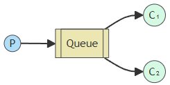

Scenario: Multiple machines receive and process tasks simultaneously, especially in situations where each machine's processing capability is prioritized.


### [!] Message Acknowledgment Mechanism

> A more detailed explanation of the "Message Acknowledgment Mechanism" will be covered in later chapters. Here we cover the **essential parts** needed for learning RabbitMQ.


#### What is the Message Acknowledgment Mechanism?

**Similar to confirming receipt of a package.**

Messages that have not been processed are considered Unacked by default. To ensure messages are successfully consumed (the package is successfully picked up), RabbitMQ provides a message acknowledgment mechanism. After a consumer receives a message, it sends a feedback:

- ack: Consumption successful.
- nack: Consumption failed.
- reject: Rejected.

The consumer tells the RabbitMQ server that the message has been successfully consumed before the server will safely remove the message, rather than sending the message and ignoring it.


#### `autoACK` Automatic Acknowledgment

```java
String basicConsume(String queue, boolean autoAck, DeliverCallback deliverCallback, CancelCallback cancelCallback)
    										 ^
```

It is recommended to set `autoAck` to false based on the actual situation and then manually acknowledge messages.


#### `.basicAck` Manual Acknowledgment

```java
.basicAck(long deliveryTag, boolean multiple)
```

- `multiple` Batch acknowledgment
  - `multiple` set to true: Acknowledges the current `deliveryTag` message and all previously unacknowledged messages.
  - `multiple` set to false: Acknowledges only the current `deliveryTag` message. It is recommended to set this to false.

#### `.basicNack`

Similar to `.basicAck` but used for negative acknowledgment or rejection.

```java
.basicNack(long deliveryTag, boolean multiple, boolean requeue)
```

- `requeue`: Whether the failed message should be requeued for retry. It is recommended to set this to false.


### Sending "Concurrent" Messages

#### Writing SendMuti Code

Go to [Work Queue - Putting it all together](https://rabbitmq.com/tutorials/tutorial-two-java.html), copy the `NewTask` code, and paste it into IDEA (similar to above, directly ctrl + V can create the document and paste the code at the same time).

Rename `NewTask` to `SendMuti`.

Change `TASK_QUEUE_NAME` to `"multi_queue"`.

Add a `Scanner` and modify the message reception method.

```java
package com.becoze.biback.mq;

import com.rabbitmq.client.Channel;
import com.rabbitmq.client.Connection;
import com.rabbitmq.client.ConnectionFactory;
import com.rabbitmq.client.MessageProperties;
import jdk.nashorn.internal.runtime.regexp.joni.ScanEnvironment;

import java.util.Scanner;

public class SendMuti {

  private static final String TASK_QUEUE_NAME = "multi_queue";

  public static void main(String[] argv) throws Exception {
    ConnectionFactory factory = new ConnectionFactory();
    factory.setHost("localhost");
    try (Connection connection = factory.newConnection();
         Channel channel = connection.createChannel()) {
        channel.queueDeclare(TASK_QUEUE_NAME, true, false, false, null);
        // .queueDeclare(String queue, boolean durable, boolean exclusive, boolean autoDelete, Map<String, Object> arguments);
		
        // gather input (terminal)
        Scanner scanner = new Scanner(System.in);
        while (scanner.hasNext()){
            String message = scanner.nextLine();
            channel.basicPublish("", TASK_QUEUE_NAME,
                    MessageProperties.PERSISTENT_TEXT_PLAIN,
                    message.getBytes("UTF-8"));
            System.out.println(" [x] Sent '" + message + "'");
        }
    }
  }
}
```


#### Code Explanation

**Steps** are the same as above:

1. Create a connection factory `new ConnectionFactory()`

2. Configure the connection factory `factory.setXXX()`

3. Create a connection `.newConnection()`

4. Create a channel `.createChannel()`

5. Declare a message queue: `.queueDeclare(...)`


**Queue Durability**: Ensures the queue continues to exist after a restart.

Set `durable` to true in `.queueDeclare`.

```java
.queueDeclare(String queue, boolean durable, boolean exclusive, boolean autoDelete, Map<String, Object> arguments);
```


**Message Durability**: Ensures that messages are not lost after a restart.

Specify `MessageProperties.PERSISTENT_TEXT_PLAIN`, which is a constant.

```java
channel.basicPublish("", TASK_QUEUE_NAME,
                    MessageProperties.PERSISTENT_TEXT_PLAIN,	// <- Here
                    message.getBytes("UTF-8"));
```


#### Testing

Run `SendMuti` and input three messages:

```bash
message1
 [x] Sent 'message1'
ok2
 [x] Sent 'ok2'
hi3
 [x] Sent 'hi3'
```


Go to `http://localhost:15672` -> queues to see:

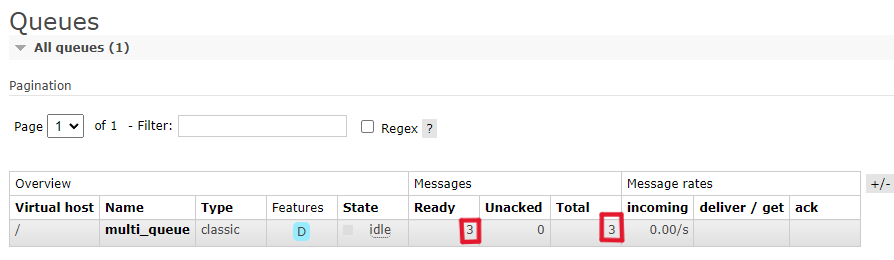


### Receiving "Concurrent" Messages

#### Writing RecvMuti Code

Go to [Work Queue - Putting it all together](https://rabbitmq.com/tutorials/tutorial-two-java.html), copy the `Worker` code, and paste it into IDEA (similar to above, directly ctrl + V can create the document and paste the code at the same time).

Rename `Worker` to `RecvMuti`.

Change `TASK_QUEUE_NAME` to `"multi_queue"`.

Comment out and remove `channel.basicQos(1);`. This controls the number of tasks that a single consumer processes at a time, which is not needed here.

Modify `doWork`.

Add `Thread.sleep(20000);` to simulate a consumer with limited performance, taking a long time to process a single task.

```java
package com.becoze.biback.mq;

import com.rabbitmq.client.Channel;
import com.rabbitmq.client.Connection;
import com.rabbitmq.client.ConnectionFactory;
import com.rabbitmq.client.DeliverCallback;

public class RecvMuti {

  private static final String TASK_QUEUE_NAME = "multi_queue";

  public static void main(String[] argv) throws Exception {
    ConnectionFactory factory = new ConnectionFactory();
    factory.setHost("localhost");
    final Connection connection = factory.newConnection();
    final Channel channel = connection.createChannel();

    channel.queueDeclare(TASK_QUEUE_NAME, true, false, false, null);
    System.out.println(" [*] Waiting for messages. To exit press CTRL+C");

//    channel.basicQos(1);

    // Define what to do with the message
    DeliverCallback deliverCallback = (consumerTag, delivery) -> {
        String message = new String(delivery.getBody(), "UTF-8");

        try {
            // doWork
            System.out.println(" [x] Received" + message + "'");
            // set waiting time, simulate process time
            Thread.sleep(20000);	
        } catch (InterruptedException e) {
            throw new RuntimeException(e);
        } finally {
            System.out.println(" [x] Done");
            channel.basicAck(delivery.getEnvelope().getDeliveryTag(), false);
        }
    };
    // enable listing
    channel.basicConsume(TASK_QUEUE_NAME, false, deliverCallback, consumerTag -> { });
  }
}
```


#### Code Explanation

**Steps** are the same as above:

1. Create a connection factory `new ConnectionFactory()`

2. Configure the connection factory `factory.setXXX()`

3. Create a connection `.newConnection()`

4. Create a channel `.createChannel()`

5. Declare a message queue: `.queueDeclare(...)`

Process messages: `deliverCallback = (consumerTag, delivery) -> { ... }`

Acknowledge message consumption: `.basicConsume(...)`


### Testing - Single Consumer

(Since `SendMuti` has been run with three messages, there should be three pending messages in the queue.)

Run `RecvMuti`. You should see a statement output every 10 seconds.

```bash
 [*] Waiting for messages. To exit press CTRL+C
 [x] Received 'message1'
 [x] Done
 [x] Received 'ok2'
 ...
```


### Testing - Multiple Consumers (Concurrency Test)

Enable `channel.basicQos(1);`.

> Controls the number of tasks a single channel consumer can handle concurrently: Each consumer can handle up to `x` tasks at the same time, with the default being 1 task.

Wrap the code in a `for` loop, running it twice to represent two consumers.

Modify and add `.basicAck` and `.basicNack`.

```java
public static void main(String[] argv) throws Exception {
    ConnectionFactory factory = new ConnectionFactory();
    factory.setHost("localhost");
    final Connection connection = factory.newConnection();

    // loop twist mean 2 consumer
    for (int i = 0; i < 2; i++) {
        final Channel channel = connection.createChannel();

        channel.queueDeclare(TASK_QUEUE_NAME, true, false, false, null);
        System.out.println(" [*] Waiting for messages. To exit press CTRL+C");
        channel.basicQos(1);

        // Define what to do with the message
        int finalI = i;
        DeliverCallback deliverCallback = (consumerTag, delivery) -> {
            String message = new String(delivery.getBody(), "UTF-8");

            try {
                // doWork
                System.out.println(" [x] Received by Consumer " + finalI + ", '" + message + "'");
                // Acknowledge message 
                channel.basicAck(delivery.getEnvelope().getDeliveryTag(), false);
                Thread.sleep(10000);
            } catch (InterruptedException e) {
                e.printStackTrace();
                // non-acknowledge (reject) message
                channel.basicNack(delivery.getEnvelope().getDeliveryTag(), false, false);
            } finally {
                System.out.println(" [x] Done");
                // Acknowledge message
                channel.basicAck(delivery.getEnvelope().getDeliveryTag(), false);
            }
        };
        // Enable listing, Consumer
        channel.basicConsume(TASK_QUEUE_NAME, false, deliverCallback, consumerTag -> {
        });
    }
}
```


Then set a breakpoint on `channel.basicAck(...);` above `.sleep(10000)`.

Start `RecvMulti` in debug mode.

Start `SendMulti` normally and input one message.

Go to the RabbitMQ management page at `localhost:15672` -> queues -> `multi_queue`.

Before clicking "Continue" at the breakpoint, you should see an `Unacked` message.

- Messages that have not been processed are considered `Unacked` by default.
- Messages can also be manually `Unacked` using `.basicNack(...)` after a series of checks.

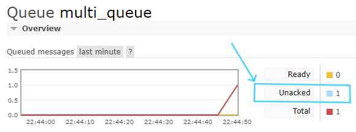

Return to `RecvMulti`, press "F9" to continue execution past the breakpoint.

Then check the RabbitMQ management page at `localhost:15672` -> queues -> `multi_queue`.

You should see that `Unacked` has been processed.

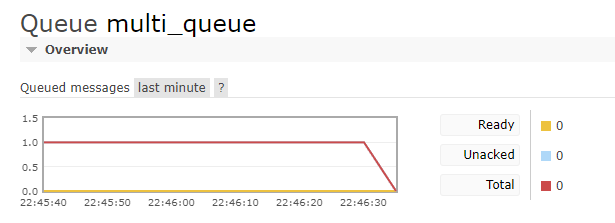


### Additional Tips

- Use `loop + Scanner` to accept user input for quickly sending multiple messages.


```java
Scanner scanner = new Scanner(System.in);
while (scanner.hasNext()) {
    String message = scanner.nextLine();
    channel.basicPublish(...);
}
```


- Use a `for` loop to create multiple consumers for quickly validating the queue model's working mechanism.

```java
for (int i = 0; i < 2; i++) {
    final Channel channel = connection.createChannel();
    ...
        
    channel.basicConsume(TASK_QUEUE_NAME, false, deliverCallback, consumerTag -> {
        });
}
```


# 2 !!! Routing Binding and Exchange

## 2.1 Routing Binding

**Routing Binding and `RoutingKey`**

Binding: Responsible for linking an exchange to a queue, also known as Routes. It acts as a forwarding policy or routing rule.

`routingKey`: The name of the route; only messages containing the specified name will enter this route.

> Analogous to a routing table in computer networks: An exchange stores the IP addresses of other routers, and `routingKey` is like an IPv4 address. Binding is like recording successful routing in the exchange’s routing table to send messages.

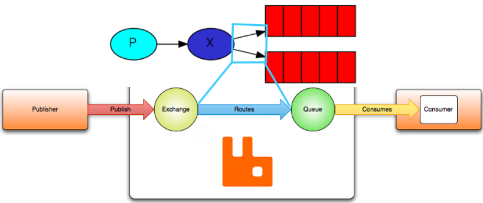


**Binding Syntax `.queueBind()`**

```java
.queueBind(String queue, String exchange, String routingKey)
```

- `queue`: The name of the message queue.

- `exchange`: The name of the exchange.

- `routingKey`: The routing key, forwarding policy, controls how messages are forwarded and to which queue. (The `routingKey` is analogous to an **IP address** in computer networks, using the routing table to bind other networks.)


## 2.2 Exchange Types

An exchange sends messages to multiple queues, and multiple consumers retrieve messages from these queues. This is a one-to-many relationship.

- **`fanout` exchange**: Broadcast exchange

  **Characteristics**: Broadcasts messages to all queues bound to the exchange.

  **Use Case**: Suitable for publish-subscribe scenarios. Also useful for writing logs/data and sharing them among multiple systems.

  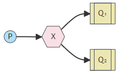

  

- **`direct` exchange**: Point-to-point exchange

  **Characteristics**: Directly sends messages to all queues that match the routing criteria.

  **Use Case**: Mostly used for one-to-one (only one consumer matches) or one-to-many (multiple consumers match) scenarios. Broadcasting (where all consumers match) is also possible but less recommended compared to `fanout`. 

  **Difference from `topic`**: The `direct` exchange is useful for exact matching (==), while `topic` is for partial matching (||).

  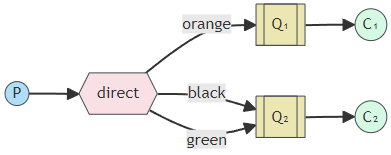

  > Figure 1 shows different routing keys bound.

  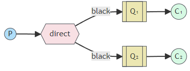

  > Figure 2 shows the same routing keys bound, achieving one-to-many or even broadcasting.

  

- **`topic` exchange**: Topic exchange

  **Characteristics**: Messages are routed to specific queues based on a **vague, category-representing** routing key.

  **Use Case**: Suitable for sending specific types of messages to specific systems (programs). It classifies/group messages and sends them to all matching consumers.

  **Difference from `direct`**: `topic` is for partial matching (||), while `direct` is for exact matching (==).

  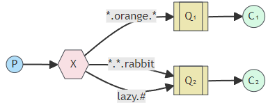

  > `*` is a wildcard in regular expressions: Represents **one** word.
  >
  > ```java
  > routingKey: "*.frontend.*"
  >  ".frontend."     // OK
  >  "X.frontend."     // OK
  >  ".frontend.X"    // OK
  >  "X.frontend.X"    // OK
  >  ".frontend"      // Error
  >  "frontend"       // Error
  >  ".frontend.backend." // Error
  > ```
  >
  > `#` is also used in regular expressions: Represents **zero or more** words.
  >
  > ```java
  > routingKey: "#.frontend.#"
  >  "frontend"       // OK
  >  ".frontend"      // OK
  >  ".frontend."    // OK
  >  ".frontend.backend." // OK
  >  // Basically, any routing key that includes the specified pattern can match, including multiple matches
  > ```
  >
  > Note: This matching is different from MySQL’s "like %" and is based on exact word matches, with each `.` separating words. For `#`, it can match zero or more words.

> **`headers` exchange**: Generally not used. Other exchanges like `fanout`, `topic`, and `direct` can meet most needs.
>
> Similar to `topic` and `direct`, `headers` can specify which queue to send messages based on the content in the headers.


## 2.3 Fanout Publish/Subscribe

### "Publish / Subscribe"

RabbitMQ https://rabbitmq.com/ -> Get Started -> [RabbitMQ Tutorials](https://rabbitmq.com/getstarted.html) -> "Publish / Subscribe" -> Java


**Scenario**: Multiple machines simultaneously receive and process tasks (especially when each machine has limited processing capability).


### Sending "fanout" Messages

`fanout`

- **Characteristics**: Broadcasting. Messages are forwarded to all queues bound to the exchange.

- **Use Case**: Suitable for publish-subscribe scenarios. Also useful for writing logs/data and sharing them among multiple systems.


Copy the `EmitLog` code from [Publish / Subscribe - Putting it all together](https://rabbitmq.com/tutorials/tutorial-three-java.html) and paste it into IDEA. (As before, use `ctrl + V` to create the document and paste the code simultaneously.)

> The official code names the class `EmitLog`, combining "Emitting" + "Log," because `direct` exchanges are also suitable for scenarios where multiple users write logs/data.

Rename `EmitLog` to `SendFanout`.

Change `EXCHANGE_NAME` to `"fanout-exchange"`.

Add a `Scanner` for user input.

```java
package com.becoze.biback.mq;

import com.rabbitmq.client.Channel;
import com.rabbitmq.client.Connection;
import com.rabbitmq.client.ConnectionFactory;

import java.util.Scanner;

public class SendFanout {

    private static final String EXCHANGE_NAME = "fanout-exchange";

    public static void main(String[] argv) throws Exception {
        ConnectionFactory factory = new ConnectionFactory();
        factory.setHost("localhost");
        try (Connection connection = factory.newConnection();
             Channel channel = connection.createChannel()) {
            // create exchange
            channel.exchangeDeclare(EXCHANGE_NAME, "fanout");
			// gater user input (terminal)
            Scanner scanner = new Scanner(System.in);
            while (scanner.hasNext()) {
                String message = scanner.nextLine();
                channel.basicPublish(EXCHANGE_NAME, "", null, message.getBytes("UTF-8"));
                System.out.println(" [x] Sent '" + message + "'");
            }
        }
    }
}
```

explain

```java
.basicPublish(String exchange, String routingKey, BasicProperties props, byte[] body)

// publish to queue
.basicPublish("", TASK_QUEUE_NAME,	// <- exchange:null, routingKeyt: TASK_QUEUE_NAME
	MessageProperties.PERSISTENT_TEXT_PLAIN,
	message.getBytes("UTF-8"));

// publish to exchange
.basicPublish(EXCHANGE_NAME, "",   	// <- exchange:EXCHANGE_NAME, routingKeyt: null
	null, 
	message.getBytes("UTF-8"));
```


### Receiving "fanout" Messages

Similarly, copy the `ReceiveLogs` code and paste it into IDEA.

Rename `ReceiveLogs` to `RecvFanout`.

Change `EXCHANGE_NAME` to `"fanout-exchange"` (to match the sender).

Configure an additional consumer `employee2`.

```java
package com.becoze.biback.mq;

import com.rabbitmq.client.Channel;
import com.rabbitmq.client.Connection;
import com.rabbitmq.client.ConnectionFactory;
import com.rabbitmq.client.DeliverCallback;

public class RecvFanout {
  private static final String EXCHANGE_NAME = "fanout-exchange";

  public static void main(String[] argv) throws Exception {
    ConnectionFactory factory = new ConnectionFactory();
    factory.setHost("localhost");
    Connection connection = factory.newConnection();

    Channel channel1 = connection.createChannel();
    Channel channel2 = connection.createChannel();
    // Declare exchange
    channel1.exchangeDeclare(EXCHANGE_NAME, "fanout");
    channel2.exchangeDeclare(EXCHANGE_NAME, "fanout");

    // Create task queues
    String employee1 = "employee_1";
    // Implement queue
    channel1.queueDeclare(employee1, true, false, false, null);
    // Bind the queue with the exchange
    channel1.queueBind(employee1, EXCHANGE_NAME, "");


    String employee2 = "employee_2";
    channel2.queueDeclare(employee2, true, false, false, null);
    channel2.queueBind(employee2, EXCHANGE_NAME, "");
    System.out.println(" [*] Waiting for messages. To exit press CTRL+C");

    // do work
    DeliverCallback deliverCallback1 = (consumerTag, delivery) -> {
        String message = new String(delivery.getBody(), "UTF-8");
        System.out.println(" [E1] Received '" + message + "'");
    };

    DeliverCallback deliverCallback2 = (consumerTag, delivery) -> {
        String message = new String(delivery.getBody(), "UTF-8");
        System.out.println(" [E2] Received '" + message + "'");
    };

    // listening
    channel1.basicConsume(employee1, true, deliverCallback1, consumerTag -> { });
    channel2.basicConsume(employee2, true, deliverCallback2, consumerTag -> { });
  }
}
```

> Remember to create the queue!!!
>
> The official documentation for `RecvXXX` does not include queue creation with `channel.queueDeclare(TASK_QUEUE_NAME, durable, exclusive, autoDelete, arguments);`.


#### Error: Channel Error

Check the exchange properties (bindings) at:

`localhost:15672` -> Exchanges -> "fanout-exchange" -> Bindings

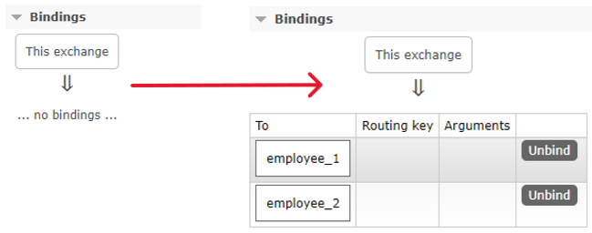

Remember to create the queue!!!


### Testing (Fanout Broadcast)

Start `SendFanout` and `RecvFanout`.

Input into `SendFanout`.

```java
Task1
 [x] Sent 'Task1'
Task2222222
 [x] Sent 'Task2222222'
```


Output from `RecvFanout`: Since tasks are broadcasted to all consumers, both E1 and E2 should receive the same task.

```java
 [E1] Received 'Task1'
 [E2] Received 'Task1'
 
 [E1] Received 'Task2222222'
 [E2] Received 'Task2222222'
```


## 2.4 Direct Point-to-Point

### "Direct-exchange"

**Characteristics**: Messages are forwarded to specific queues based on the routing key. (It is not necessarily one-to-one; it can be one-to-many.)

**Scenario**: Specific messages are only delivered to specific systems (programs) for processing.

```java
channel.queueBind(queueName, EXCHANGE_NAME, "black");
```


or "Multiple Binding"


### Sending "Direct" Messages

Copy the `EmitLogDirect` code from [Routing - Putting it all together](https://rabbitmq.com/tutorials/tutorial-four-java.html) and paste it into IDEA. (As before, use `ctrl + V` to create the document and paste the code simultaneously.)

> The official code names the class `EmitLogDirect`, combining "Emitting" + "Log". The `direct` exchange is also suitable for scenarios where multiple users write logs/data.

Rename `EmitLogDirect` to `SendDirect`.

Change `EXCHANGE_NAME` to `"direct-exchange"`.

Add a `Scanner` for user input.

```java
package com.becoze.biback.mq;

import com.rabbitmq.client.Channel;
import com.rabbitmq.client.Connection;
import com.rabbitmq.client.ConnectionFactory;

import java.util.Scanner;

public class SendDirect {

  private static final String EXCHANGE_NAME = "direct_exchange";

  public static void main(String[] argv) throws Exception {
    ConnectionFactory factory = new ConnectionFactory();
    factory.setHost("localhost");
    try (Connection connection = factory.newConnection();
         Channel channel = connection.createChannel()) {
        channel.exchangeDeclare(EXCHANGE_NAME, "direct");

        Scanner scanner = new Scanner(System.in);
        // gater user input (terminal)
        while (scanner.hasNext()) {
            String userInput = scanner.nextLine();
            String[] strings = userInput.split(">");
            // invalid input, skip curren input (while loop)
            if (strings.length < 1){
                continue;
            }
            String message = strings[0];
            String routingKey = strings[1];

            channel.basicPublish(EXCHANGE_NAME, routingKey, null, message.getBytes("UTF-8"));
            System.out.println(" [x] Sent '" + message + "' with routing: " + routingKey);
        }
    }
  }
}
```


### Receiving "Direct" Messages

Similarly, copy the `ReceiveLogsDirect` code and paste it into IDEA. (As before, use `ctrl + V` to create the document and paste the code simultaneously.)

> The official code names the class `ReceiveLogsDirect`, combining "Receiving" + "Logs". The `direct` exchange is also suitable for scenarios where multiple users write logs/data.

Rename `ReceiveLogsDirect` to `RecvDirect`.

Change `EXCHANGE_NAME` to `"direct-exchange"` to match the producer.


### Binding Message Queues and Producers

The `routingKey` used in `SendDirect`'s `.basicPublish()` must match the `routingKey` in `RecvDirect`'s `.queueBind()` for proper binding.

```java
/*
 *	SendDirect.java
 */
// .basicPublish(String exchange, String routingKey, BasicProperties props, byte[] body)
channel.basicPublish(EXCHANGE_NAME, routingKey, null, message.getBytes("UTF-8"));
										^  // user-input:"e1"
                                              
/*
 *	RecvDirect.java
 */
// .queueBind(String queue, String exchange, String routingKey)
channel.queueBind(queue1, EXCHANGE_NAME, "e1");
										  ^
```


### Testing

Run `RecvDirect` and `SendDirect`.

Go to [http://localhost:15672](http://localhost:15672). In Queues and Streams, you can see the newly created exchange. Clicking on it shows the queues and their bindings with Routing Keys:

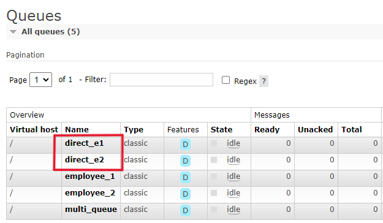

In Exchanges, you can see the newly created `direct_exchange` exchange. Clicking on the exchange shows the two queues bound to it:

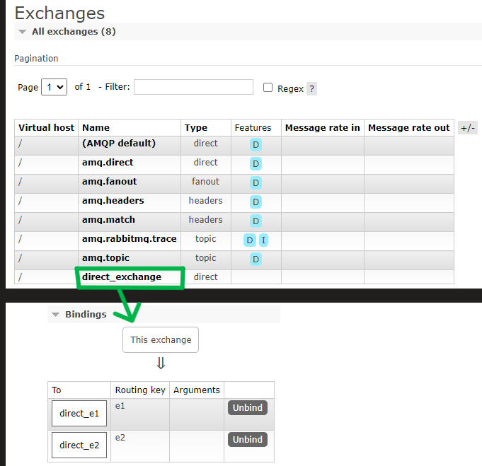


`SendDirect` sends:

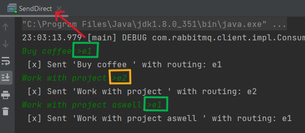

`RecvDirect` receives:

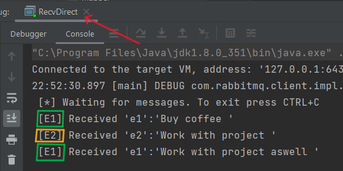


### Testing - Sending to Non-Existent Consumers

Run `RecvDirect` and `SendDirect`.

Go to [http://localhost:15672](http://localhost:15672).

As before, in Queues and Streams, you can see the newly created queue. In Exchanges, you can see the new `direct_exchange` exchange.

`SendDirect` sends:

```bash
take a rest >me
 [x] Sent 'take a rest ' with routing: me
```

Since the message is sent with the routing key `me`, `e1` and `e2` will not be affected.

`RecvDirect` receives:

```bash
(nothing)...
...
```


In Exchanges, you can see that the exchange received a message. **However, since there is no consumer with the routing key `me` (no one to process the message), it is immediately deleted.**

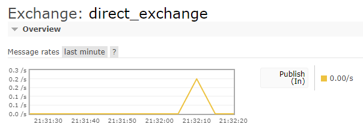


## 2.5 Topics 

### "Topic Exchange"

**Characteristics**: Messages are routed to queues based on a **patterned, classifying** routing key. 

**Scenario**: Allows specific types of messages to be handled by specific systems (programs). It’s like categorizing messages and queues and then dispatching messages to all matching consumers.


> `*` Regular expression "wildcard": Matches exactly one word.
>
> `#` Also used in regular expressions: Matches zero or more words.


### Sending "Topic" Messages

Copy the `EmitLogTopic` code from [Topic - Putting it all together](https://rabbitmq.com/tutorials/tutorial-five-java.html) and paste it into IDEA. (Use `ctrl + V` to simultaneously create and paste the document.)

Rename `EmitLogTopic` to `SendTopic`.

Change `EXCHANGE_NAME` to `"topic-exchange"`.

Add a `Scanner` for user input.

```java
package com.becoze.biback.mq;

import com.rabbitmq.client.Channel;
import com.rabbitmq.client.Connection;
import com.rabbitmq.client.ConnectionFactory;

import java.util.Scanner;

public class SendTopic {

  private static final String EXCHANGE_NAME = "topic_exchange";

  public static void main(String[] argv) throws Exception {
    ConnectionFactory factory = new ConnectionFactory();
    factory.setHost("localhost");
    try (Connection connection = factory.newConnection();
         Channel channel = connection.createChannel()) {

        channel.exchangeDeclare(EXCHANGE_NAME, "topic");

        Scanner scanner = new Scanner(System.in);
        while (scanner.hasNext()) {
            String userInput = scanner.nextLine();
            String[] strings = userInput.split(">");
            // invalid input, skip curren input (while loop)
            if (strings.length < 1){
                continue;
            }
            String message = strings[0];
            String routingKey = strings[1];

            channel.basicPublish(EXCHANGE_NAME, routingKey, null, message.getBytes("UTF-8"));
            System.out.println(" [x] Sent '" + message + "' with routing: " + routingKey);
        }
    }
  }
}
```


### Receiving "Topic" Messages

Similarly, copy the `ReceiveLogsTopic` code and paste it into IDEA. (Use `ctrl + V` to simultaneously create and paste the document.)

Rename `ReceiveLogsTopic` to `RecvTopic`.

Change `EXCHANGE_NAME` to `"topic-exchange"` to match the producer.

Create three queues: `frontend_queue`, `backend_queue`, and `market_queue`, and bind them with the corresponding routing keys: `*.frontend.*`, `*.backend.*`, and `*.market.*`. (Reuse code from `RecvDirect`.)

```java
// Message queue 1
String queue1 = "frontend_queue";
channel.queueDeclare(queue1, true, false, false, null);
channel.queueBind(queue1, EXCHANGE_NAME, "*.frontend.*");
//											^ routingKey

// Message queue 2
...
```


Create corresponding consumers for these queues.

Code: 

```java
package com.becoze.biback.mq;

import com.rabbitmq.client.Channel;
import com.rabbitmq.client.Connection;
import com.rabbitmq.client.ConnectionFactory;
import com.rabbitmq.client.DeliverCallback;

public class RecvTopic {

  private static final String EXCHANGE_NAME = "topic_exchange";

  public static void main(String[] argv) throws Exception {
    ConnectionFactory factory = new ConnectionFactory();
    factory.setHost("localhost");
    Connection connection = factory.newConnection();
    Channel channel = connection.createChannel();

    channel.exchangeDeclare(EXCHANGE_NAME, "topic");

      // Message queue 1
      String queue1 = "frontend_queue";
      channel.queueDeclare(queue1, true, false, false, null);
      channel.queueBind(queue1, EXCHANGE_NAME, "#.frontend.#");

      // Message queue 2
      String queue2 = "backend_queue";
      channel.queueDeclare(queue2, true, false, false, null);
      channel.queueBind(queue2, EXCHANGE_NAME, "#.backend.#");

      // Message queue 3
      String queue3 = "market_queue";
      channel.queueDeclare(queue3, true, false, false, null);
      channel.queueBind(queue3, EXCHANGE_NAME, "#.market.#");

      System.out.println(" [*] Waiting for messages. To exit press CTRL+C");


      // front end dowork
      DeliverCallback deliverCallback_Nick = (consumerTag, delivery) -> {
          String message = new String(delivery.getBody(), "UTF-8");
          System.out.println(" [Nick] Received '" +
                  delivery.getEnvelope().getRoutingKey() + "':'" + message + "'");
      };

      // back end dowork
      DeliverCallback deliverCallback_Alice = (consumerTag, delivery) -> {
          String message = new String(delivery.getBody(), "UTF-8");
          System.out.println(" [Alice] Received '" +
                  delivery.getEnvelope().getRoutingKey() + "':'" + message + "'");
      };
      // market dowork
      DeliverCallback deliverCallback_Tom = (consumerTag, delivery) -> {
          String message = new String(delivery.getBody(), "UTF-8");
          System.out.println(" [Tom] Received '" +
                  delivery.getEnvelope().getRoutingKey() + "':'" + message + "'");
      };

      channel.basicConsume(queue1, true, deliverCallback_Nick, consumerTag -> { });
      channel.basicConsume(queue2, true, deliverCallback_Alice, consumerTag -> { });
      channel.basicConsume(queue3, true, deliverCallback_Tom, consumerTag -> { });
  }
}
```


### Testing

Run `SendTopic` and `RecvTopic`.

Go to [http://localhost:15672](http://localhost:15672). In Queues and Streams, you can see the new exchange. Clicking on it shows the queues and their bindings with Routing Keys:

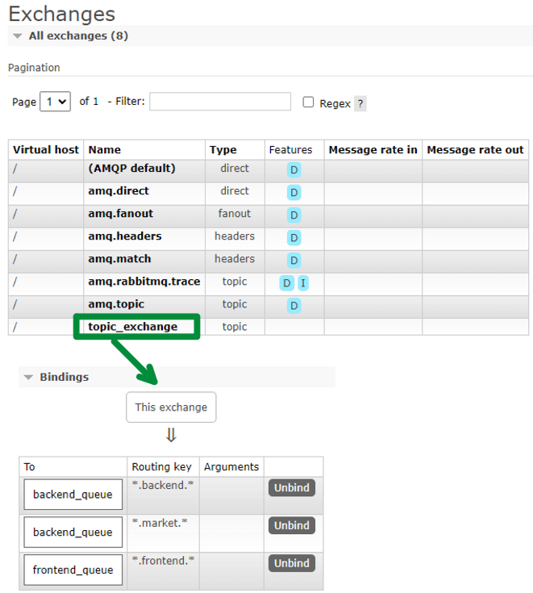

**Sending and Receiving Messages:**

```bash
SendTopic:
	work on react >frontend
RecvTopic:
	[Nick] Received 'work on react '
------------------------------------------------------------
SendTopic:
	review code >backend
RecvTopic:
	[Alice] Received 'review code '
------------------------------------------------------------
SendTopic:
	intergration >frontend.backend
RecvTopic:
	[Nick] Received 'frontend.backend':'intergration '
	[Alice] Received 'frontend.backend':'intergration '
------------------------------------------------------------
SendTopic:
	hi >frontend.backend.market
RecvTopic:
	[Tom] Received 'frontend.backend.market':'hi '
	[Nick] Received 'frontend.backend.market':'hi '
	[Alice] Received 'frontend.backend.market':'hi '
```
