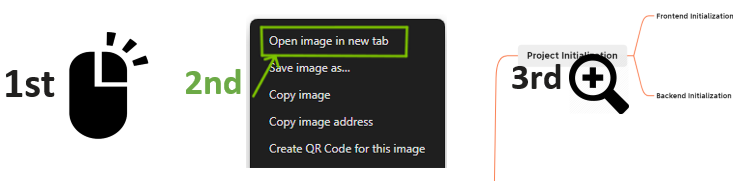

# BI
## GitHub Repo
<i class="fa-brands fa-github"></i> [Business Intelligent Platform - Back end <i class="fa-solid fa-arrow-up-right-from-square"></i>](https://github.com/becoze/bi-back)

<i class="fa-brands fa-github"></i> [Business Intelligent Platform - Front end <i class="fa-solid fa-arrow-up-right-from-square"></i>](https://github.com/becoze/bi-front)

## Features 
- Analysis (synchronous)
- Analysis (asynchronous)
- AI Prompting
- Easy Excel
- User requests rate limiting
- Dead-letter queue
- Spring Session Redis for distributed login
- Multi-environment configuration
- Global exception handler + custom error codes

## Tech Stack
### Backend:
- Java Spring Boot
- MySQL Database
- Redis: Redisson for rate limiting
- JDK: thread pool (rate limited & access control) and asynchronization
- MyBatis Plus: data access
- MyBatisX (IDEA plugin): auto-generate code based on database tables
- RabbitMQ: message queue
- ChatGPT AI SDK: AI power
- Swagger + Knife4: project documentation
- Easy Excel: spreadsheet data processing
- JUnit5: unit test
- Other: Hutool utility library, Apache Common Utils, Gson parsing library, Lombok annotations

### Frontend:
- React 18
- Ant Design Pro v5 scaffold & library
- OpenAPI: Automatically generate api code based on Swagger API document
- EChart: chart generation

### Development Tools:

## System Design

## Project Log

> Enlarge image if needed
