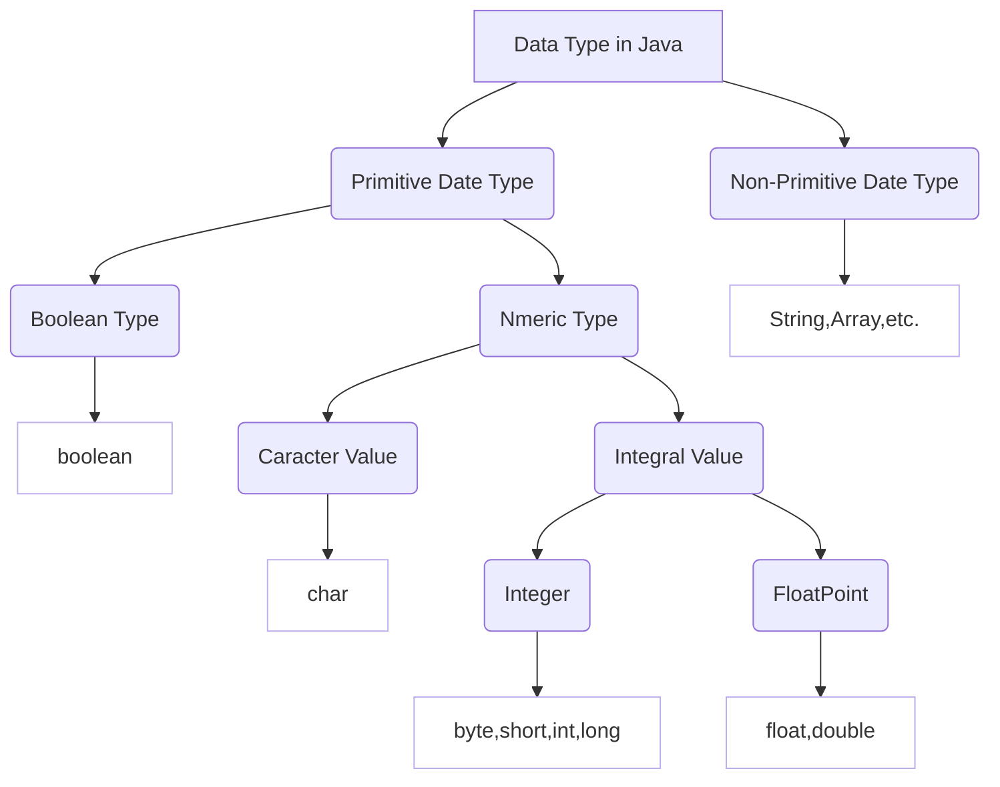

# ⭐ Basic Data Types



⚠ (An image will be displayed here. If nothing appears or if you see a bunch of code, please refresh the page (F5). Sorry for any inconvenience caused.)

# Default Values for Data Types

| Date types | Default Value |
| --- | --- |
| byte; short; int; long | 0 |
| float; double | 0.0 |
| char | ' ' or \u0000 |
| boolean | false |
| String | null |


# Integer Data Type

- Integer constants (specific values) are by default of type `int`.

| Type | Storage Space | Range |
| --- | --- | --- |
| byte | 1 byte | -128 to 127 |
| short | 2 bytes | -2^15 to 2^15-1 (-32768 to 32767) |
| int | 4 bytes | -2^31 to 2^31-1 (-2,147,483,648 to 2,147,483,647) |
| long | 8 bytes | -2^63 to 2^63-1 |

**Declaration**

```java
byte   n1 = 1000;
short  n2 = 2000;
int    n3 = 4000;
long   n4 = 8000L;
long   n5 = 8000l;

int    n6 = 4000L;    // Invalid
```


# Floating-Point Data Types

- Floating-point representation in computers: `Floating-point number = Sign bit + Exponent bit + Mantissa bit`.
- Floating-point numbers suffer from precision issues, and the mantissa part can lose precision. It is recommended to use `double`.
- Floating-point constants (specific values) are by default of type `double`.

| Type | Storage Space | Range |
| --- | --- | --- |
| float  | 4 bytes | -3.403E38 to 3.403E38 |
| double  | 8 bytes | -1.798E308 to 1.798E308 |

**Declaration**

```java
float  f1 = 3.14f;    // float
double f2 = 3.14f;    // float
double f3 = 3.14F;    // float

double d4 = 3.14;     // double
double d5 = 3.14d;    // double
double d6 = 3.14D;    // double

float  n7 = 3.14;     // Error
```

**Mathematical Expressions**

```java
double n1 = 0.14;
double n2 = .14;
double n3 = 123.0;
double n4 = 5.12e2;  
       // 5.12x10^2 = 512.0
double n4 = 5.12E-2;  
       // 5.12/10^2 = 0.0512
```

## **Loss of Precision in Floating-Point Numbers**

- Performing operations on decimal numbers can result in loss of precision.

```java
double n1 = 8.1 / 3;  
System.out.println("result " + n1);
// result in math: 2.7
// result in OS: 2.69999999999997
```

```java
double n1 = 3.3 / 3;  
System.out.println("result " + n1);
// result in math: 1.1
// result in OS: 1.09999999999
```

- Directly comparing variables with floating-point results for equality is not recommended.

```java
// Error
double n1 = 8.1 / 3;
if(n1 == 2.7){ 
    System.out.println("Wrong");
}
```

- Due to precision issues, it is better to check the absolute difference between the numbers. If the absolute difference is very small, they can be considered equal.

```java
// Correct
double n1 = 8.1 / 3;
double absolute = Math.abs(n1 - 2.7); // 4.4408920E-16

if(absolute < 0.00000001){ 
    System.out.println("Correct");
}
```


# Character Data Type

- Character constants are enclosed in single quotes `’ ’`.
- `char` is essentially an integer, and it outputs the character corresponding to the Unicode value.
- `char` can participate in numeric operations and output integer numbers.
- When two `char` values are used in an operation, they are treated as integers, and the result is an integer.

| Type | Storage Space | Range |
| --- | --- | --- |
| char | 2 bytes | 1 letter, digit, escape character, ASCII code, Chinese character |

```java
char c1 = 'a';    // English characters
char c2 = '音';   // Chinese character (only works with encodings that include Chinese characters)
char c3 = '\t';   // escape character 
char c4 = '1';    // digit
char c5 = 97;     // code, Unicode 97 represents 'a', codes don't have single quotes ''
```

**Character Type Details**

- `char` is essentially an integer. Computers store it as a 2-byte integer code.

```java
char c1 = 'a';
System.out.println((int)c1);  // Outputs the Unicode for 'a', which is 97

char c2 = 'b' + 1;
System.out.println((int)c2);   // Outputs 99, which is the result of 'b' (98) + 1
System.out.println(c2);        // Outputs 'c', which is the ASCII character corresponding to 99
```

# Boolean Data Type

- Boolean data type has a size of one byte and can only store `true` or `false`.
- In Java, you cannot use `0` or `non-zero` to represent `true` or `false`. This works in languages like C, but not in Java.

| Type | Storage Space | Range |
| --- | --- | --- |
| boolean | 1 byte | 'true' or 'false' |

```java
boolean b1 = true;
```