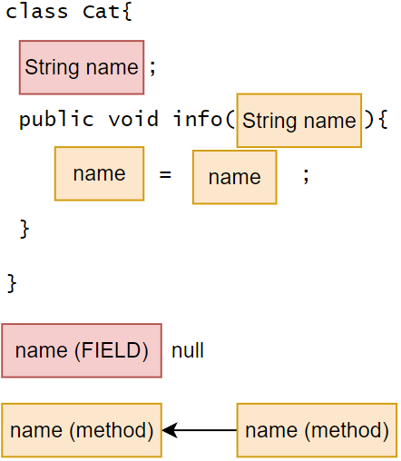

# Keywords — this, this()

📌 `this` represents the current object's xxx parts (such as attributes, methods), not the method of local variables.

> `this.name` is equivalent to `cat1.name`.
            this is equivalent to cat1.
            this is equivalent to the current object.
> 
- The `this` keyword can be used to access the properties, methods, and constructors of the current class.
    - `this` can only be used inside methods defined in the class, not outside the class definition.
- `this` is used to distinguish between the properties of the current class and local variables (allowing method parameters and properties to have the same name for cleaner code and clarity).

## `this`

**Accessing Attributes/Methods:** `this.methodName(parameter list)`.

- When accessing, the parameter list must match.

```java
class Cat{
	String name;
	public void getInfo(){
		// ...
	}
	public void run(){
		this.getInfo();    // Equivalent to Cat.getInfo()
	}
}
```

### `this.name` vs `name`

✅ **With this**

- **Specifies the attribute.**

```java
...
cat1.info("Nick");
cat1.name;  // "Nick"  <---
...
class Cat{
	String name;
	public void info(String name){
		this.name = name;
	}
}
```


❌ **Without this**

- **Proximity principle.** The nearest variable with the same name, which can be a method local variable, a parameter list, etc.

```java
...
cat1.info("Nick");
cat1.name;  // null  <---
...
class Cat{
	String name;
	public void info(String name){
		name = name;
	}
}
```




💡 When method parameters and properties have the same name, due to the scope, `name` refers to the nearest "name," which is the method's `name`.


## 🔥`this()`

**Accessing Constructors:** `this(parameter list)`.


💡 Accessing constructors within constructors.

- Can only be used inside constructors, and one constructor can only access another constructor using `this` (cannot access two constructors simultaneously).
- When accessing, the parameter list must also match.
- If `this` is used to access another constructor, the **`this` statement must be placed as the first statement**.

```java
class Cat{
	String name;

	public Cat(){
		this("Nick");  // Accessing the Cat(String name) constructor
	}
	public Cat(String name){
		// ...
	}
}
```