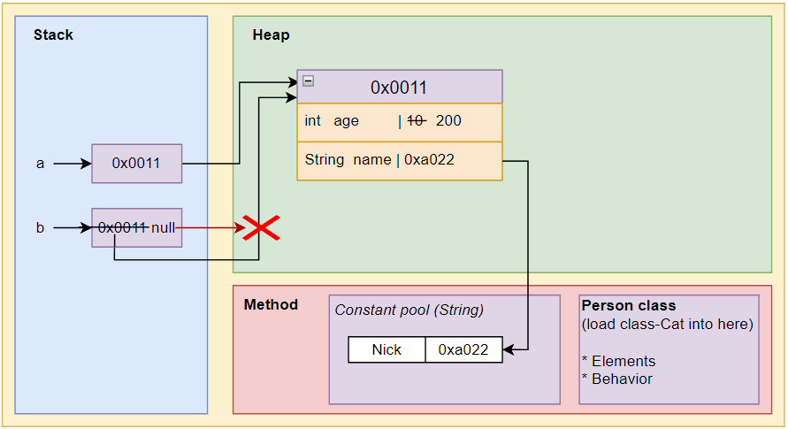

# ⭐ Creating Classes, Attributes, and Methods — Memory Allocation Mechanism

## Memory Principles When Instantiating Objects

Example:

```java
Cat cat1 = new Cat();
cat1.name = "Nick"; 
cat1.age = 3;
cat1.color = "yellow"
```

🔥 In the heap space (actual space), the real object is `new Cat();`, everything else is just a reference (`cat1` - object reference).


The actual object space (similar to an array) in the heap can be referenced by multiple object names.
`cat1` is an object name, just an object reference, storing the object's address value.

## Object Allocation Mechanism

```java
class Person {             // Load the Person class information into the method area
    private int age;
    private String name;
}
Person p1 = new Person();    /* Create the object name p1 in the stack, at this point its value is null.
                                Allocate memory space for p1 (object instantiation) in the heap, including the corresponding Person field. At this point, the attribute values are default.
                                Assign the memory address value to the object p1. p1 points to the object.
                            */
p1.age = 22;                // Change the p1.age to 22
p1.name = "Nick";           // Change the p1.name to "Nick"
Person p2 = p1;              // Create the object p2 in the stack and assign the address value of p1 to p2. (p2 does not create new memory space; its address value is p1)

System.out.println("p2 age is " + p2.age);
// p2 age is 22

p1.age = 30;  // or p2.age = 30;  Both operate on the same value
System.out.println("p2 age is " + p2.age);
// p2 age is 30
```


## Memory Principles When Null Pointer Exception Occurs

```java
Person a = new Person();
a.age = 10;
a.name = "Nick";
Person b;
b = a;
System.out.println("b name is " + b.name);    // b name is Nick

b.age = 495;
b = null;    
System.out.println("a age is " + a.age);    // a age is 495
System.out.println("b age is " + b.age);    // Error!!! Null_Pointer_Exception, compiles successfully but an exception will occur.
```



## Memory Principles of Method Execution and Garbage Collection

📌 Whenever the program reaches a method (including the main method), a temporary independent stack space is **opened** to execute this method.
This independent stack space will be **deleted/released** when the method ends.

```java
Public class Method01 {
    public static void main(String[] a) {
        Person p1 = new Person();
        int returnResult = p1.getSum(10, 20);  
    }
}

class Person {
    // field
    String name;

    // method
    public int getSum(int num1, int num2) {
        int result = n1 + n2;
        return result;
    }
}
```


1. Whenever the program reaches a method, a temporary independent stack space is **opened** to execute the method.

2. After executing the method sequentially or reaching a return, **release/delete** this temporary stack space. Then continue executing the following code.

🔥 The main method is also a method. When the main method completes, it will also delete the stack space for the current method (main), indicating the exit of the entire program.