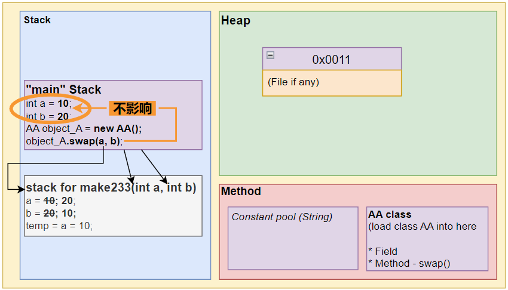
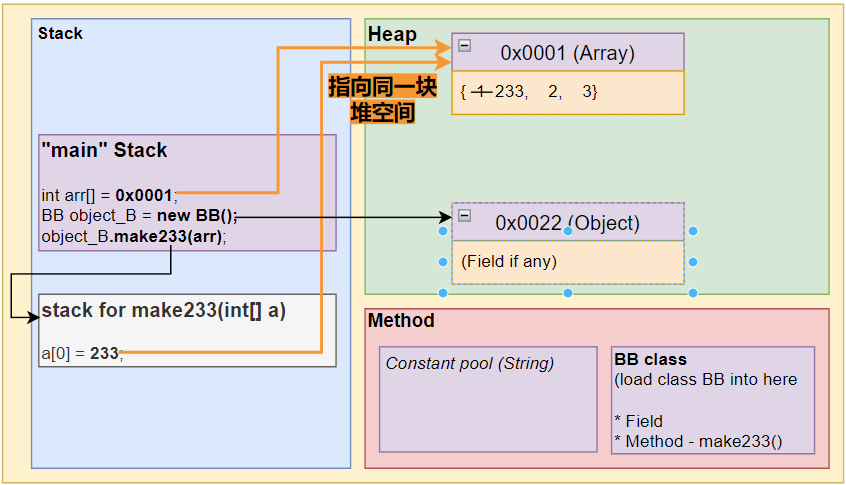

# ⭐Method Arguments Passing Mechanism

## Primitive Data Types

💡 **Each method has its own independent stack space.**
Under primitive data types: changes to variables in one method do not affect variables in other methods (such as `main` method).

📌 **For primitive data types, values are passed (value copy), changes to formal arguments do not affect actual arguments!**

```java
public class ArgPassing {
	public static void main(String[] args){
		int a = 10;
		int b = 20;
		AA object_A = new AA();
		object_A.swap(a,b);   // <--- Copy the input values to another **independent stack** (not the address value).
		System.out.println("a = " + a + ", b = " + b); 
		// !!! After Method: swap: a = 10, b = 20
	}
}

class AA {
	public void swap(int a, int b){
		System.out.println("a = " + a + ", b = " + b); // Before swap: a = 10, b = 20
		int temp = a;
		a = b;
		b = temp;
		System.out.println("a = " + a + ", b = " + b); // Before swap: a = 20, b = 10
	}
}
```



## Reference Data Types — Passing Arrays

📌 **For reference data types, the address value is passed, changes to formal arguments can affect actual arguments!**

```java
public class ArgPassing {
	public static void main(String[] args){

		BB object_B = new BB();
		int[] arr = {1,2,3};
		object_B.make233(arr);  // <--- Pass the address value, pointing to the same space.

		for(int i = 0; i < arr.length; i++){
			System.out.print(arr[i] + " ");
		} // 233, 2, 3
	}
}
class BB {
	public void make233(int[] a) {

		a[0] = 233;
		for(int i = 0; i < a.length; i++){
			System.out.print(a[i] + " ");
		} // 233, 2, 3
		System.out.println();
	}
}
```



## Reference Data Types — Passing Classes

📌 **For reference data types, the address value is passed, changes to formal arguments can affect actual arguments!**

### Case 1 - `p.age = 3000;`

✂️ **Change the value of the formal parameter object in the method**. It will affect `main` because they point to the same space.

```java
public class ArgPassing {
	public static void main(String[] args){
		BB object_B = new BB();
		Person p = new Person();

		p.age = 10;
		System.out.print(p.age);  // <--- age is 10

		object_B.chageAge(p);
		System.out.print(p.age);  // <--- age is 3000
	}
}

class Person{
	String name;
	int age;
}
```

```java
class BB {
	public void chageAge(Person p){
		p.age = 3000;
	}
}
```


### Case 2 - `p = null;`

✂️ **Set the address of the formal parameter object to null in the method.** It will not change the space pointed to by `main` because it just nulls out the method's own pointer.

```java
class BB {
	public void chageAge(Person p){
		p = null;
	}
}
```


null's p is in the method, main method's p hasn't changed.
`System.out.println(p.age);` output is 10;

### Case 3 - `p = new Paerson();`

✂️ **Create a new object with the formal argument object in the method, pointing to a new space.** It will not change the space pointed to by `main`.

```java
class BB {
	public void chageAge(Person p){
		p = new Person();
		p.age = 99;
	}
}
```

