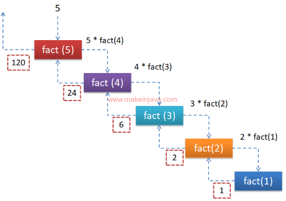

# Recursion

💡 **Recursion:** calling itself in the method body. It is usually used to solve algorithmic problems, such as quicksort, merge sort, binary search, divide and conquer algorithms, etc.

- **Recursion Feature in Java:** Every time a method is executed, a new stack space is created, each stack space is independent.
- If reference type variables (such as arrays, objects) are used in the method, they will share the reference type data. (The same address value, pointing to the same heap space.)
- Recursion must approach the exit condition, otherwise, it will be infinite recursion, resulting in a stack overflow `StackOverflowError`.
- When a method is executed, or encounters a return, it will return. Follow who called, and return the result to it. (Such as calling methods within methods, the result is returned to the calling method.)

## Execution order 

Case 1 - **Q: What does the code below output?**

```java
public class Work {
	public static void main(String[] args){
		 Tools test = new Tools();
			test.recursion(4);
	}
}

class Tools {
	public void recursion(int n){
		if(n > 1) {
			recursion(n - 1);   // <--- Recursion
		}
		System.out.println(n);
	}
}
```

```java
1. main test.test(4);
2. 	n = 4;    // (4 > 1)
3. 	recursion(4-1);
4. 	|		n = 3;    // (3 > 2)
5.	|		recursion(3-1);
6.	|		|		n = 2;    // (2 > 1)
7.	|		|		recursion(2-1);
8.	|		|		|		n = 1;    // (1 !> 1)
9.	|		|		|		println(1);
10.	|		|	  println(2);
11.	|	  println(3);
12. println(4);

/* output: 
1 2 3 4
```

Case 2 - Q: What does the code below output?

```java
public class Work {
	public static vodi main(String[] args){
		 Tools test = new Tools();
			test.recursion(4);
	}
}

class Tools {
	public void recursion(int n){
		if(n > 1) {
			test(n - 1);   // <--- Recursion
		} else {
			System.out.println(n);
		}
	}
}
```

`if(n > 1) test(n); else println(n);`

```java
1. main test.test(4);
2. 	n = 4;    // (4 > 1)
3. 	recursion(4-1);
4. 	|		n = 3;    // (3 > 2)
5.	|		recursion(3-1);
6.	|		|		n = 2;    // (2 > 1)
7.	|		|		recursion(2-1);
8.	|		|		|		n = 1;    // (1 !> 1)
9.	|		|		|		println(1); // [else]

/* output: 
1
```

## Factorial Problem

🔥


```java
public class Work{
	public static void main(String){
		Tools myTools = new Tools();
		int result = myTools.factorial(5);
	}
}

class Tools{
	public int factorial(int n){
		if (n == 1) {
			return 1;
		} else {
			return factorial(n - 1) * n;
		}
	}
}
```

```java
n = 5 | f(5)
n = 4 | =             f(4) * 5
n = 3 | =         f(3) * 4 * 5
n = 2 | =     f(2) * 3 * 4 * 5
n = 1 | = f(1) * 2 * 3 * 4 * 5
        = 1    * 2 * 3 * 4 * 5
        = 120
```

