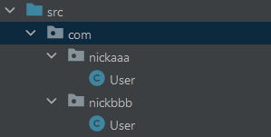
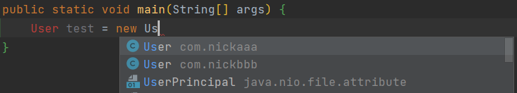
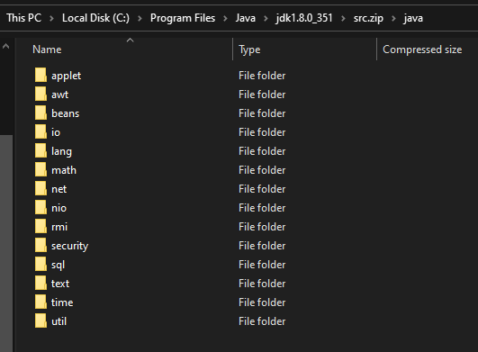
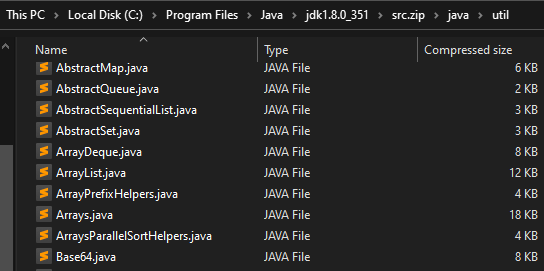

# Package

💡 Purpose of packages:
1. Differentiate classes with the same name (Independence between different packages, avoiding naming conflicts).
2. Efficiently manage classes when there are many.
3. Control access scope.

🎯 In short: package just a **folders** stores class files.

```java
package com.packagename;
import com.packagename.Model;

public static void main(String[] args){...}
```

- `package` is to declare the package in which the current class resides. There is and only one at the top of the class.
- The `import` statement is placed below the `package` statement, before the class definition. Multiple import statements are allowed, and their order doesn't matter.

## Naming Rules for Packages

* Can only contain numbers, letters, underscores, and dots. Cannot start with a number, cannot be a keyword or reserved word.
* Lowercase word connect with `.` 

```java
package com.nickaaa.user;        // User module
import com.nickaaa.exception;    // Error handling module
import com.nickaaa.utils;        // Utility classes
```


## Using Packages

### Creating Packages

Create a new package: Go to IDEA → Right-click on "src" → "New" → "Package" → Name it `com.[package name]`

At this point, you can create "same-name" classes in different packages.



```java
package com.nickaaa.user;
```


### Importing Packages

- Importing a class from a package: `import java.util.Scanner;` It is recommended to import only the needed class or a few classes.
- Importing all classes from a package: `import java.util.*;` It is not recommended to import all classes at once.

```java import com.usercenter.exception;    // Error handling module
import com.nickaaa.exception;
import com.nickaaa.utils;
```


### Using Packages

In other methods (e.g., the main method), you can `import com.package.name` and use the corresponding class from that package.



When using classes with the same name from two different packages, such as `User`:

- You cannot simultaneously import the **classes with same name ** from different packages.
- You can only import **one of them**, and the imported one can be used directly.
- If you want to use the **other one**, you need to include the package name.

```java
import com.nickaaa.User;

public static void main(String[] args){
    User test1 = new User();   						// Imported com.nickaaa.User, so test 1 is User-class from nickaaa

    com.nickbbb.User test2 = new com.nickbbb.User(); // We cannot import the classes with the same name. So using User from nickbbb directly
```


## Commonly Used Java Packages

- **java.lang**: The lang package is a basic package, automatically imported, no need to explicitly import.

    ```java
    // import java.lang.Math;  No need to import java.lang package
    
    public static void main(String[] args){
        int num1 = Math.abs(-1); // Using a method from java.lang to get absolute value
    }
    ```

- **java.util**: Util package, Java's utility package, utility classes, Scanner.
- **java.net**: Network package, for network development.
- **java.awt**: Used for Java's graphical user interface (GUI) development.


## Java Packages in JDK

You can find more Java packages at this path on your computer: C:\Program Files\Java\jdk1.8.0_351\src.zip\java



Classes inside the Util package

