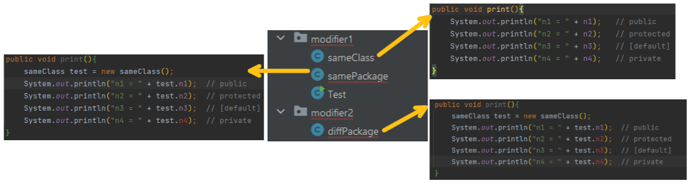

# Access Modifier

💡 Access modifiers: Control the access permissions of methods and properties.

## Modifier Permission Scope

| Access Modifier | Access Level | in the Same Class* | in the Same Package | in the Same Subclass (extends) | in the Different Package |
| --- | --- | --- | --- | --- | --- |
| `public` | Public | ✅ | ✅ | ✅ | ✅ |
| `protected` | Protected | ✅ | ✅ | ✅ | ❌ |
| [No modifier] | Default | ✅ | ✅ | ❌ | ❌ |
| `private` | Private | ✅ | ❌ | ❌ | ❌ |

> "Same Class" can also call it: "This Class," or "Current Class"

### **Example:**

1. Define n1, n2, n3, n4 with different access levels in `modifier1.sameClass` (code below).

```java
package com.modifier1.sameClass;

class Main {
    public int n1;
    protected int n2;
    int n3;
    private int n4;
}
```

2. Attempt to call them in `sameClass`, `samePackage`, `diffPackage` classes.



## Application

### Field access control

```java
public int n1 = 100;
protected int n2 = 200;
int n3 = 300;
private int n4 = 400;
```

### Methods access control

```java
public void m1(){ ... }

protected void m2(){ ... }

void m3(){ ... }

private void m4(){ ... }
```

### Classes access control

Only `[Default]` and `public` can apply to classes.

```java
package com.package;

public class c1 {
}

class c2 {
}
```

```java
package com.main;

public static void main(String args[]){
    c1 test1 = new c1(); // OK, c1 is public 

    c2 test2 = new c2(); // Wrong! c2 is [default], can not access
}
```