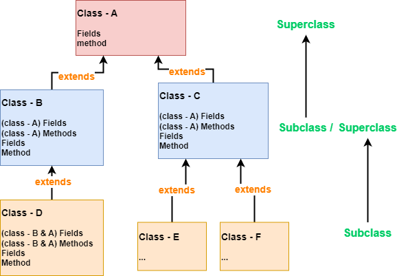

# Extends (1. Basics)

💡 Inheritance: Enhances code reusability, extensibility, and maintainability.

```java
public class Subclass extends Superclass{ ... }
```

# Concepts

💡 A subclass inherits **all** attributes and methods of the superclass. Inherited attributes and methods are treated as if they belong to the subclass itself.

<aside>
🧩 Extensibility and Maintainability: When modifying the superclass, all subclasses automatically inherit the changes.



# Not Using Inheritance vs. Using Inheritance🔧

✅ Abstract a new superclass. Define common attributes and methods in the superclass. All subclasses don't need to redefine these attributes and methods; they only need to declare inheritance using `extends`.

1. Abstract a new superclass.
2. Define common attributes and methods in the superclass.
3. Subclasses inherit all attributes and methods from the superclass using `extends`.

## Not Using Inheritance

🔧 Low Code Reusability, Extensibility, and Maintainability

📌 Multiple classes share a significant amount of identical attributes and methods. For example, only the output statement of `printInfo()` differs, while everything else is identical. **This is when inheritance becomes useful.**

```java
public class Pupil {
  public String name;
  public int age;
  private double score;

  public void setScore(double score) {
      this.score = score;
  }

  public void printInfo(){
      System.out.println(name + " is Pupil");
  }
}

// Graduate has many identical attributes and methods to Pupil,
// academic information includes name, age, score, etc.
public class Graduate {
  public String name;
  public int age;
  private double score;

  public void setScore(double score) {
      this.score = score;
  }

  public void printInfo(){
      System.out.println(name + " is Graduate");
  }
}
```

## Using Inheritance 

🔧 High Code Reusability, Extensibility, and Maintainability

`Student.java` **— NEW!!!**

```java
public class Student {
  public String name;
  public int age;
  private double score;

  public void setScore(double score) {
      this.score = score;
  }
}

// Since it (extends) inherits from the Student class,
// it is equivalent to having its own attributes and methods like name, age, score, etc.
public class Pupil extends Student {
	// Can also have Pupil-specific methods
	public void printInfo(){ System.out.println(name + " is Pupil");}
}

public class Graduate extends Student{
	// Can also have Graduate-specific methods
	public void printInfo(){ System.out.println(name + " is Graduate");}
}
```