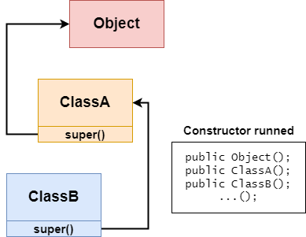

# 📌 Extends (2. Details)

## 1. Indirect Access to Private Attributes and Methods

💡 A subclass inherits all attributes and methods.
**Non-private attributes/methods** can be accessed directly in a subclass. However,
**Private attributes/methods** cannot be accessed directly in a subclass; the parent class needs to provide access through **public methods**.


### Cannot Directly Access Non-Private Methods

`Super.java`

```java
public class Super{

  public int n1 = 100;
  protected int n2 = 200;
  int n3 = 30;
  private int n4 = 400;

  public void test1(){ ... }
  protected void test2(){ ... }
  void test3(){ ... }
  private void test4(){ ... }
}
```

`Sub.java`

```java
public class Sub extends Super{
  public void test(){
    int a = n1; // public
    int b = n2; // protected
    int c = n3; // default
    int d = n4; // private - Error

    test1(); // public
    test2(); // protected
    test3(); // default
    test4(); // private - Error
  }
}
```

### Provide Access to Private Methods through **Public Methods**

`Super.java`

```java
public class Super{

    public int n1 = 100;
    protected int n2 = 200;
    int n3 = 30;
    private int n4 = 400;

    public void test1(){ ... }
    protected void test2(){ ... }
    void test3(){ ... }
    private void test4(){ ... }

    public int getN4(){
        return n4;
    }
    public void callTest4(){
        test4();
    }
}
```

`Sub.java`

```java
public class Sub extends Super{
  public void test(){
    int a = n1; // public
    int b = n2; // protected
    int c = n3; // default
    int d = getN4(); // OK, using public method to get private n4

    test1(); // public
    test2(); // protected
    test3(); // default
    callTest4(); // Ok, using public method to get private test4
  }
}
```

## 2. All Java Classes are Subclasses of Object Class, Object is the Parent Class of All Classes.

- ctrl + H can be used to view class inheritance relationships.
- All classes not explicitly extending another class implicitly extend the Object class (`public class AAA extends Object{}`).

## 3. Invocation of Parent Class Constructor is Not Limited to Direct Parent Class. It Goes All the Way Up to the Object Class (Top-level Parent Class).



```java
public class AAA {
	public AAA(){
		super(); // super() can be used when there is no extends, representing implicit inheritance from Object.
	}
}
```

## 4. Java Single Inheritance Mechanism: A subclass can inherit from at most one parent class (direct inheritance).

How to make class A inherit methods from both class B and class C?

Solution: A class —inherits from→ B class —inherits from→ C class. Then class A can use methods from both B and C classes.

## 5. Inheritance should not be abused, there must be an "is-a" logical relationship between the subclass and the superclass

✅ Cat **is a** Animal `public class Cat extend Animal{ }` 

✅ Bachelor Student **is a** Student `public class BachelorStudent extend Student{ }`

❌ Student **is a** University