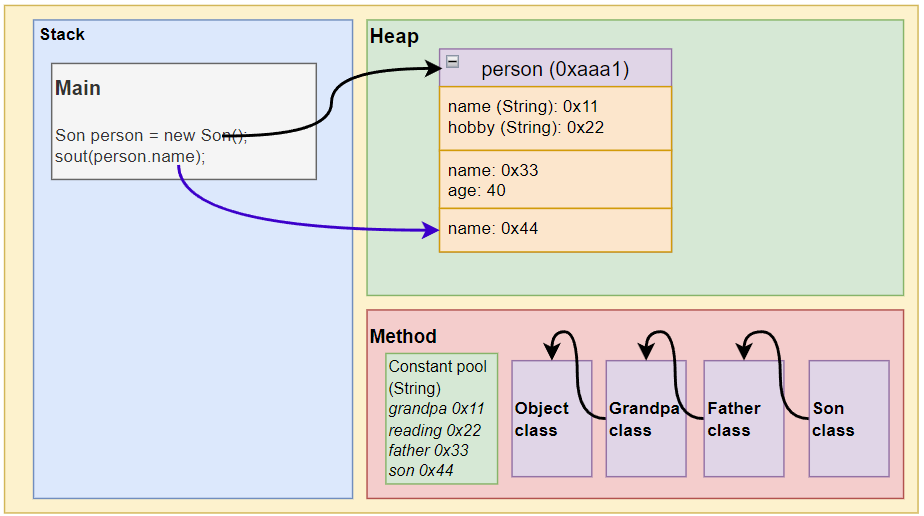

# 📌 Inheritance (3. Order of Member Invocation)

## Classes with Inheritance Can Have Same Name Attributes/Methods

💡 When you `new` an object of a subclass with inheritance, it has its own memory space and also independent memory spaces for all its parent classes. **This implies that classes can have attributes/methods with the same name.**


## Two Orders of Invoking Members

### `method()` and `this.method()` in Normal Situations

💡 **Searching for attributes/methods in classes with inheritance:**

1. First, check if the current class has the attribute/method. If it has and is accessible, return the information; otherwise, throw an error.

2. If the current class doesn't have the attribute/method, look up the parent class to see if it has the attribute. If the parent class has the attribute and is accessible, return the information; otherwise, throw an error.

3. If the parent class doesn't have the attribute, follow the same rule (3) and continue searching for higher-level parent classes until reaching Object.

### `super.method()` Skips the Current Class (Other Rules Remain the Same)

💡 **Searching for attributes/methods in classes with inheritance:**

1. **Skip the current class**.
2. **Directly check if the parent class** has the attribute/method. If the parent class has the attribute and is accessible, return the information; otherwise, throw an error.
3. If the parent class doesn't have the attribute, follow the same rule (3) and continue searching for higher-level parent classes until reaching Object.

**Is accessible** means: the attribute/method is not private. If it is private and inaccessible, create a public method that returns the private attribute.

```java
main(){
	...
	System.out.println(person.age);  
}

class GrandPa{
	int age = 70;
}
class Father extends GrandPa{
	private int age = 40;  // <--stops here
} 
class Son extends Father {
	
}
```

**Otherwise throw an error** means: Once the specified attribute/method is found, it will either return (accessible) or throw an error (private); it will not skip and look for the next one.

> Reasonably create a unique **public method**:
1. Returns a private attribute/method. Or
2. Directly accesses an attribute/method to avoid errors.
## Example

```java
public class ExtendsTheory {
	public static void main(String[] args){
		Son preson = new Son();  
		System.out.println(person.name);  // return: son  2. Finds "name" in Son and can access it.
		System.out.println(person.age);   // return: 40   2. Finds "age" in Father and can access it.
		System.out.println(person.hobby); // return: reading 2. Finds "hobby" in GrandPa.
	}
}

class GrandPa{
	String name = "grandpa";  // 1. Classes can have same name attributes/methods.
	String hobby = "reading";
}
class Father extends GrandPa{
	String name = "father"：  // 1. Classes can have same name attributes/methods.
	int age = 40;
} 
class Son extends Father {
	String name="son";       // 1. Classes can have same name attributes/methods.
}
```

