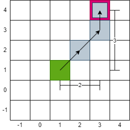
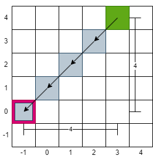

# 1266. Minimum Time Visiting All Points

Problem Link: [LeetCode - 1266. Minimum Time Visiting All Points (Easy)](https://leetcode.com/problems/minimum-time-visiting-all-points/)
Related Tags: Pathfinding, Mathematics, Arrays

# Think

The problem only requires returning the number of moves, which is equivalent to the `distance` between points, making it a classic pathfinding and shortest path problem.

Since the problem allows diagonal movement, and even moving through points without visiting them, it is quite flexible. The minimum distance between two points can be calculated by finding the absolute difference between the coordinates `(x1 - x)` and `(y1 - y)`.

# Key

- Since diagonal movement is allowed, the "maximum value between `x1 - x` and `y1 - y`" is the shortest distance.
- Distance: The `xDiff` calculated by `x1 - x` may be negative. For example, ([3,4] to [-1,0]; `(-1) - 3 = -4`). Therefore, `Math.abs(int)` is used to convert it to an absolute value, representing the distance, and making it easier to calculate the total distance.
- Maximum value: `Math.max(int, int)` is used to find and return the maximum value, eliminating the need for writing if-else statements.

Example: [1,1] to [3,4]. Distance = 3

```java
x = 1, x1 = 3
xDiff = Math.abs(x1 - x) = |3 - 1| = 2

y = 1, y1 = 4
yDiff = Math.abs(x1 - x) = |4 - 1| = 3

distance = Math.max(xDistance, yDistance) = 3 < 2 = 3
```



Example: [3,4] to [-1,0]. Distance = 4

```java
xDiff = 4
yDiff = 4
distance = 4
```



# Answer

Approach 1: Directly calculate distance

```java
public int minTimeToVisitAllPoints(int[][] points) {
    int res = 0; 
    for(int i = 0; i < points.length - 1; i ++){
        int xDistance = Math.abs(points[i+1][0] - points[i][0]);
        int yDistance = Math.abs(points[i+1][1] - points[i][1]);
        res += Math.max(xDistance, yDistance);
    }
    return res;
}
```

Approach 2: Step by step (Slower)

This problem can be solved mathematically by directly calculating the maximum value, avoiding the need to simulate each step.

```java
public int minTimeToVisitAllPoints(int[][] points) {
    int res = 0;
    int x = points[0][0];
    int y = points[0][1];
    for(int i = 1; i < points.length; i++){
        while(x != points[i][0] || y != points[i][1]){
            int xDiff = diff(x, points[i][0]);
            int yDiff = diff(y, points[i][1]);
            /*
				Move to the current position
			*/
            // move diagonally   
            if(yDiff != 0 && yDiff != 0){
                x += xDiff;
                y += yDiff;
                res++;
                continue;
            }
            // move vertically 
            if(yDiff != 0){
                y += yDiff;
                res++;
                continue;
            }
            // move horizontally  
            if(xDiff != 0){
                x += xDiff;
                res++;
                continue;
            }
        }
    }
    return res;
}
// Find the distance between two points x1-x/y1-y, and determine whether to move left/right, up/down, or not move at all
public int diff(int current, int target){
    if(target - current > 0){
        return 1;
    }else if(target - current < 0){
        return -1;
    }else{ 
        return 0;
    }
}
```
