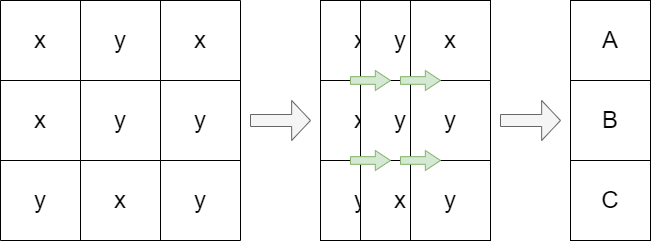
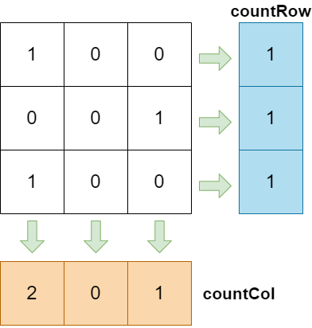
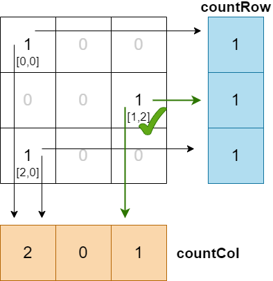
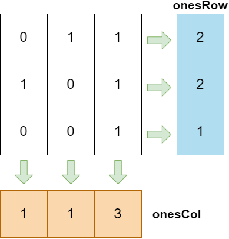

# 1582 + 2482 (Abstracting a 2D matrix into 1D)

💡 Abstracting a 2D matrix into 1D helps reduce complexity.



> Question Links:
>
> [LeetCode - 1582. Special Positions in a Binary Matrix (Easy)](https://leetcode.com/problems/special-positions-in-a-binary-matrix/)
>
> Related Tags: Greedy, 2D Array

> [LeetCode - 2482. Difference Between Ones and Zeros in Row and Column (Medium)](https://leetcode.com/problems/difference-between-ones-and-zeros-in-row-and-column/)
>
> Related Tags: Array, Matrix

# 1582. Special Positions in a Binary Matrix

## Question

Given an `m x n` binary matrix `mat`, return *the number of special positions in* `mat`*.*

A position `(i, j)` is called **special** if `mat[i][j] == 1` and all other elements in row `i` and column `j` are `0` (rows and columns are **0-indexed**).

**Example 1:**


```
Input: mat = [[1,0,0],[0,0,1],[1,0,0]]
Output: 1
Explanation: (1, 2) is a special position because mat[1][2] == 1 and all other elements in row 1 and column 2 are 0.
```

**Example 2:**


```
Input: mat = [[1,0,0],[0,1,0],[0,0,1]]
Output: 3
Explanation: (0, 0), (1, 1) and (2, 2) are special positions.
```


## Think

Understand the problem: `mat[i][j] == 1` and every other element in row `i` and column `j` is `0` can be broken down into two conditions.

* "All other elements in the current "row" are `0`" can be understood as having **only one** `1` in the entire row.
* Add to that, "All other elements in the current "column" are `0`", **only one** `1` in the entire column.

So, the problem can be understood as having only one `1` in the entire row and the entire column for a given position.

> Similar to Sudoku


## Key

💡 Abstracting a 2D matrix into 1D

The Key : "Only one `1` in the current 'row/column'". This can be determined by adding up the numbers in each row and column, and then checking the conditions.




Special position: When the "row" is equal to `1` and the "column" is also equal to `1`



| `mat[i,j]` | countRow | countCol | is special position |
| ---------- | -------- | -------- | ------------------- |
| [0,0]      | 1        | 2        | No                  |
| [1,2]      | 1        | 1        | **Yes** `(res++)`   |
| [2,0]      | 1        | 2        | No                  |


## Code

- Time complexity: $O(m * n)$. `row` and `col`.
- Space complexity: $O(m + n)$. `rowCount` has a size of m, and `colCount` has a size of n.

> If we use the traditional way.
>
> Time complexity will be: $O(m * n * (m + n))$, it take extremely long.
>
> Space complexity will be: $O(1)$.
>
> ```java
> for(int i : mat){
>     for(int j : mat){
>         // cheack is row have other 1s
>         for(){}
>         // cheack is column have other 1s
>         for(){}
>     }
> }
> ```

```java
public int numSpecial(int[][] mat) {
    // Define two arrays to store the counts
    int[] countRow = new int[mat.length];
    int[] countCol = new int[mat[0].length];

    for(int row = 0; row < mat.length; row++){
        for(int col = 0; col < mat[0].length; col++){
            if(mat[row][col] != 0){
                countRow[row]++;
                countCol[col]++;
            }
        }
    }

    int res = 0;
    for(int row = 0; row < countRow.length; row++){
        for(int col = 0; col < countCol.length; col++){
            if(mat[row][col] == 1 && countRow[row] == 1 && countCol[col] == 1){
                res++;
            }
        }
    }
    return res;
}
```


# 2482. Difference Between Ones and Zeros in Row and Column

## Question

You are given a **0-indexed** `m x n` binary matrix `grid`.

A **0-indexed** `m x n` difference matrix `diff` is created with the following procedure:

- Let the number of ones in the `ith` row be `onesRowi`.
- Let the number of ones in the `jth` column be `onesColj`.
- Let the number of zeros in the `ith` row be `zerosRowi`.
- Let the number of zeros in the `jth` column be `zerosColj`.
- `diff[i][j] = onesRowi + onesColj - zerosRowi - zerosColj`

Return *the difference matrix* `diff`.

**Example 1:**


```
Input: grid = [[0,1,1],[1,0,1],[0,0,1]]
Output: [[0,0,4],[0,0,4],[-2,-2,2]]
Explanation:
- diff[0][0] = onesRow0 + onesCol0 - zerosRow0 - zerosCol0 = 2 + 1 - 1 - 2 = 0 
- diff[0][1] = onesRow0 + onesCol1 - zerosRow0 - zerosCol1 = 2 + 1 - 1 - 2 = 0 
- diff[0][2] = onesRow0 + onesCol2 - zerosRow0 - zerosCol2 = 2 + 3 - 1 - 0 = 4 
- diff[1][0] = onesRow1 + onesCol0 - zerosRow1 - zerosCol0 = 2 + 1 - 1 - 2 = 0 
- diff[1][1] = onesRow1 + onesCol1 - zerosRow1 - zerosCol1 = 2 + 1 - 1 - 2 = 0 
- diff[1][2] = onesRow1 + onesCol2 - zerosRow1 - zerosCol2 = 2 + 3 - 1 - 0 = 4 
- diff[2][0] = onesRow2 + onesCol0 - zerosRow2 - zerosCol0 = 1 + 1 - 2 - 2 = -2
- diff[2][1] = onesRow2 + onesCol1 - zerosRow2 - zerosCol1 = 1 + 1 - 2 - 2 = -2
- diff[2][2] = onesRow2 + onesCol2 - zerosRow2 - zerosCol2 = 1 + 3 - 2 - 0 = 2
```

**Example 2:**


```
Input: grid = [[1,1,1],[1,1,1]]
Output: [[5,5,5],[5,5,5]]
Explanation:
- diff[0][0] = onesRow0 + onesCol0 - zerosRow0 - zerosCol0 = 3 + 2 - 0 - 0 = 5
- diff[0][1] = onesRow0 + onesCol1 - zerosRow0 - zerosCol1 = 3 + 2 - 0 - 0 = 5
- diff[0][2] = onesRow0 + onesCol2 - zerosRow0 - zerosCol2 = 3 + 2 - 0 - 0 = 5
- diff[1][0] = onesRow1 + onesCol0 - zerosRow1 - zerosCol0 = 3 + 2 - 0 - 0 = 5
- diff[1][1] = onesRow1 + onesCol1 - zerosRow1 - zerosCol1 = 3 + 2 - 0 - 0 = 5
- diff[1][2] = onesRow1 + onesCol2 - zerosRow1 - zerosCol2 = 3 + 2 - 0 - 0 = 5
```

> Problem Link: [LeetCode - 2482. Difference Between Ones and Zeros in Row and Column (Medium)](https://leetcode.com/problems/difference-between-ones-and-zeros-in-row-and-column/)
>
> Related Tags: Array, Matrix


## Think

Understanding the problem: `diff[i][j] = onesRowi + onesColj - zerosRowi - zerosColj` 

* `onesRow` total count of 1s in the current "row"
* `onesCol` total count of 1s in the current "column"
* `zerosRow` total count of 0s in the current "row"
* `zerosCol` total count of 0s in the current "column"

## Key

The key phrase is "total count of 1s in the current 'row/column'". Similar to the previous problem 1582, calculate the total count of 1s for each row and column.



Since a "row" is either 1 or 0, the count of 0s can be directly obtained. `Count of 0s = length of row - Count of 1s`. The same logic applies to the "column".

* `zerosRow = m - onesRow`
* `zerosCol = n - onesCol`

Finally,

```
diff[i][j] = onesRowi + onesColj - zerosRowi - zerosColj
		   = onesRowi + onesColj - (m - onesRowi) - (n - onesColj)
		   = onesRowi + onesColj - m + onesRowi - n + onesColj
		   = onesRowi * 2 + onesColj * 2 - m - n
```


## Code

- Time complexity: $O(m * n)$. `row` and `col`.
- Space complexity: $O(m + n)$. `rowCount` has a size of m, and `colCount` has a size of n.

> If we use the traditional way.
>
> Time complexity will be: $O(m * n * (m + n))$, it take extremely long.
>
> Space complexity will be: $O(1)$.
>
> ```java
> for(int i : mat){
>     for(int j : mat){
>         // sum all the 1s on row
>         for(){}
>         // sum all the 1s on column
>         for(){}
>     }
> }
> ```

```java
public int[][] onesMinusZeros(int[][] grid) {
    int m = grid.length;
    int n = grid[0].length;
    int[] rowCount = new int[m];
    int[] colCount = new int[n];

    for(int i = 0; i < m; i++){
        for(int j = 0; j < n; j++){
            if(grid[i][j] == 1){
                rowCount[i]++;
                colCount[j]++;
            }
        }
    }

    int[][] res = new int[m][n];
    for(int i = 0; i < m; i++){
        for(int j = 0; j < n; j++){
            res[i][j] = rowCount[i] + colCount[j] - (m - rowCount[i]) - (n - colCount[j]);
        }
    }

    return res;
}
```