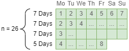
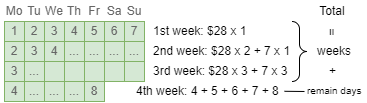
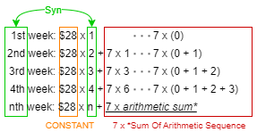
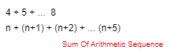

# 1716. Calculate Money in Leetcode Bank

# Question

Hercy wants to save money for his first car. He puts money in the Leetcode bank **every day**.

He starts by putting in `$1` on Monday, the first day. Every day from Tuesday to Sunday, he will put in `$1` more than the day before. On every subsequent Monday, he will put in `$1` more than the **previous Monday**.

Given `n`, return *the total amount of money he will have in the Leetcode bank at the end of the* `nth` *day.*

**Example 1:**

```
Input: n = 4
Output: 10
Explanation: After the 4th day, the total is 1 + 2 + 3 + 4 = 10.
```

**Example 2:**

```
Input: n = 10
Output: 37
Explanation: After the 10th day, the total is (1 + 2 + 3 + 4 + 5 + 6 + 7) + (2 + 3 + 4) = 37. Notice that on the 2nd Monday, Hercy only puts in $2.
```

**Example 3:**

```
Input: n = 20
Output: 96
Explanation: After the 20th day, the total is (1 + 2 + 3 + 4 + 5 + 6 + 7) + (2 + 3 + 4 + 5 + 6 + 7 + 8) + (3 + 4 + 5 + 6 + 7 + 8) = 96.
```

> Problem Link: [LeetCode - 1716. Calculate Money in Leetcode Bank (Easy)](https://leetcode.com/problems/calculate-money-in-leetcode-bank/)
>
> Related Tags: Greedy, Array, Arithmetic Sequence

# Think

### Step 1

If n = 26 days, that is, from Monday, 26 days later, how much money is left in the bank. 26 days can be divided into 3 weeks + 5 days:



### Step 2

No matter how many total days, the total profit of the complete x weeks is the same. For example, when n=8, there is a complete first week, and the total for the first week is 28; when n=26, there is also a complete first week, and the total for the first week is also 28.

💡 `total sum of complete weeks` and `total sum of remaining days` = total sum

So when n=26, `total sum of complete weeks` and `total sum of remaining days` are:



### Step 3

The total sum of complete weeks

```java
1st week = 1 + 2 + 3 + 4 + 5 + 6 + 7 
     	 = 28
    
2nd week = (week1) + 2 + 3 + 4 + 5 + 6 + 7 + 8 
    	 =(1 + 2 + 3 + 4 + 5 + 6 + 7) + 2 + 3 + 4 + 5 + 6 + 7 + 8 
    	 =(1 + 2 + 3 + 4 + 5 + 6 + 7) +[(1 + 2 + 3 + 4 + 5 + 6 + 7) + 7]
    	 = (1 + 2 + 3 + 4 + 5 + 6 + 7) x 2 + 7 
    	 = 28 x 2 + 7
    
3rd week = 28 x 3 + 7 + 7  +  7
              week2 ^   ^week3^
    	 = 28 x 3 + 7 x 3
    
4th week = 28 x 4 + 7 x 6
    ...
  n week = 28 x m + 7 x (arithmetic sequence sum)
		 = 28 x m + 7 x (n * [2 * a + (m − 1) * d] / 2)
```

Arithmetic sequence sum:

$m * [2 * a + (m − 1) * d] / 2$

It can be seen that `28 x m + 7 x (n * [2 * a + (m − 1) * d] / 2)` is the `total sum of complete weeks` general formula.

* m = number of complete weeks = $26 / 7$ = 3
* a = initial amount of money = 1
* d = difference = 1 (Always $1 more than the previous Monday)

Chart representation:



### Step 4

The total sum of the remaining days: 4 + 5 + 6 + 7 + 8 is a classic arithmetic sequence sum.

$m * [2 * a + (m − 1) * d] / 2$

* m = remaining days = $26 \% 7$ = 5
* a = initial amount of money = 1 + `x th` week = 1 + 4
* d = difference = 1 (Always $1 more than the previous day)

Chart representation:



💡 `total sum of complete weeks` and `total sum of remaining days` = total sum

# Key

By calculating the profit of each week plus the last few days, we can directly calculate the total number of "weeks" and the total number of "days" left. Both time and space complexity are $O(1)$.

The time and space complexity of traversing 26 days with a `for` loop are both $O(n)$ and $O(1)$, respectively.

**Formula for the sum of an arithmetic sequence**:

$Sn=n[2a+(n−1)d]/2$

- Sn = Total sum
- n = Number of items / Length of the sequence
- a = First item / Initial digit
- d = Difference

# Answer

```java
public int totalMoney(int n) {
    	// number of whole weeks 
        int wholeWeeks = n / 7;
		
    	// number of weeks exclude first week (-1). And do not -1 when we don't even have 1 whole week
    	// The -1 is for convenience in calculation, as the first week is not included in the arithmetic sequence
        int followingWeeks = wholeWeeks > 0 ? wholeWeeks - 1 : 0;
    
    	// apply the arithmetic sequence sum formula
        int extra7 = followingWeeks * (2 + (followingWeeks - 1)) / 2;
    	// apply formula 28 x m + 7 x (arithmetic sequence sum)
        int money = (28 * wholeWeeks) + extra7 * 7;
		
    	// number of remain day
        int remainDay = n % 7;
    	// apply the arithmetic sequence sum formula
        money += remainDay * (2*(1 + wholeWeeks) + (remainDay - 1))/2;

        return money;
    }
```