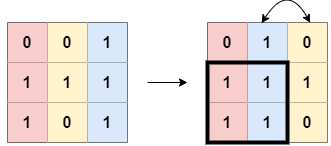

# 1727. Largest Submatrix With Rearrangements

# Think



The problem requires finding the `area` of the largest subarray, not the `steps` for rearrangement, even though we rearrange the columns to maximize the subarray.

First, for each column, we calculate the number of consecutive 1s upward, and store it in the matrix array.

Then, for each row, we sort the columns of that row and calculate the maximum rectangle area with each column as the right boundary.

# Key


💡 Map the 2D array to a 1D array based on certain rules

- Calculate the number of consecutive 1s upward from that column by using the operation `arr[i] += arr[i-1]`.
- Sort the row and rearrange the array to get the best condition for the largest subarray.
- Calculate the maximum rectangle area with each column as the right boundary.


# Answer

```java
public int largestSubmatrix(int[][] matrix) {
	  int m = matrix.length;
	  int n = matrix[0].length;
	  int ans = 0;
	  
	  for (int row = 0; row < m; row++) {
	      for (int col = 0; col < n; col++) {
	          if (matrix[row][col] != 0 && row > 0) { 
	              matrix[row][col] += matrix[row - 1][col];
	          }
	      }
	      
	      int[] currRow = matrix[row].clone();
	      Arrays.sort(currRow);
	      for (int i = 0; i < n; i++) {
	          ans = Math.max(ans, currRow[i] * (n - i));
	      }
	  }
	  
	  return ans;
}
```