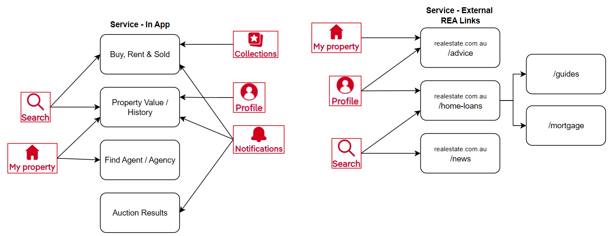
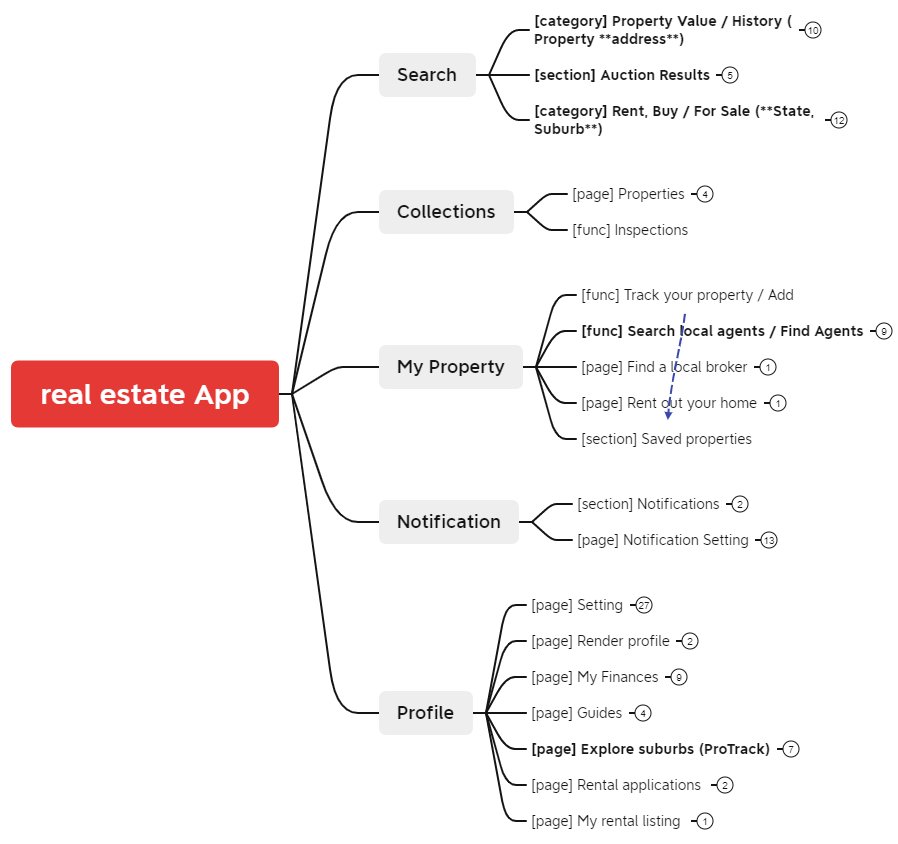
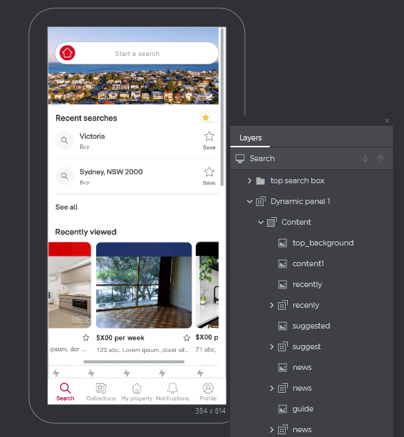

# 📌 REA app Prototype - Optimize "Auction Result" Display 

## Service analysis 

## Third Party APIs analysis

| View UI (10)                                                 | Debug / Testing (7)                                          | Asynchronous /  Even-base (3)       | Network (1)          |
| ------------------------------------------------------------ | ------------------------------------------------------------ | ---------------------------------------- | -------------------- |
| Butter knife Joda-time Glide Prettytime Sticky-headers-recyclerview RecyclerViewItemAnimators Library Android Sliding Up Panel BottomBar Material Calender View Zoomable | Stetho Junit 4 Roboelectric Mockito AssertJ Andriod Firebase Test Lab for Android Timber | RxJava RxAndroid EventBus      | OkHttp               |
| **Features (3)**                                             | **Performance (3)**                                          | **Security (2)**                         | **Web (2)**          |
| Dagger 2 Facebook SDK for Android Google API Services | Icepick RxPremissions Apache Commons Lang          | Firebase Analytics Firebase Hosting | Pusher Retrofit |

> **View / UI**
>
> - `Butter knife`: view binding library for Android that uses annotations to generate boilerplate code for UI interactions, such as binding views and handling clicks.
> - `Joda-time`: handling dates and times in Java, offering better functionality than the built-in java.util.Date and java.util.Calendar.
> - `Glide`: image loading and caching library for Android, designed to handle loading images efficiently.
> - `Prettytime`: displaying human-readable timestamps (e.g., "3 minutes ago").
> - `Sticky-headers-recyclerview`: helps create RecyclerView items with sticky headers that remain visible at the top of the list when scrolling.
> - `RecyclerViewItemAnimators Library`: custom animations for RecyclerView items.
> - `Android Sliding Up Panel`: provides a sliding panel that slides up from the bottom of the screen, useful for creating expandable views.
> - `BottomBar`: provides an easy way to implement a bottom navigation bar with tabs.
> - `Material Calender View:` A customizable calendar widget for Android, designed to follow Material Design guidelines.
> - `Zoomable`: adding zoom functionality to Android ImageView.
>
> **Debug / Testing**
>
> - `Stetho`: debugging bridge for Android applications, integrating with the Chrome Developer Tools.
> - `Junit 4`: unit testing testing framework for Java.
> - `Roboelectric`: allows Android tests to be run on the JVM, providing a way to test Android code without an emulator or device.
> - `Mockito`: a mocking framework for unit tests in Java
> - `AssertJ Andriod`: provides fluent assertions for Android testing.
> - `Firebase Test Lab for Android`: allows you to test your Android app on a variety of devices and configurations.
> - `Timber`: logging library for Android, providing a better way to log in your app.
>
> **Asynchronous / Even-base**
>
> - `RxJava`: composing asynchronous and event-based programs using observable sequences for the Java VM.
> - `RxAndroid`: extension of RxJava for Android, providing Android-specific bindings to RxJava.
> - `EventBus`: simplifying communication between different parts of an application (e.g., activities, fragments, services) through event-based messaging.
>
> **Network**
>
> - `OkHttp`: HTTP client for Android and Java applications, designed to handle network requests efficiently and reliably.
>
> **Features**
>
> - `Dagger 2`: dependency injection framework for Java and Android, making it easier to manage dependencies and their lifecycles.
> - `Facebook SDK for Android`: allows Android apps to integrate with Facebook. It provides features such as user authentication, sharing content, accessing social graph data, and more.
> - `Google API Services`: provide access to various Google services like Maps, Drive, and YouTube.
>
> **Performance**
>
> - `Icepick`: saving and restoring instance state in Android activities and fragments, reducing boilerplate code.
> - `RxPremissions`: simplifies the process of requesting permissions in Android using RxJava.
> - `Apache Commons Lang`: provides utility functions for the java.lang API, enhancing core Java classes.
>
> **Security**
>
> - `Firebase Analytics`: helps track user behavior and interactions in mobile apps.
> - `Firebase Hosting`: provides fast and secure hosting for web apps, static and dynamic content.
>
> **Web**
>
> - `Pusher`: provides real-time communication capabilities for web and mobile apps.
> - `Retrofit`: type-safe HTTP client for Android and Java, making it easier to consume RESTful web services.

## User flow / UI analysis 

(short ver.)

## Prototyping

(Partial Screenshot)

