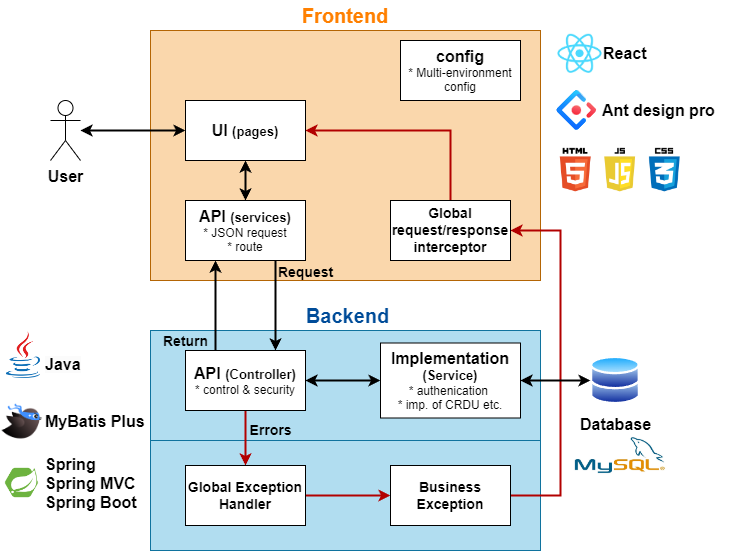
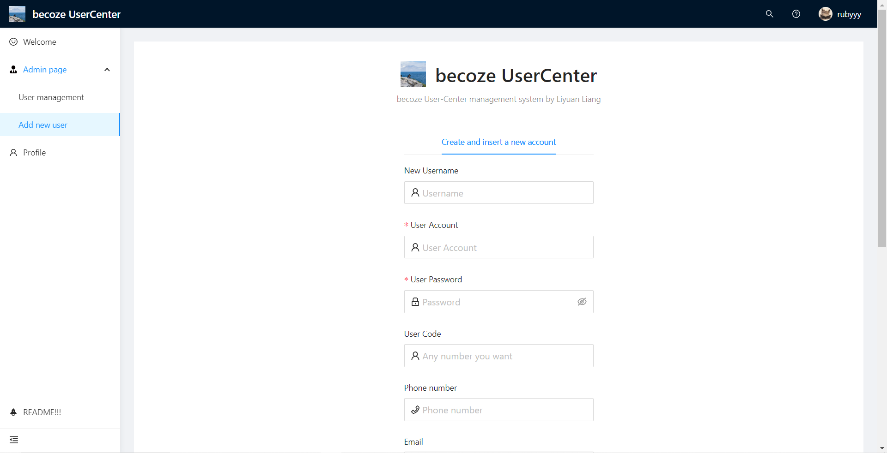
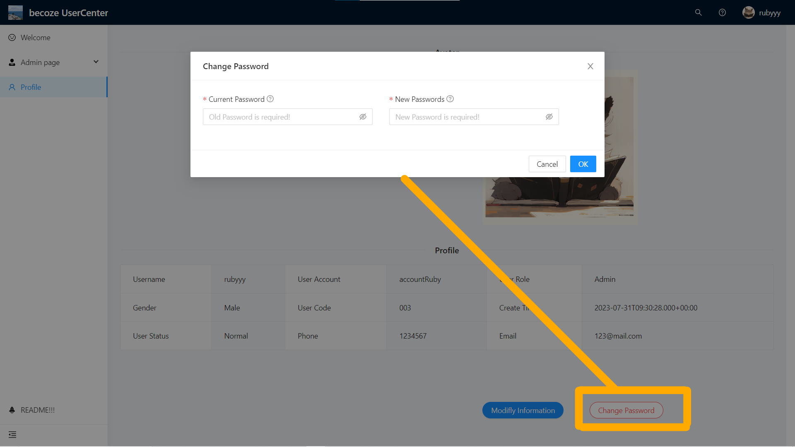

# UserCenter
## GitHub Repo

<i class="fa-brands fa-github"></i> [User Center - Back end <i class="fa-solid fa-arrow-up-right-from-square"></i>](https://github.com/becoze/usercenter-back)

<i class="fa-brands fa-github"></i> [User Center - Front end <i class="fa-solid fa-arrow-up-right-from-square"></i>](https://github.com/becoze/usercenter-front)

## Tech Stack
### Backend:
- Java
- Spring (IoC and DI)
- SpringMVC (web framework)
- Spring Boot (easier set up and deploy)
- Mybatis & Mybatis-plus (ORM: map OOP models to relational database models)
- log4j (log)
- MySQL (database)

### Frontend:
- React
- HTML + CSS + JS
- Umi (React enhancement)
- Ant Design Pro (elements and components)

### Development Tools:
- IntelliJ IDEA & WebStrom (IDE)
- Maven (dependency management tool )
- Mysql
- jdk1.8
- Typora (development log writing)

## System Design

## Project introduction - Video

<iframe width="560" height="315" src="https://www.youtube.com/embed/waCRV8ZARv4" frameborder="0" allowfullscreen></iframe>

> 5 Minutes project showcase video

## Project introduction - Image

## Project Log
> Enlarge image if needed

